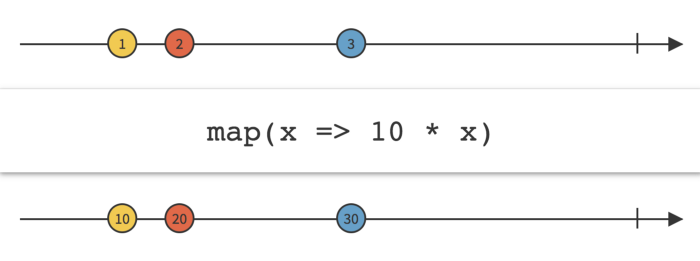
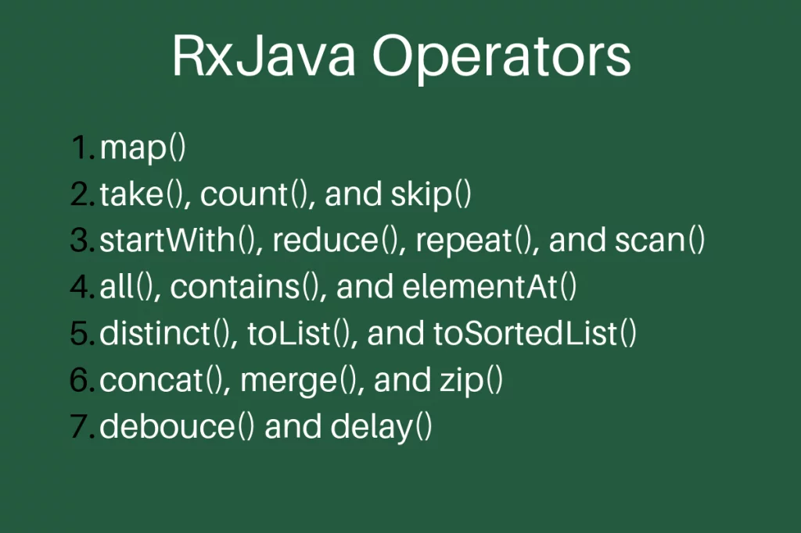

### DAGGER

-   **What is the use-case of @BindsInstance Annotation?**<br/>
    - @BindsInstance is used to bind the available data at the time building the Component. Suppose I have user name available before building a component then I can use as shown in the following example:
    https://google.github.io/dagger/users-guide.html#binding-instances


-   **What is the use-case of @Module Annotation?**<br/>
    - @Module is the Annotation used on the class for the Dagger to look inside it, to provide dependencies. We may be declaring methods inside the module class that are enclosed with @Provides annotation.

-   **What is the use-case of @Provides Annotation?**<br/>
    - @Provides annotation is used on a method in Module class and can return / provide a Dependency object.

-   **What is the use-case of @Component Annotation?**<br/>
    - @Component is used on Interface or abstract class. Dagger uses this interface to generate an implementation class with fully formed, dependency injected implementation, using the modules declared along with it. This generated class will be preceded by Dagger. For example if i create an interface named ProgramComponent with @Component annotation, Dagger will generate a Class named 'DaggerProgramComponent' implementing the  ProgramComponent interface.

-   **What is the use-case of @Scope Annotation?**<br/>
    - @Scope is an annotation used on Interface to create a new Custom Scope. A Scope declaration helps to keep single instance of a class as long as its scope exists. For example, in Android, we can use @ApplicationScope for the object to live as long as the Application is live or @ActivityScope for the object to be available till the activity is killed.

-   **What is the use of Qualifier in Dagger?**<br/>
    - We are often in a situation where we will be needing multiple objects with different instance values. For example, we need declare Student("Vamsi") and Student("Krishna"). In such case we can use a Qualifier to tell Dagger that we need multiple instances of same class. The default implementation of Qualifier is using @Named annotation, for eg., @Named("student_vamsi") and @Named("student_krishna")
    If we want to create a Custom Qualifier we would be using @Qualifier to declare a custom Qualifier interface.

-   **What is the use-case of @Inject Annotation in Dagger?**<br/>
    - @Inject annotation is used to request dagger to provide the respective Object. We use @Inject on Constructor, Fields (mostly where constructor is not accessible like Activities, Fragments, etc.) and Methods.

* **Why do we use the Dependency Injection Framework like Dagger in Android?** - [Learn more here](https://blog.mindorks.com/why-do-we-use-the-dependency-injection-framework-in-android)

* **How does the Dagger work?** - [Learn more here](https://blog.mindorks.com/android-annotation-processing-tutorial-part-1-a-practical-approach) and [here]((https://www.youtube.com/watch?v=Grzqz-B3NWU))

* **What is Component in Dagger?** - [Learn more here](https://www.youtube.com/watch?v=Grzqz-B3NWU)

* **What is Module in Dagger?** - [Learn more here](https://www.youtube.com/watch?v=Grzqz-B3NWU)

* **How does the custom scope work in Dagger?**


### RXJAVA

* **RXJava - What is it?**
   * [RxJava - Basics, Types of Operators, Types of Observables - Article](https://medium.com/@anitaa_1990/exploring-rxjava-in-android-e52ed7ef32e2)
   * [RxJava - Basics, Types of Operators, Types of Observables - Sample Implementation](https://github.com/anitaa1990/RxAndroid-Sample)
     

-   **What is an Observable in RXJava2?**<br/>
    - An Observable  simply emits the data to those which subscribed to it. All the emission is done asynchronously to the subscribers. A simple Observable can be created as follows:

    ```java
    // RxAndroid Tutorial - Adding Observable
    Observable<String> stringObservable = Observable.just("Hello Reactive Programming!");
    ```
-   **What is an Observer in RXJava2?**
    - Observer consumes the data emitted by the Observable. To do this, Observer needs to subscribe to the Observable. Example shows how to create an Observable in RxJava2.
    ```java
    // RxAndroid Tutorial - Adding observer
    Observer<String> stringObserver = new Observer<String>() {
            @Override
            public void onSubscribe(Disposable d) {
            }

            @Override
            public void onNext(String s) {
                Toast.makeText(MainActivity.this, s, Toast.LENGTH_SHORT).show();
            }

            @Override
            public void onError(Throwable e) {
            }

            @Override
            public void onComplete() {
            }
        };
    ```

-   **How to Subscribe / Unsubscribe in RXJava?**<br/>
    - We can make an Observer to subscribe to Observable as follows:
    ```java
    // RxAndroid tutorial - observer subscribing to observable
    stringObservable.subscribe(stringObserver);
    ```
-   **Map vs FlatMap**
    - **Map** transforms the items emitted by an Observable by applying a function to each item.
    
    

    - **FlatMap** transforms the items emitted by an Observable into Observables.
    
    

-   **What are the different types of Observables in RxJava?**<br/>
    - Single
    - Maybe
    - Completable
    - Observable
    - Flowable

-   **What is a Single in RxJava?**<br/>
    - A Single in RxJava is an Observable which emits only one item if completed or returns error.

-   **What is Maybe in RxJava?** <br/>
    - A Maybe in RxJava is used when the Observable needs to emit a value or a no value or an error.

-   **What is Completable in RxJava?** <br/>
    - A Completable in RxJava is an Observable which just completes the task and does not emit anything if completed. It returns an error if anything fails.
    It is similar to reactive concept of runnable.

-   **What is Back Pressure in RxJava?**<br/>
    - Back Pressure is the state where your observable (publisher) is creating more events than your subscriber can handle.

-   **What is Flowable in RxJava?** <br/>
    - A Flowable in RxJava is used when the Observable emits more data than the Observer can consume. In Other words, Flowable can handle back pressure where as an Observable cannot.

-   **What is a Cold Observable?**<br/>
    - A Cold Observable is an Observable that does not emit items until a Subscriber subscribes. If we have more than one Subscriber, then the Cold Observable will emit each sequence of items to all Subscribers one by one.

-   **What is a Hot Observable?**<br/>
    - A Hot observable is an Observer that will emit items

-   **List RxJava operators.**
    
    
    
    [Learn more here](https://www.journaldev.com/19254/rxjava-operators)


-   **Hot Observables vs Cold Observables**<br/>

-   **Explain about reactive programming?**<br/>


* **FlatMap Vs Map Operator** - [Learn more here](https://medium.com/mindorks/rxjava-operator-map-vs-flatmap-427c09678784)
    
* **When to use `Create` operator and when to use `fromCallable` operator of RxJava?** - [Learn more here](https://blog.mindorks.com/understanding-rxjava-create-and-fromcallable-operator)
    
* **When to use `defer` operator of RxJava?** - [Learn more here](https://blog.mindorks.com/understanding-rxjava-defer-operator)
    
* **How are Timer, Delay, and Interval operators used in RxJava?** - [Learn more here](https://blog.mindorks.com/understanding-rxjava-timer-delay-and-interval-operators)

* **How to make two network calls in parallel using RxJava?** - [Learn more here](https://blog.mindorks.com/understanding-rxjava-zip-operator-with-example)
    
* **Tell the difference between Concat and Merge.** - [Learn more here](https://blog.mindorks.com/rxjava-operator-concat-vs-merge)

* **Explain Subject in RxJava?** - [Learn more here](https://blog.mindorks.com/understanding-rxjava-subject-publish-replay-behavior-and-async-subject-224d663d452f)

* **What are the types of Observables in RxJava?** - [Learn more here](https://blog.mindorks.com/understanding-types-of-observables-in-rxjava-6c3a2d0819c8)

* **How to implement EventBus with RxJava?** - [Learn more here](https://blog.mindorks.com/implementing-eventbus-with-rxjava-rxbus-e6c940a94bd8)

* **How to implement search feature using RxJava in your application?** - [Learn more here](https://blog.mindorks.com/implement-search-using-rxjava-operators-c8882b64fe1d)

* **How The Android Image Loading Library Glide and Fresco Works?** - [Learn more here](https://blog.mindorks.com/how-the-android-image-loading-library-glide-and-fresco-works-962bc9d1cc40)

* **Difference between Schedulers.io() and Schedulers.computation() in RxJava.**

* **When to call dispose and clear on CompositeDisposable in RxJava?** - [Learn more here](https://stackoverflow.com/questions/47057885/when-to-call-dispose-and-clear-on-compositedisposable)

* **What is Multipart Request in Networking?** - [Learn more here](https://www.youtube.com/watch?v=p7SiNT0q1I8)