# 🤖 ANDROID INTERVIEW QUESTIONS


This document is a cheat sheet for Android interviews, and I created this because wanted to have repo, where I can prepare for android job interview, without searching question and answers all around the internet and have everything organized in a single document. In almost all answers you can find the links with the source of the answer, where you may read more detailed information on the question. The most of the content is a mixture of different guides found on github, so I want to thank all the contributors for the great effort and time spend, like:

* [anitaa1990](https://github.com/anitaa1990/Android-Cheat-sheet)
* [Kirchhoff-](https://github.com/Kirchhoff-/Android-Interview-Questions)
* [derekargueta](https://github.com/derekargueta/Android-Interview-Questions#core-android)
* [vamsitallapudi](https://github.com/vamsitallapudi/Android-Interview-Questions-And-Answers#core-android)
* [niharika2810](https://github.com/niharika2810/android-interview-questions)
* [MaximAbramchuck](https://github.com/MaximAbramchuck/awesome-interview-questions#android) 
* [MindorksOpenSource](https://github.com/MindorksOpenSource/android-interview-questions)

## CONTRIBUTING

Pull Request are highly appreciated. If possible, include a link to the solution/topic. Questions should be fairly straightforward and technical. Feel free to create a pull request if you find any mistakes or have better answers. 
Hope this is useful, and thanks!


## CONTENT TOPICS

* [ANDROID BASICS](#base)
* [ACTIVITIES](#activities)
* [FRAGMENTS](#fragments)
* [VIEWS AND LAYOUTS](#views-and-layouts)
* [DIALOGS AND TOAST](#dialogs-and-toast)
* [CONTENT PROVIDERS](#content-providers)
* [INTENTS AND BROADCASTING](#intents-and-broadcasting)
* [SERVICES](#services)
* [TASKS AND INTER-PROCESS COMMUNICATION](#tasks-and-inter-process-communication)
* [DISPLAYING LIST OF CONTENT](#displaying-list-of-content)
* [DATA SAVING](#data-saving)
* [PERMISIONS](#permisions)
* [ANDROID BATTERY](#android-battery)
* [ANDROID SYSTEM INTERNAL](#android-system-internal)
* [ANDROID SECURITY](#android-security)
* [JETPACK](#android-jetpack)
* [ARCHITECTURE](#architecture)
* [ANDROID LIBRARIES](#android-libraries)
* [ANDROID TOOLS](#android-tools)
* [ANDROID TESTING](#android-testing)
* [ANDROID DESIGN PROBLEMS](#android-design-problems)


#### BASE
* **What is the Android Architecture?** 
    

* **Tell all the Android application components.**
    - Android application architecture has the following components:
        - **Activities** - Provides the window in which the app draws its UI
        - **Services** − It will perform background functionalities
        - **Intent  & Broadcast Receivers** − It will perform the inter connection between activities and the data passing mechanism
        - **Content Providers** − It will share the data between applications
        - Resource Externalization − strings and graphics
        - Notification − light, sound, icon, notification, dialog box and toast
    
    [Learn more here](https://developer.android.com/guide/components/fundamentals.html#Components)

* **Describe Android application components.** 
    - A **Activity** represents a single screen with a user interface, in-short Activity performs actions on the screen. An activity provides the window in which the app draws its UI. This window typically fills the screen, but may be smaller than the screen and float on top of other windows. Generally, one activity implements one screen in an app. For instance, one of an app’s activities may implement a Preferences screen, while another activity implements a Select Photo screen. In new architectural approaches, there is only one activity for the entire application, and it controls the fragments that interact with the user.

    - A **Service** is an application component that can perform long-running operations in the background, and it doesn't provide a user interface. Another application component can start a service, and it continues to run in the background even if the user switches to another application. Additionally, a component can bind to a service to interact with it and even perform interprocess communication (IPC). For example, a service can handle network transactions, play music, perform file I/O, or interact with a content provider, all from the background.

    - A **Broadcast Receivers** (receiver) is an Android component which allows you to register for system or application events. Android apps can send or receive broadcast messages from the Android system and other Android apps, similar to the publish-subscribe design pattern. These broadcasts are sent when an event of interest occurs. For example, the Android system sends broadcasts when various system events occur, such as when the system boots up or the device starts charging. Apps can also send custom broadcasts, for example, to notify other apps of something that they might be interested in (for example, some new data has been downloaded). Apps can receive broadcasts in two ways: Manifest-declared receivers and Context-registered receivers


    - A **Content Provider** manages access to a central repository of data. You implement a provider as one or more classes in an Android application, along with elements in the manifest file. One of your classes implements a subclass `ContentProvider`, which is the interface between your provider and other applications. Although content providers are meant to make data available to other applications, you may of course have activities in your application that allow the user to query and modify the data managed by your provider.

* **What is the project structure of an Android Application?** 
    - To see the actual file structure of the project including all files hidden from the Android view, select **Project** from the dropdown at the top of the **Project** window.

        When you select **Project** view, you can see a lot more files and directories. The most important of which are the following:

        - `module-name/` 
        
        - `build/` -> Contains build outputs.
        - `libs/` -> Contains private libraries.
        - `src/` -> Contains all code and resource files for the module in the following subdirectories:
        - `androidTest/` -> Contains code for instrumentation tests that run on an Android device.
        - `main/` -> Contains the "main" sourceset files: the Android code and resources shared by all build variants (files for other build variants reside in sibling directories, such as `src/debug/` for the debug build type).
        - `AndroidManifest.xml` -> Describes the nature of the application and each of its components. 
        - `java/` -> Contains Java code sources.
        - `jni/` -> Contains native code using the Java Native Interface (JNI).
        - `gen/` -> Contains the Java files generated by Android Studio, such as your `R.java` file and interfaces created from AIDL files.
        - `res/` -> Contains application resources, such as drawable files, layout files, and UI string.
        - `assets/` -> Contains file that should be compiled into an `.apk` file as-is. You can navigate this directory in the same way as a typical file system using URIs and read files as a stream of bytes using the AssetManager . For example, this is a good location for textures and game data.
        - `test/` -> Contains code for local tests that run on your host JVM.
        - `build.gradle` (module) -> This defines the module-specific build configurations.
        - `build.gradle` (project) -> This defines your build configuration that apply to all modules. This file is integral to the project, so you should maintain them in revision control with all other source code.

        [Learn more here](https://developer.android.com/studio/projects)

* **What is `Context`? How is it used?** 
    - A **Context** is a handle to the system; it provides services like resolving resources, obtaining access to databases and preferences, and so on. An Android app has activities. Context is like a handle to the environment your application is currently running in.
    - **Application Context:** This context is tied to the lifecycle of an application. The application context can be used where you need a context whose lifecycle is separate from the current context or when you are passing a context beyond the scope of an activity.
    - **Activity Context:** This context is available in an activity. This context is tied to the lifecycle of an activity. The activity context should be used when you are passing the context in the scope of an activity or you need the context whose lifecycle is attached to the current context.

        [Learn more here](https://blog.mindorks.com/understanding-context-in-android-application-330913e32514) or [here](https://github.com/Kirchhoff-/Android-Interview-Questions/blob/master/Android/What's%20Context.md)


* **When to call activity context OR application context?**  
    - To be blunt, "some programmers" use `getApplicationContext()` (or `getBaseContext()`, to a lesser extent) because their Java experience is limited. They implement an inner class (e.g., an `OnClickListener` for a `Button` in an `Activity`) and need a `Context`. Rather than using `MyActivity.this` to get at the outer class' `this`, they use `getApplicationContext()` or `getBaseContext()` to get a `Context` object.

       You *only* use `getApplicationContext()` when you *know* you need a `Context` for something that may live longer than any other likely `Context` you have at your disposal. Scenarios include:

        - Use `getApplicationContext()` if you need something tied to a `Context` that itself will have global scope. I use `getApplicationContext()`, for example, in `WakefulIntentService`, for the static `WakeLock` to be used for the service. Since that `WakeLock` is static, and I need a `Context` to get at `PowerManager` to create it, it is safest to use `getApplicationContext()`.

        - Use `getApplicationContext()` when you bind to a `Service` from an `Activity`, if you wish to pass the `ServiceConnection` (i.e., the handle to the binding) between `Activity` instances via `onRetainNonConfigurationInstance()`. Android internally tracks bindings via these `ServiceConnections` and holds references to the `Contexts` that create the bindings. If you bind from the `Activity`, then the new `Activity` instance will have a reference to the `ServiceConnection` which has an implicit reference to the old `Activity`, and the old `Activity` cannot be garbage collected.


        Some developers use custom subclasses of `Application` for their own global data, which they retrieve via `getApplicationContext()`. That's certainly possible. I prefer static data members, if for no other reason than you can only have *one* custom `Application` object. I built one app using a custom `Application` object and found it to be painful.

        Here are reasons why *not* to use `getApplicationContext()` wherever you go:

        - It's not a complete `Context`, supporting everything that `Activity` does. Various things you will try to do with this `Context` will fail, mostly related to the GUI,

        - It can create memory leaks, if the `Context` from `getApplicationContext()` holds onto something created by your calls on it that you don't clean up. With an `Activity`, if it holds onto something, once the `Activity` gets garbage collected, everything else flushes out too. The `Application` object remains for the lifetime of your process.


        Although in current Android Activity and Service implementations, `getApplication()` and `getApplicationContext()` return the same object, there is no guarantee that this will always be the case (for example, in a specific vendor implementation).

        So if you want the Application class you registered in the Manifest, you should **never** call `getApplicationContext()` and cast it to your application, because it may not be the application instance (which you obviously experienced with the test framework).

        Why does `getApplicationContext()` exist in the first place ?

        - `getApplication()` is only available in the Activity class and the Service class, whereas `getApplicationContext()` is declared in the Context class.

         That actually means one thing : when writing code in a broadcast receiver, which is not a context but is given a context in its onReceive method, you can only call `getApplicationContext()`. Which also means that you are not guaranteed to have access to your application in a BroadcastReceiver.


* **What is `AndroidManifest.xml`?** 
    - **Manifest**: Every application must have an AndroidManifest.xml file (with precisely that name) in its root directory. The manifest presents essential information about the application to the Android system, information the system must have before it can run any of the application's code. It contains information of your package, including components of the application such as activities, services, broadcast receivers, content providers etc.
    - **R.Java:** It is an auto-generated file by aapt (Android Asset Packaging Tool) that contains resource IDs for all the resources of res/ directory. 
        
        [Learn more here](https://developer.android.com/guide/topics/manifest/manifest-intro)

* **What is AndroidManifest.xml used for? Give examples of what kind of data you would add to it.**

    - The `AndroidManifest.xml` file contains information of your package, including components of the application such as activities, services, broadcast receivers, content providers etc. 
    Responsibilities:
        - Protect the application to access any protected parts by providing the permissions.
        - Declares the android api that the application is going to use.
        - Declares lists the instrumentation classes. The instrumentation classes provides profiling and other informations.
        - Specify whether app should be install on an SD card of the internal memory.
    * **Nodes:**
        - **uses-sdk** - It is used to define a minimum and maximum SDK version that must be available on a device so that our application function properly. However, beware that attributes in the **<uses-sdk>** element are overridden by corresponding properties in the `build.gradle`
  
        - **uses-configuration** - The uses-configuration nodes are used to specify the combination of input mechanisms that are supported by our application.

        - **uses-features** -  It is used to specify which hardware and software features your app needs.

        - **supports-screens** - It is used to describe the screen support for application.

        - **permission** - It is used to create permissions to restrict access to shared application components. Also used the existing platform permissions for this purpose or define your own permissions in the manifest.

        - **application** - The declaration of the application. This element contains subelements that declare each of the application's components (such as *Activity*, *Service*, *Content Provider*, and *Broadcast Receiver*) and has attributes that can affect all the components.

            [Learn more here](http://developer.android.com/guide/topics/manifest/manifest-intro.html)

* **What is `Application` class?**
    - The Application class in Android is the base class within an Android app that contains all other components such as activities and services. The Application class, or any subclass of the Application class, is instantiated before any other class when the process for your application/package is created.


#### ACTIVITIES

* **What are the four states of the Activity Lifecycle?**  
    - The Android OS uses a priority queue to assist in managing activities running on the device. Based on the state a particular Android activity is in, it will be assigned a certain priority within the OS. This priority system helps Android identify activities that are no longer in use, allowing the OS to reclaim memory and resources.

        These states can be broken into three main groups as follows:

        * **Active** or **Running**:  Activities are considered active or running if they are in the foreground, also known as the top of the activity stack. This is considered the highest priority activity in the Android Activity stack, and as such will only be killed by the OS in extreme situations, such as if the activity tries to use more memory than is available on the device as this could cause the UI to become unresponsive.

        * **Paused**: When the device goes to sleep, or an activity is still visible but partially hidden by a new, non-full-sized or transparent activity, the activity is considered paused. Paused activities are still alive, that is, they maintain all state and member information, and remain attached to the window manager. This is considered to be the second highest priority activity in the Android Activity stack and, as such, will only be killed by the OS if killing this activity will satisfy the resource requirements needed to keep the Active/Running Activity stable and responsive.

        * **Stopped**: Activities that are completely obscured by another activity are considered stopped or in the background. Stopped activities still try to retain their state and member information for as long as possible, but stopped activities are considered to be the lowest priority of the three states and, as such, the OS will kill activities in this state first to satisfy the resource requirements of higher priority activities.
        
        [Learn more here](https://developer.android.com/reference/android/app/Activity.html#ActivityLifecycle)

* **What is `Activity` and its lifecycle?** 
    - Activities are basically containers or windows to the user interface.
        * ```OnCreate()```: This is when the view is first created. This is normally where we create views, get data from bundles etc.</br>
        * ```OnStart()```: Called when the activity is becoming visible to the user. Followed by onResume() if the activity comes to the foreground, or onStop() if it becomes hidden.</br>
        * ```OnResume()```: Called when the activity will start interacting with the user. At this point your activity is at the top of the activity stack, with user input going to it.</br>
        * ```OnPause()```: Called as part of the activity lifecycle when an activity is going into the background, but has not (yet) been killed.
        * ```OnStop()```: Called when you are no longer visible to the user.</br>
        * ```OnDestroy()```: Called when the activity is finishing</br>
        * ```OnRestart()```: Called after your activity has been stopped, prior to it being started again</br>

    
[Learn more here](https://www.youtube.com/watch?v=RiFui-i-s-o)


* **What is the difference between onCreate() and onStart()** 
    - The `onCreate()` method is called once during the Activity lifecycle, either when the application starts, or when the Activity has been destroyed and then recreated, for example during a configuration change.
    - The `onStart()` method is called whenever the Activity becomes visible to the user, typically after `onCreate()` or `onRestart()`.

    [Learn more here](https://www.youtube.com/watch?v=RiFui-i-s-o)

* **When only onDestroy is called for an activity without onPause() and onStop()?** 
    - If `finish()` is called in the OnCreate method of an activity, the system will invoke onDestroy() method directly.
    
    [Learn more here](https://www.youtube.com/watch?v=QSxcLnZ1-RU)


* **When is onPause() called without onStop() being called?**
    - This scenario occurs when you start a DialogActivity from your current activity, then the onPause() of current activity is called and after coming on current Activity the onResume() is called.

* **Which method gets called when home button pressed? and back pressed?**
    - When you install application first time following method call one by one in Activity
        - onCreate()
        - onStart()
        - onResume()
    - After that when you press Home Button then following method call
        - onPause()
        - onStop()
    - And after pressing back button:
        - onPause()
        - onStop()
        - onDestroy() 
* **Why do we need to call setContentView() in onCreate() of Activity class?** 
    - As onCreate() of an Activity is called only once, this is the point where most initialization should go. It is inefficient to set the content in onResume() or onStart() (which are called multiple times) as the setContentView() is a heavy operation.
    
    [Learn more here](https://www.youtube.com/watch?v=zeYK8JdMOi8)

* **What is onSavedInstanceState() and onRestoreInstanceState() in activity?**
    - **OnRestoreInstanceState()** - When activity is recreated after it was previously destroyed, we can recover the saved state from the Bundle that the system passes to the activity. Both the onCreate() and onRestoreInstanceState() callback methods receive the same Bundle that contains the instance state information. But because the onCreate() method is called whether the system is creating a new instance of your activity or recreating a previous one, you must check whether the state Bundle is null before you attempt to read it. If it is null, then the system is creating a new instance of the activity, instead of restoring a previous one that was destroyed.
 
    - **onSaveInstanceState**() - is a method used to store data before pausing the activity.

* **How does the activity respond when the user rotates the screen?**
    - When the screen is rotated, the current instance of activity is destroyed a new instance of the Activity is created in the new orientation. The onRestart() method is invoked first when a screen is rotated. The other lifecycle methods get invoked in the similar flow as they were when the activity was first created.


* **How to prevent the data from reloading and resetting when the screen is rotated?**
    - The most common approach these days would be to use a combination of ViewModels and onSaveInstanceState(). So how we do we that?
       * Basics of [ViewModel](https://developer.android.com/reference/android/arch/lifecycle/ViewModel): A ViewModel is LifeCycle-Aware. In other words, a ViewModel will not be destroyed if its owner is destroyed for a configuration change (e.g. rotation). The new instance of the owner will just re-connected to the existing ViewModel. So if you rotate an Activity three times, you have just created three different Activity instances, but you only have one ViewModel.
       * So the common practice is to store data in the ViewModel class (since it persists data during configuration changes) and use OnSaveInstanceState to store small amounts of UI data.
       * For instance, let’s say we have a search screen and the user has entered a query in the Edittext. This results in a list of items being displayed in the RecyclerView. Now if the screen is rotated, the ideal way to prevent resetting of data would be to store the list of search items in the ViewModel and the query text user has entered in the OnSaveInstanceState method of the activity.</br>

  
* **What’s the difference between FLAG_ACTIVITY_CLEAR_TASK and FLAG_ACTIVITY_CLEAR_TOP?**</br>
  * **FLAG_ACTIVITY_CLEAR_TASK** is used to clear all the activities from the task including any existing instances of the class invoked. The Activity launched by intent becomes the new root of the otherwise empty task list. This flag has to be used in conjunction with FLAG_ ACTIVITY_NEW_TASK.</br>
 
  * **FLAG_ACTIVITY_CLEAR_TOP** on the other hand, if set and if an old instance of this Activity exists in the task list then barring that all the other activities are removed and that old activity becomes the root of the task list. Else if there’s no instance of that activity then a new instance of it is made the root of the task list. Using **FLAG_ACTIVITY_NEW_TASK** in conjunction is a good practice, though not necessary.</br>  
  
* **Mention two ways to clear the back stack of Activities when a new Activity is called using intent**</br>
   * The first approach is to use a **FLAG_ACTIVITY_CLEAR_TOP** flag. The second way is by using **FLAG_ACTIVITY_CLEAR_TASK** and **FLAG_ACTIVITY_NEW_TASK** in conjunction.</br>
  

#### FRAGMENTS
  
* **Describe fragments:**</br>
  - Fragment is a UI entity attached to Activity. Fragments can be reused by attaching in different activities. Activity can have multiple fragments attached to it. Fragment must be attached to an activity and its lifecycle will depend on its host activity. 

    [Learn more here](https://blog.mindorks.com/android-fragments-and-its-lifecycle) or [here](http://developer.android.com/guide/components/fragments.html)</br>

* **What are the four states of the Activity Lifecycle?** 
    - Managing the lifecycle of a fragment is a lot like managing the lifecycle of an activity. Like an activity, a fragment can exist in three states:
    
        * **Resumed**: The fragment is visible in the running activity.

        * **Paused**: Another activity is in the foreground and has focus, but the activity in which this fragment lives is still visible (the foreground activity is partially transparent or doesn't cover the entire screen).

        * **Stopped**: The fragment isn't visible. Either the host activity has been stopped or the fragment has been removed from the activity but added to the back stack. A stopped fragment is still alive (all state and member information is retained by the system). However, it is no longer visible to the user and is killed if the activity is killed.

 
* **Describe fragment lifecycle**</br>
  * ```onAttach()``` : The fragment instance is associated with an activity instance.The fragment and the activity is not fully initialized. Typically you get in this method a reference to the activity which uses the fragment for further initialization work.
  
  * ```onCreate()``` : The system calls this method when creating the fragment. You should initialize essential components of the fragment that you want to retain when the fragment is paused or stopped, then resumed.
  * ```onCreateView()``` : The system calls this callback when it’s time for the fragment to draw its user interface for the first time. To draw a UI for your fragment, you must return a View component from this method that is the root of your fragment’s layout. You can return null if the fragment does not provide a UI.
  * ```onActivityCreated()``` : The onActivityCreated() is called after the onCreateView() method when the host activity is created. Activity and fragment instance have been created as well as the view hierarchy of the activity. At this point, view can be accessed with the findViewById() method. example. In this method you can instantiate objects which require a Context object
  * ```onStart()``` : The onStart() method is called once the fragment gets visible.
  * ```onResume()``` : Fragment becomes active.
  * ```onPause()``` : The system calls this method as the first indication that the user is leaving the fragment. This is usually where you should commit any changes that should be persisted beyond the current user session.
  * ```onStop()``` : Fragment going to be stopped by calling onStop()
  * ```onDestroyView()``` : Fragment view will destroy after call this method
  * ```onDestroy()``` :called to do final clean up of the fragment’s state but Not guaranteed to be called by the Android platform.</br>  


* **Which method is called only once in a fragment life cycle?**
    - `onAttached()`

* **What is the correlation between activity and fragment life cycle?**<br/>
    -   Here is how Activity's and Fragment's lifecyle are called together:


* **What is the difference between fragments & activities. Explain the relationship between the two.**</br>
     - An Activity is an application component that provides a screen, with which users can interact in order to do something whereas a Fragment represents a behavior or a portion of user interface in an Activity (with its own lifecycle and input events, and which can be added or removed at will).

    [Learn more here](https://stackoverflow.com/questions/10478233/why-fragments-and-when-to-use-fragments-instead-of-activities) or [here](https://stackoverflow.com/a/45252253/497132)
  
  
* **When should you use a fragment rather than an activity?**
     * When there are ui components that are going to be used across multiple activities. 
     * When there are multiple views that can be displayed side by side (viewPager tabs)
    * When you have data that needs to be persisted across Activity restarts (such as retained fragments)</br>

  
* **Difference between adding/replacing fragment in backstack?**</br>
  * **replace** removes the existing fragment and adds a new fragment. This means when you press back button the fragment that got replaced will be created with its onCreateView being invoked.
  * **add** retains the existing fragments and adds a new fragment that means existing fragment will be active and they wont be in ‘paused’ state hence when a back button is pressed onCreateView is not called for the existing fragment(the fragment which was there before new fragment was added).
  * In terms of fragment’s life cycle events onPause, onResume, onCreateView and other life cycle events will be invoked in case of replace but they wont be invoked in case of add.</br>
  
  [Learn more here](https://stackoverflow.com/questions/24466302/basic-difference-between-add-and-replace-method-of-fragment/24466345)

  
* **Why is it recommended to use only the default constructor to create a Fragment?**</br>
  * The reason why you should be passing parameters through bundle is because when the system restores a fragment (e.g on config change), it will automatically restore your bundle. This way you are guaranteed to restore the state of the fragment correctly to the same state the fragment was initialised with.</br>
  
  [Learn more here](https://www.youtube.com/watch?v=9EdvcycKP9A)
  
  
* **You’re replacing one Fragment with another — how do you ensure that the user can return to the previous Fragment, by pressing the Back button?**</br>
  * We need to save each Fragment transaction to the backstack, by calling ```addToBackStack()``` before you ```commit()``` that transaction</br>
 
  
* **Callbacks invoked during addition of a fragment to back stack and while popping back from back stack:**</br>
  * ```addOnBackStackChangedListener``` is called when fragment is added or removed from the backstack. Use this [link](https://why-android.com/2016/03/29/learn-how-to-use-the-onbackstackchangedlistener/) for reference</br>
  
  
* **What are retained fragments**</br>
  * By default, Fragments are destroyed and recreated along with their parent Activity’s when a configuration change occurs. Calling ```setRetainInstance(true)``` allows us to bypass this destroy-and-recreate cycle, signaling the system to retain the current instance of the fragment when the activity is recreated.</br>
  
  
* **Difference between FragmentPagerAdapter vs FragmentStatePagerAdapter?**</br>
  * **FragmentPagerAdapter**: the fragment of each page the user visits will be stored in memory, although the view will be destroyed. So when the page is visible again, the view will be recreated but the fragment instance is not recreated. This can result in a significant amount of memory being used. FragmentPagerAdapter should be used when we need to store the whole fragment in memory. FragmentPagerAdapter calls ```detach(Fragment)``` on the transaction instead of ```remove(Fragment)```.
  
  * **FragmentStatePagerAdapter**:  the fragment instance is destroyed when it is not visible to the User, except the saved state of the fragment. This results in using only a small amount of Memory and can be useful for handling larger data sets. Should be used when we have to use dynamic fragments, like fragments with widgets, as their data could be stored in the 
savedInstanceState.Also it won't affect the performance even if there are large number of fragments.</br>


* **How would you communicate between two Fragments?** 
    - The communication between fragments should not be done directly. There are two ways of doing so.

        - With the help of ViewModel
        - With the help of Interface

        To have a sharing of data between Fragments, either you can use a shared ViewModel that is shared between all the Fragments or you can make an Interface and then use this interface to communicate between fragments.

        The ViewModel process is very simple and you can learn how to communicate between Fragments using ViewModel by reading our Shared ViewModel blog at MindOrks.

        But you should know every possible way of doing so. In this blog, we will be learning about the Interface way of Fragment communication.

        So, basically we will be having one Activity and in that activity, we will be having two Fragments. Our aim is to send the data from one Fragment to the other with the help if Interface.

        The idea is very simple. We can summarize the whole step into the below points:
        - Make an Interface in your FragmentA
        - Implement the Interface of the FragmentA in your Activity
        - Call the Interface method from your Activity
        - In your Activity, call your FragmentB to do the required changes 

    [Learn more here](https://blog.mindorks.com/how-to-communicate-between-fragments)


#### VIEWS AND LAYOUTS

* **What is `View` in Android and its lifecycle ?** 
    - `View` class represents the basic building block for user interface components. A View occupies a rectangular area on the screen and is responsible for drawing and event handling. View is the base class for *widgets*, which are used to create interactive UI components (buttons, text fields, etc.).

        Every `Activity` has it’s own lifecycle similarly Views also have a lifecycle. A view which was rendered on the screen must undergo these lifecycle methods to get drawn on the screen correctly.

    

    - `onAttachedToWindow()` - Called when the view is attached to a window. This is the phase where the view knows it can be active and has a surface for drawing. So we can start allocating any resources or set up listeners.
    
    - `onFinishInflate()` - Called after a view and all of its children has been inflated from XML.
    - `onMeasure(int, int)` - Called to determine the size requirements for this view and all of its children.
    - `onLayout(boolean, int, int, int, int)` - Called when this view should assign a size and position to all of its children.
    - `onSizeChanged(int, int, int, int)` - Called when the size of this view has changed.
    - `onDraw(android.graphics.Canvas)` - Canvas object generated (or updates) has a list of OpenGL-ES commands (displayList) to send to the GPU. Never create objects in `onDraw()` as it gets called a number of times.
    - `invalidate()` - method that insists on force reDrawing of a particular view that we wish to show changes. Needs to be called when there was a change in view’s appearance.
    - `requestLayout()` - At some point, there is a state change in the view. `requestLayout()` is the signal to the view system that it needs to recalculate the Measure and Layout phase of the views (measure → layout → draw).
    - `onDetachedFromWindow()` - This is called when the view is detached from a window. At this point, it no longer has a surface for drawing. This place where you need to stop doing any kind of work that is scheduled or clean up resources that are allocated. This method is called when we call remove view on the `ViewGroup` or when the `Activity` is destroyed etc.


* **What is `ViewGroup`?** 
    - A `ViewGroup` is a special view that can contain other views (called children.) The view group is the base class for layouts and views containers. This class also defines the `ViewGroup.LayoutParams` class which serves as the base class for layouts parameters.

        ViewGroups is invisible container in which other Views can be placed.  The class `ViewGroup` extends the class `View`
        Popular ViewGroups: 
        - LineraLayout
        - RelativeLayout
        - RelativeLayout
        - MotionLayout
        - ConstraintLayout

* **Differences between `View` and `ViewGroup`?**
    - `View`: View objects are the basic building blocks of User Interface(UI) elements in Android. View is a simple rectangle box which responds to the user’s actions. Examples are EditText, Button, CheckBox etc. View refers to the android.view.View class, which is the base class of all UI classes.

        - `View` objects are the basic building blocks of User Interface(UI) elements in Android.
        - `View` is a simple rectangle box which responds to the user's actions.
        - `View` refers to the android.view.View class, which is the base class of all UI classes.
    
    - `ViewGroup` is the invisible container. It holds View and ViewGroup. For example, LinearLayout is the ViewGroup that contains Button(View), and other Layouts also. ViewGroup is the base class for Layouts.
        - `ViewGroup` is the invisible container. It holds `View` and `ViewGroup`
         - `ViewGroup` is the base class for Layouts.

* **What's the difference between match_parent and wrap_content?**
    - **`match_parent`**
        Setting the layout of a widget to match_parent will force it to expand to take up as much space as is available within the layout element it's been placed in.

    - **`wrap_content`**
        Setting a View's size to wrap_content will force it to expand only far enough to contain the values (or child controls) it contains. For controls -- like text boxes (TextView) or images (ImageView) -- this will wrap the text or image being shown. For layout elements it will resize the layout to fit the controls / layouts added as its children.


* **Difference between `View.GONE` and `View.INVISIBLE`?** 
    - `View.GONE`: This view is invisible, and it doesn't take any space for layout purposes.
    - `View.INVISIBLE`: This view is invisible, but it still takes up space for layout purposes.

* **What is a `Spannable`?** 
    - This is the interface for text to which markup objects can be attached and detached. It used for styling text. Can be applied to whole paragraphs or to parts of the text. Used for:
    - Change the color
    - Make text clickable
    - Scale text size
    - Draw custom points
    - Change line height

    [Learn more here](https://medium.com/androiddevelopers/underspanding-spans-1b91008b97e4)

* **What is a `SpannableString`?**
   - A SpannableString has immutable text, but its span information is mutable. Use a SpannableString when your text doesn't need to be changed but the styling does. Spans are ranges over the text that include styling information like color, highlighting, italics, links, etc

* **What is a difference between Spannable and String?**
    - A Spannable allows to attach formatting information like bold, italic, ... to sub-sequences ("spans", thus the name) of the characters. It can be used whenever you want to represent "rich text".


* **How to generate dynamic colors based in image?** 
    - In Android, we have an API called Color Palette API which helps us to extract colors out of an Image. 

    [Learn more here](https://blog.mindorks.com/color-palette-in-android)


* **How to implement Dark mode in any application?**
    - Dark theme is available in Android 10 (API level 29) and higher. It has many benefits.

        You might want to allow users to change the app's theme while the app is running. Your app can let the user choose between themes. The recommended options are:
            - Light
            - Dark
            - System default (*the recommended default option*)

        Each of the options map directly to one of the AppCompat.DayNight modes:

            - Light - `MODE_NIGHT_NO`
            - Dark - `MODE_NIGHT_YES`

    [Learn more here](https://blog.mindorks.com/implementing-dark-mode-theme-in-android)
            

* **What is a Canvas?** 
    *   Canvas API in Android is a drawing framework which helps us to custom design like line, circle or even a rectangle. Using these we can make any shape whichever we want according to design. 

         The drawing of canvas happens in Bitmap, where we draw the outline and then the Paint API helps to fill color and whatever style we need. 

    [Learn more here](https://blog.mindorks.com/understanding-canvas-api-in-android)

* **What is a `SurfaceView`?** 
    - `SurfaceView` can be updated on the background thread.

    - `SurfaceView` has dedicate surface buffer while all the view share one surface buffer that is allocated by ViewRoot. In another word, `SurfaceView` cost more resources.

    - `SurfaceView` cannot be hardware accelerated (as of JB4.2) while 95% operations on normal View are HW accelerated using openGL ES.

    - More work should be done to create your customized `SurfaceView`. You need to listener to the surfaceCreated/Destroy Event, create a render thread, more importantly, synchronized the render thread and main thread. 

    - The timing to update is different. Normal view update mechanism is constraint or controlled by the framework: You call `view.invalidate()` in the UI thread or `view.postInvalidate()` in other thread to indicate to the framework that the view should be updated. However, the view won't be updated immediately but wait until next VSYNC event arrived. The easy approach to understand VYSNC is to consider it is as a timer that fire up every 16ms for a 60fps screen. In Android, all the normal view update, is synchronized with VSYNC to achieve better smoothness.

    [Learn more here](https://developer.android.com/reference/android/view/SurfaceView)

* **SurfaceView vs View**
    - Views are all drawn on the same GUI thread which is also used for all user interaction.

       So if you need to update GUI rapidly or if the rendering takes too much time and affects user experience then use `SurfaceView`.

* **Relative Layout vs Linear Layout.** 
   * **Linear Layout** - Arranges elements either vertically or horizontally. i.e. in a row or column. 
   * **Relative Layout** - Arranges elements relative to parent or other elements.</br>
    
    [Learn more here](https://blog.mindorks.com/android-layout-relative-linear-frame)

* **What is  Constraint Layout** 
    - ConstraintLayout allows you to create large and complex layouts with a flat view hierarchy (no nested view groups). It's similar to RelativeLayout in that all views are laid out according to relationships between sibling views and the parent layout, but it's more flexible than RelativeLayout and easier to use with Android Studio's Layout Editor.

        Intention of ConstraintLayout is to optimize and flatten the view hierarchy of your layouts by applying some rules to each view to avoid nesting.

    [Learn more here](https://blog.mindorks.com/using-constraint-layout-in-android-531e68019cd)

* **LayoutInflater vs findViewById**
    - When I first started Android programming, I was really confused by `LayoutInflater` and `findViewById`. Sometimes we used one and sometimes the other.

        - `LayoutInflater` is used to create a new `View` (or `Layout`) object from one of your xml layouts.
        - `findViewById` just gives you a reference to a view than has already been created. You might think that you haven't created any `views` yet, but whenever you call `setContentView` in `onCreate`, the activity's layout along with its subviews gets inflated (created) behind the scenes.

    So if the view already exists, then use `findViewById`. If not, then create it with a `LayoutInflater`.

* **What about Guidelines, Barriers, Chains, Groups?**
    - **Guidelines:**
    Guidelines are small visual helpers to design layouts with. Views can be aligned to a guideline which can simplify layouts, especially if you have the same margin values duplicated on a lot of elements. 
        
        Guidelines can be specified in dp from start or end of the screen or they can be a percentage of the width of the screen. To cycle through the different guideline modes, you can click the round icon at the top of the guideline.

        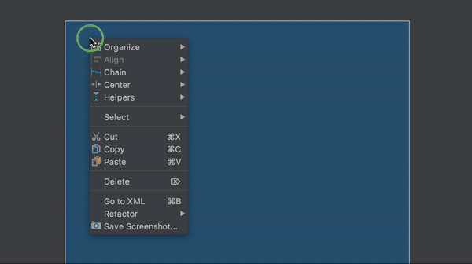
        
    - **Barriers:**
        Barriers are one of my favourite features in ConstraintLayout. A barrier is an invisible view that contains reference to the views that you wish to use to form a “barrier” against. If one of the views grows, the barrier will adjust its size to the largest height or width of the referenced items. Barriers can be vertical or horizontal and can be created to the top, bottom, left or right of the referenced views. Other views can then constrain themselves to the barrier.
        
        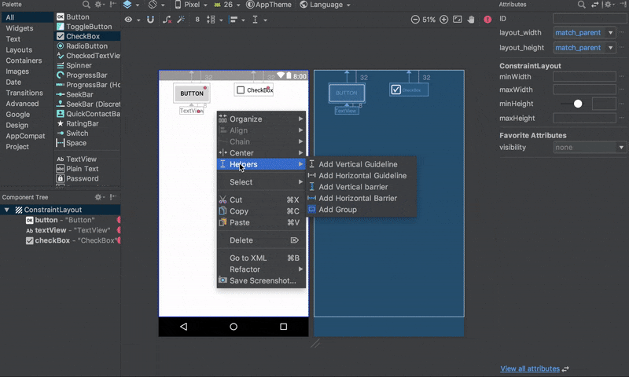

    - **Chains:**
        Chains allow you to control the space between elements and how the elements use the space. To create a chain, select the elements that you want to form part of the chain, and then right click – “Chain” – “Create Horizontal/Vertical Chain”.
       
       You are then able to cycle through the different chain modes. There are four different modes: spread_inside, packed, spread and weighted.
        
        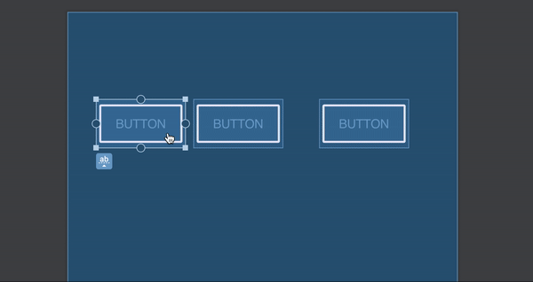
        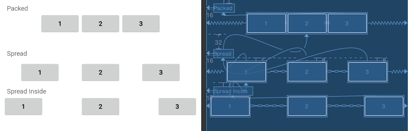


    - **Groups:**
        With groups, you can logically group together certain views. Don’t confuse this with normal ViewGroups in Android though. A group in ConstraintLayout only contains references to the view ids and not nesting the views inside a group. With a group, you can set the visibility of all views in the group, by just setting the groups visibility without needing to set every view’s visibility. This is useful for things such as error screens or loading screens where a few elements need to change their visibility at once.
        
        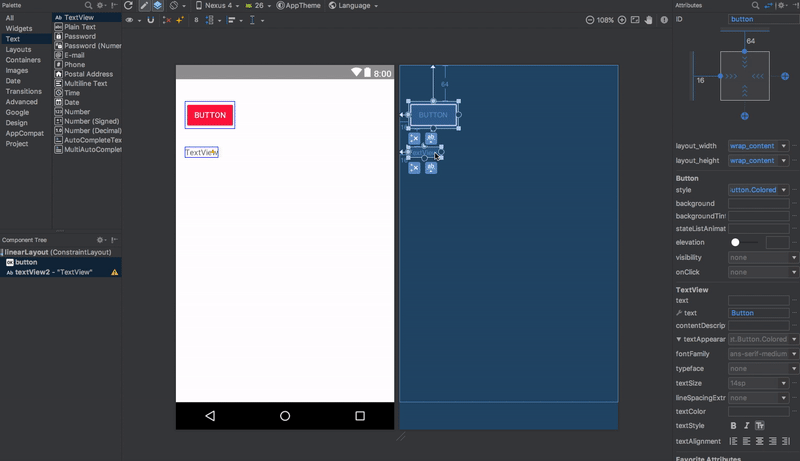


* **Do you know what is the view tree? How can you optimize its depth?** - [Learn more here](https://developer.android.com/reference/android/view/ViewTreeObserver)

* **How does the Touch Control and Events work in Android?** - [Learn more here](https://blog.mindorks.com/touch-control-and-events-in-android) and [here](https://www.youtube.com/watch?v=tKeYr7iV5xE)
 
* **Difference between margin & padding?**</br>
   * Padding will be space added inside the container, for instance, if it is a button, padding will be added inside the button. Margin will be space added outside the container.</br>
   
   
* **What is View Group? How are they different from Views?**</br>
   * **View**: View objects are the basic building blocks of User Interface(UI) elements in Android. View is a simple rectangle box which responds to the user's actions. Examples are EditText, Button, CheckBox etc. View refers to the ```android.view.View``` class, which is the base class of all UI classes.
   * **ViewGroup**: ViewGroup is the invisible container. It holds View and ViewGroup. For example, LinearLayout is the ViewGroup that contains Button(View), and other Layouts also. ViewGroup is the base class for Layouts.</br>   
  
* **What is the difference between a regular .png and a nine-patch image?**</br>
   * It is one of a resizable bitmap resource which is being used as backgrounds or other images on the device. The NinePatch class allows drawing a bitmap in nine sections. The four corners are unscaled; the middle of the image is scaled in both axes, the four edges are scaled into one axis.

        - In general, a Nine-patch image allows resizing that can be used as background or other image size requirements for the target device. The Nine-patch refers to the way you can resize the image: 4 corners that are unscaled, 4 edges that are scaled in 1 axis, and the middle one that can be scaled into both axes.</br>

* **What is the difference between Bitmap and Drawable in Android?**
    - A **Bitmap** is a representation of a bitmap image (something like java.awt.Image).
    - A **Drawable** is an abstraction of "something that can be drawn". It could be a Bitmap (wrapped up as a BitmapDrawable), but it could also be a solid color, a collection of other Drawable objects, or any number of other structures.

* **Raw folder vs Assets folder**
    - The files in both directories will be stored intact in the APK package after being packaged and will not be compiled into binary systems.

        The differences between res/raw and assets:

        - Since `raw` is a subfolder of Resources (`res`), Android will automatically generate an ID for any file located inside it. This ID is then stored an the `R` class that will act as a reference to a file, meaning it can be easily accessed from other Android classes and methods and even in Android XML files. Using the automatically generated ID is the fastest way to have access to a file in Android.
        
        - The Assets folder is an “appendix” directory. The `R` class does not generate IDs for the files placed there, so its less compatible with some Android classes and methods. Also, it’s much slower to access a file inside it, since you will need to get a handle to it based on a String. However some operations are more easily done by placing files in this folder, like copying a database file to the system’s memory. There’s no (easy) way to create an Android XML reference to files inside the Assets folder.


* **@id vs @+id**</br>
    - The at-symbol (`@`) at the beginning of the string indicates that the XML parser should parse and expand the rest of the ID string and identify it as an ID resource. The plus-symbol (`+`) means that this is a new resource name that must be created and added to our resources (in the `R.java` file). In other words, the `+` symbol tells Android build tools that you are declaring a new resource, `@id/` you are referring to an existing resource (predefined by `@+id/` and already exists in `R.java`.
    

* **nodpi VS anydpi**</br>
   * **nodpi: Fallback** 
        - A drawable inside the `res/drawable-nodpi/`  folder is valid for any screen density. Eg. **drawable-nodpi/ic_icon.png**
        The above icon will will look small on `xxxhdpi` devices and big on `ldpi` devices.

            **drawable-hdpi/ic_icon.png** **drawable-nodpi-21/ic_icon.xml**
            In android 21 hdpi devices `ic_icon.png` will be used and in android 21 xhdpi devices `ic_icon.xml` will be used.

   * **anydpi: Takeover** 
        - A drawable inside `drawable-anydpi`  is also valid for any screen
        density but anydpi variant has more priority over any density specific variant.

            Eg. If we have **res/drawable-anydpi/ic_icon.xml** and  **res/drawable-xxxhdpi/ic_icon.png** then `ic_icon.xml` will be used even in xxxhdpi devices.

            Most of the times `-anydpi` used in conjunction with other qualifiers. A good example is  `anydpi-v21` as vector drawables were introduced in android 21 , so after that  we usually have `res/drawable-anydpi-v21/ic_icon.xml` (Vector drawable) and `res/drawable-xxhdpi/ic_icon.png`. The vector drawable (`ic_icon.xml`) will be used in all android 21+ devices and `ic_icon.png` will be used in xxhdpi devices runing in android 4.4 or older
   
* **When might you use a FrameLayout?**</br>
   * Frame Layouts are designed to contain a single item, making them an efficient choice when you need to display a single View.
       If you add multiple Views to a FrameLayout then it’ll stack them one above the other, so FrameLayouts are also useful if you need overlapping Views, for example if you’re implementing an overlay or a HUD element.</br> 
   

* **How to support different screen sizes?**</br>
   * **Use ConstraintLayout**
        The best way to create a responsive layout for different screen sizes is to use ConstraintLayout as the base layout in your UI. ConstraintLayout allows you to specify the position and size for each view according to spatial relationships with other views in the layout. This way, all the views can move and stretch together as the screen size changes.
        The easiest way to build a layout with ConstraintLayout is to use the Layout Editor in Android Studio. It allows you to drag new views to the layout, attach their constraints to the parent view and other sibling views, and edit the view's properties, all without editing any XML by hand.

    * **Create alternative layouts**
        If the above option doesn't meet your needs,say you need to support a much larger device like tabs,then your app should also provide alternative layout resources to optimize the UI design for certain screen sizes.

   * **Create stretchable nine-patch bitmaps**
        A nine-patch bitmap is basically a standard PNG file, but with an extra 1px border that indicates which pixels should be stretched.As shown in figure below,the intersection between the black lines on the left and top edge is the area of the bitmap that can be stretched.
   * **Avoid hard-coded layout sizes** - Use wrap_content or match_parent. Create alternative layouts - The app should provide alternative layouts to optimize the UI design for certain screen sizes. For eg: different UI for tablets
   * **Use the smallest width qualifier**.  For example, you can create a layout named main_activity that's optimized for handsets and tablets by creating different versions of the file in directories as follows:            
      * res/layout/main_activity.xml           # For handsets (smaller than 600dp available width)                      
      * res/layout-sw600dp/main_activity.xml   # For 7” tablets (600dp wide and bigger). 
      * The smallest width qualifier specifies the smallest of the screen's two sides, regardless of the device's current orientation, so it's a simple way to specify the overall screen size available for your layout.
        
        ```
        MyProject/
            res/
                layout/ # default (portrait)
                    main.xml
                layout-land/ # landscape
                    main.xml
                layout-large/ # large (portrait)
                        main.xml
                    layout-large-land/ # large landscape
                        main.xml    ```

    [Learn more here](https://developer.android.com/training/multiscreen/screensizes)
  
* **Outline the process of creating custom Views:**</br>
   * Create a class that Subclass a view
   * Create a res/values/attrs.xml file and declare the attributes you want to use with your custom View.
   * In your View class, add a constructor method, instantiate the Paint object, and retrieve your custom attributes.
   * Override either onSizeChanged() or onMeasure().
   * Draw your View by overriding onDraw().
  
  [Sample Implementation](https://code.tutsplus.com/tutorials/android-sdk-creating-custom-views--mobile-14548) or [Learn more here](https://blog.mindorks.com/create-your-own-custom-view)
   
- **Explain how to present different styles/drawables for a button depending
on the state of the button (pressed, selected, etc.) using XML**
    - A StateListDrawable is a drawable object defined in XML that uses a several different images to represent the same graphic, depending on the state of the object. For example, a Button widget can exist in one of several different states (pressed, focused, or neither) and, using a state list drawable, you can provide a different background image for each state.

        You can describe the state list in an XML file. Each graphic is represented by an <item> element inside a single <selector> element. Each <item> uses various attributes to describe the state in which it should be used as the graphic for the drawable.

        During each state change, the state list is traversed top to bottom and the first item that matches the current state is used—the selection is not based on the "best match," but simply the first item that meets the minimum criteria of the state.

    [Learn more here](http://developer.android.com/guide/topics/resources/drawable-resource.html#StateList)
  
* **Briefly describe some ways that you can optimize View usage**</br>
   * Checking for excessive overdraw: install your app on an Android device, and then enable the "Debug GPU Overview" option.
   * Flattening your view hierarchy: inspect your view hierarchy using Android Studio’s ‘Hierarchy Viewer’ tool.
   * Measuring how long it takes each View to complete the measure, layout, and draw phases. You can also use Hierarchy Viewer to identify any parts of the rendering pipeline that you need to optimize.</br>
   
   
* **Bitmap pooling in android?**</br>
   * Bitmap pooling is a simple technique, that aims to reuse bitmaps instead of creating new ones every time. When you need a bitmap, you check a bitmap stack to see if there are any bitmaps available. If there are not bitmaps available you create a new bitmap otherwise you pop a bitmap from the stack and reuse it. Then when you are done with the bitmap, you can put it on a stack. 

    [Find more info here](https://www.linkedin.com/pulse/performance-improvement-bitmap-pooling-android-ali-muzaffar/) or [Learn more here](https://blog.mindorks.com/how-to-use-bitmap-pool-in-android-56c71a55533c)</br>
   
* **How would you implement swipe animation in Android**</br> 
   ```
   <set xmlns:android="http://schemas.android.com/apk/res/android"
     android:shareInterpolator="false">
    <translate android:fromXDelta="-100%" android:toXDelta="0%"
             android:fromYDelta="0%" android:toYDelta="0%"
             android:duration="700"/>
    </set>
    ```   

* **Is it possible to create an activity in Android without a user interface ?**
    - Yes, an activity can be created without any user interface. These activities are treated as abstract activities.

* **How to play sounds in Android?** - [Learn more here](https://blog.mindorks.com/using-mediaplayer-to-play-an-audio-file-in-android)

* **How image compression is preformed?** - [Learn more here](https://blog.mindorks.com/understanding-image-compression-in-android)

* **How to load bitmap to memory?**</br>
   * [Find more info here](https://android.jlelse.eu/loading-large-bitmaps-efficiently-in-android-66826cd4ad53) or Learn more here](https://developer.android.com/topic/performance/graphics/load-bitmap) and [here](https://developer.android.com/topic/performance/graphics/manage-memory)</br>   

* **What are the best practices for using text in Android?** - [Learn more here](https://blog.mindorks.com/best-practices-for-using-text-in-android)

* **Explain about Density Independence Pixel** - [Learn more here](https://blog.mindorks.com/understanding-density-independent-pixel-sp-dp-dip-in-android)

* **How to check if Software keyboard is visible or not?** 
    - With the help of viewTreeObserver, we can find if there is some change in the viewGroup in a particular activity or not. After that, we can find the height of the current screen and then the height of the keyboard and by using this height we can determine if the keyboard is visible or not.

    [Learn more here](https://blog.mindorks.com/how-to-check-the-visibility-of-software-keyboard-in-android)

* **How to take screenshot in Android programmatically?** - [Learn more here](https://blog.mindorks.com/how-to-programmatically-take-a-screenshot-on-android)

* **How to handle multi-touch in android?** - [Learn more here](https://developer.android.com/training/gestures/multi)

* **How to implement XML namespaces?** - [Learn more here](https://developer.android.com/reference/javax/xml/namespace/NamespaceContext)
  

#### DIALOGS AND TOAST


* **What is `Dialog` in Android?** 
    - A dialog is a small window that prompts the user to make a decision or enter additional information. A dialog does not fill the screen and is normally used for modal events that require users to take an action before they can proceed.

    [Learn more here](https://developer.android.com/guide/topics/ui/dialogs)

* **Which dialog boxes are supported by android?**
    - Android supports 4 dialog boxes:
        - **AlertDialog**: Alert dialog box supports 0 to 3 buttons and a list of selectable elements which includes check boxes and radio buttons.

        - **ProgressDialog**: This dialog box is an extension of AlertDialog and supports adding buttons. It displays a progress wheel or bar.

        - **DatePickerDialog**: The user can select the date using this dialog box.

        - **TimePickerDialog**: The user can select the time using this dialog box.


* **What is `Toast` in Android?** 
    - Android Toast can be used to display information for the short period of time. A toast contains message to be displayed quickly and disappears after sometime.

    [Learn more here](https://developer.android.com/guide/topics/ui/notifiers/toasts)

* **What are Loaders in Android?**</br>
   - Loader API was introduced in API level 11 and is used to load data from a data source to display in an activity or fragment. Loaders persist and cache results across configuration changes to prevent duplicate queries.
      
        **Note**: (Loader is Deprecated. We Have to use combination of ViewModels and LiveData instead of using Loaders) A Loader is used to fetch the data from a Content provider and cache the results across the configuration changes to avoid duplicate queries. Few implementations of Loaders like CursorLoader can implement an observer to monitor any data changes and can then trigger a reload.
       
       [Sample Implementation](https://medium.com/mindorks/a-journey-to-the-world-of-mvp-and-loaders-part-2-e176200e5866) </br>
   
* **What the difference between `Dialog` and `Dialog Fragment`?** 
   
    - The `Dialog` class is the base class for dialogs, but you should avoid instantiating `Dialog` directly. Instead, use one of it's subclasses. `Dialogs` are entirely dependent on Activities. If the screen is rotated, the dialog is dismissed. 

        A `DialogFragment` is a fragment that displays a dialog window, floating on top of its activity's window. This fragment contains a `Dialog` object, which it displays as appropriate based on the fragment's state. Using `DialogFragment` to manage the dialog ensures that it correctly handles lifecycle events such as when the user presses the Back button or rotates the screen. 

    [Learn more here](https://stackoverflow.com/questions/7977392/android-dialogfragment-vs-dialog)


#### CONTENT PROVIDERS

* **What is a content providers and what is it typically used for?**</br>
  * A ContentProvider provides data from one application to another, when requested. It manages access to a structured set of data.  It provides mechanisms for defining data security. ContentProvider is the standard interface that connects data in one process with code running in another process.</br>  
 
  * When you want to access data in a **ContentProvider**, you must instead use the ContentResolver object in your application’s Context to communicate with the provider as a client. The provider object receives data requests from clients, performs the requested action, and returns the results.

  * ContentProvider is mainly used for access data from one application to another application. For example by using ContentProvider we can get phone contacts,call log from phone to our own application in android. we can also access data which are stored in (sqlite)databases. 

  [Learn more here](http://developer.android.com/guide/topics/providers/content-providers.html)


* **What is ContentProviders typically used for and how works?**
    - You need to build a content provider if you want to provide one or more of the following features:
        - You want to offer complex data or files to other applications.
        - You want to allow users to copy complex data from your app into other apps.
        - You want to provide custom search suggestions using the search framework.
        - You want to expose your application data to widgets.
        - You want to implement the `AbstractThreadedSyncAdapter`, `CursorAdapter`, or `CursorLoader` classes.
    
        You don't need a provider to use databases or other types of persistent storage if the use is entirely within your own application and you don’t need any of the features listed above.

        To understand how it works, consider the following diagram:

    

* **Content URIs**
    - Content URIs are the uniform resource identifiers that identify the data in the content providers. A content URI includes two things: *Authority* that is the symbolic name of the Provider and a *Path* that is a name that points towards the data. Every content provider methods have an argument which is URI. URIs for content providers look like this:

        `content://<authority>/<path>/<optional_id>`

        - **content://** – It’s always present, and is the scheme portion of the URI.
        - **authority** – It is the unique name of the content provider, like photos, contacts. It’s a string that can identify the whole content provider.
        - **path** – It is often used to identify some or the other data of the provider. The path is mostly used to identify individual tables.
        - **optional_id** – id is used to access a single particular record of a file. We use this only in cases where we need to access only a particular record and not the complete file. It’s a numeric identifier to access a particular row of the data table.
        <br>
    * **Access data using Content Provider:**</br>
      * Start by making sure your Android application has the necessary read access permissions. Then, get access to the ContentResolver object by calling getContentResolver() on the Context object, and retrieving the data by constructing a query using ContentResolver.query().</br>
    
      * The ContentResolver.query() method returns a Cursor, so you can retrieve data from each column using Cursor methods.</br> 

* **What are contract classes?** 
    - A contract class is a public final class that contains constant definitions for the URIs, column names, MIME types, and other meta-data about the ContentProvider. It can also contain static helper methods to manipulate the URIs.

        Why is it used?

            - The Contract Class establishes a contract between the content provider and other applications. It ensures that your content provider can be accessed correctly even if there are changes to the actual values of URIs, column names etc.
            
            - Since it provides mnemonic names for its constants, developers are less likely to use incorrect values for column names or URIs.
            
            - It's easy to make the Javadoc documentation available to the clients that want to use your content provider.

    [Learn more here](https://stackoverflow.com/a/36265603/497132)      


#### INTENTS AND BROADCASTING


* **What are the ways to pass data between activities?**
    - Using Static Method: You can use static Method to get data from one activity to another activity.
    - Using Intents
    - Bundle Method


* **Describe three common use cases for using an Intent**
    - Common use cases for using an Intent include:

        - To start an activity: You can start a new instance of an Activity by passing an Intent to startActivity() method.
        
        - To start a service: You can start a service to perform a one-time operation (such as download a file) by passing an Intent to startService().

        - To deliver a broadcast: You can deliver a broadcast to other apps by passing an Intent to sendBroadcast(), sendOrderedBroadcast(), or sendStickyBroadcast().

* **What is an intent?**</br>
    - Intents are messages that can be used to pass information to the various components of android. For instance, launch an activity, open a webview etc.
    
        Exist two types of intents:
        
        * **Implicit:** Implicit intent is when you call system default intent like send email, send SMS, dial number.</br>
        * **Explicit:** Explicit intent is when you call an application activity from another activity of the same application.</br>
    
    [Learn more here](https://blog.mindorks.com/what-are-intents-in-android) or [here](http://developer.android.com/guide/components/intents-filters.html)

* **What is an Explicit `Intent`?** 
    - If you want communication between the components of your application only then you can use the Explicit Intents. Explicit Intents are used to communicate with a particular component of the same application. For example, if you want to launch an Activity by clicking some button on the present Activity then you can specify the fully-qualified address of the desired Activity to launch that Activity. Since this approach requires a fully-qualified address, so, you can use this approach in your own application i.e. you can use Explicit Intents to have communication in your own application.

    For example, if you built a service in your app, named DownloadService, designed to download a file from the web.

    [Learn more here](https://blog.mindorks.com/what-are-intents-in-android) or [here](https://developer.android.com/guide/components/intents-filters.html#ExampleExplicit)

* **What is an Implicit `Intent`?** 
    - Here, you don’t need to specify the fully-qualified address. All you need to do is just specify the action that is to be performed by an Intent. By using the Implicit Intents you can communicate between various applications present in the mobile device. For example, you can access the current location by accessing the location data from other application also i.e. if one application A is detecting the current location of the user then you can use the data of the user i.e. the current location by communicating with application A.

    For example, if you have content that you want the user to share with other people, create an intent with the ACTION_SEND action and add extras that specify the content to share. When you call startActivity() with that intent, the user can pick an app through which to share the content.

    **Caution**: It's possible that a user won't have any apps that handle the implicit intent you send to startActivity(). Or, an app may be inaccessible because of profile restrictions or settings put into place by an administrator. If that happens, the call fails and your app crashes. To verify that an activity will receive the intent, call resolveActivity() on your Intent object. If the result is non-null, there is at least one app that can handle the intent and it's safe to call startActivity(). If the result is null, do not use the intent and, if possible, you should disable the feature that issues the intent. The following example shows how to verify that the intent resolves to an activity. This example doesn't use a URI, but the intent's data type is declared to specify the content carried by the extras.

    [Learn more here](https://blog.mindorks.com/what-are-intents-in-android) or [here](https://developer.android.com/guide/components/intents-filters.html#ExampleSend)
        
* **How you can force an app chooser?**
    - When there is more than one app that responds to your implicit intent, the user can select which app to use and make that app the default choice for the action. The ability to select a default is helpful when performing an action for which the user probably wants to use the same app every time, such as when opening a web page (users often prefer just one web browser).

    However, if multiple apps can respond to the intent and the user might want to use a different app each time, you should explicitly show a chooser dialog. The chooser dialog asks the user to select which app to use for the action (the user cannot select a default app for the action). For example, when your app performs "share" with the ACTION_SEND action, users may want to share using a different app depending on their current situation, so you should always use the chooser dialog.

    To show the chooser, create an Intent using createChooser() and pass it to startActivity(), as shown in the following example. This example displays a dialog with a list of apps that respond to the intent passed to the createChooser() method and uses the supplied text as the dialog title.

* **What is an ACTION?**</br>
  * Description of the intent. For instance, ACTION_CALL - used to perform calls</br>

* **What is a bundle?**
    - Bundles are generally used for passing data between various Android activities. It depends on you what type of values you want to pass, but bundles can hold all types of values and pass them to the new activity.


* **Diference Intent vs Bundle**
    - Bundle can operate on objects, but Intent can’t. Bundle has more interfaces than Intent and is more flexible to use, but using Bundle also needs Intent to complete data transfer. In a word, Bundle aims to store data, while Intent aims to transfer value.

    [Learn more here](https://developpaper.com/the-difference-between-android-value-passing-intent-and-bundle/)


* **What is a Sticky `Intent`?**
    - Sticky Intents allows communication between a function and a service.
    sendStickyBroadcast() performs a sendBroadcast(Intent) known as sticky, i.e. the Intent you are sending stays around after the broadcast is complete, so that others can quickly retrieve that data through the return value of registerReceiver(BroadcastReceiver, IntentFilter). For example, if you take an intent for ACTION_BATTERY_CHANGED to get battery change events: When you call registerReceiver() for that action — even with a null BroadcastReceiver — you get the Intent that was last Broadcast for that action. Hence, you can use this to find the state of the battery without necessarily registering for all future state changes in the battery.
    
    [Learn more here](https://stackoverflow.com/a/26038985/497132)

*   **What is the difference between START_NOT_STICKY, START_STICKY AND START_REDELIVER_INTENT?**
    - **START_NOT_STICKY:**
    If the system kills the service after onStartCommand() returns, do not recreate the service unless there are pending intents to deliver. This is the safest option to avoid running your service when not necessary and when your application can simply restart any unfinished jobs.
    - **START_STICKY:**
    If the system kills the service after onStartCommand() returns, recreate the service and call onStartCommand(), but do not redeliver the last intent. Instead, the system calls onStartCommand() with a null intent unless there are pending intents to start the service. In that case, those intents are delivered. This is suitable for media players (or similar services) that are not executing commands but are running indefinitely and waiting for a job.
   
    - **START_REDELIVER_INTENT:**
    If the system kills the service after onStartCommand() returns, recreate the service and call onStartCommand() with the last intent that was delivered to the service. Any pending intents are delivered in turn. This is *suitable for services that are actively performing a job that should be immediately resumed, such as downloading a file.*

* **What is a Pending Intent?**</br>
    - PendingIntent is a token that you give to a foreign application (e.g. NotificationManager, AlarmManager, Home Screen AppWidgetManager, or other 3rd party applications), which allows the foreign application to use your application's permissions to execute a predefined piece of code. It specifies a task that requires to be performed in future.
  
        If you want someone to perform any Intent operation at future point of time on behalf of you, then we will use Pending Intent. </br>
  

* **What is the function of an `IntentFilter`?**  
    -  Intent filters are a very powerful feature of the Android platform. They provide the ability to launch an activity based not only on an explicit request, but also an implicit one. For example, an explicit request might tell the system to “Start the Send Email activity in the Gmail app". By contrast, an implicit request tells the system to “Start a Send Email screen in any activity that can do the job." When the system UI asks a user which app to use in performing a task, that’s an intent filter at work. 

    Here's an example of how to declare Intent Filter in AndroidManifest:
        
 ```
        <activity android:name=".ExampleActivity" android:icon="@drawable/app_icon">
          <intent-filter>
              <action android:name="android.intent.action.SEND" />
              <category android:name="android.intent.category.DEFAULT" />
              <data android:mimeType="text/plain" />
          </intent-filter>
        </activity>
```

[Learn more here](https://developer.android.com/reference/android/content/IntentFilter)

* **Difference between Service & Intent Service**</br>
  * **Service** is the base class for Android services that can be extended to create any service. A class that directly extends Service runs on the main thread so it will block the UI (if there is one) and should therefore either be used only for short tasks or should make use of other threads for longer tasks.</br>  
  * **IntentService** is a subclass of Service that handles asynchronous requests (expressed as “Intents”) on demand. Clients send requests through startService(Intent) calls. The service is started as needed, handles each Intent in turn using a worker thread, and stops itself when it runs out of work. Writing an IntentService can be quite simple; just extend the IntentService class and override the onHandleIntent(Intent intent) method where you can manage all incoming requests.

    | `Service`  | `IntentService`  |
    |---|---|
    | Is invoked using `startService()`  | Is invoked using `Intent` |
    | Can be invoked from any thread  | Can in invoked from the Main thread only  |
    | Runs background operations on the Main Thread of the Application by default. Hence it can block your Application’s UI  | Creates a separate   worker thread to run background operations  |
    | Invoked multiple times would create multiple instances.  |  Invoked   multiple times won’t create multiple instances |
    | Needs to be stopped using `stopSelf()` or `stopService()`  | Automatically    stops after the queue is completed. No need to trigger `stopService()` or `stopSelf()`  |
    | Can run parallel operations  | Multiple intent calls are automatically queued and they would be executed sequentially |

    [Learn more here](https://stackoverflow.com/a/15772151/497132) or [here](https://blog.mindorks.com/service-vs-intentservice-in-android)
  

* **An Intent can it be used to provide data to a ContentProvider? Why or why not?**
    - The Intent object is a common mechanism for starting new activity and transferring data from one activity to another. However, you cannot start a ContentProvider using an Intent.

        When you want to access data in a ContentProvider, you must instead use the ContentResolver object in your application’s Context to communicate with the provider as a client. The ContentResolver object communicates with the provider object, an instance of a class that implements ContentProvider. The provider object receives data requests from clients, performs the requested action, and returns the results.


* **What are "launch modes"?** 
    - Manifest file. When declaring an activity in a manifest file, you can specify how the activity should associate with tasks when it starts. Supported values include:
       * **Standard**: It creates a new instance of an activity in the task from which it was started. Multiple instances of the activity can be created and multiple instances can be added to the same or different tasks. 
         * Example: Suppose there is an activity stack of A -> B -> C. Now if we launch B again with the launch mode as “standard”, the new stack will be A -> B -> C -> B.
         
       * **SingleTop**: It is the same as the standard, except if there is a previous instance of the activity that exists in the top of the stack, then it will not create a new instance but rather send the intent to the existing instance of the activity. 
         * Example: Suppose there is an activity stack of A -> B. Now if we launch C with the launch mode as “singleTop”, the new stack will be A -> B -> C as usual. 
         * Now if there is an activity stack of A -> B -> C. If we launch C again with the launch mode as “singleTop”, the new stack will still be A -> B -> C.
       * **SingleTask**: A new task will always be created and a new instance will be pushed to the task as the root one. So if the activity is already in the task, the intent will be redirected to onNewIntent() else a new instance will be created. At a time only one instance of activity will exist. 
         * Example: Suppose there is an activity stack of A -> B -> C -> D. Now if we launch D with the launch mode as “singleTask”, the new stack will be A -> B -> C -> D as usual. 
         * Now if there is an activity stack of A -> B -> C -> D.  If we launch activity B again with the launch mode as “singleTask”, the new activity stack will be A -> B. Activities C and D will be destroyed.
       * **SingleInstance**: Same as single task but the system does not launch any activities in the same task as this activity. If new activities are launched, they are done so in a separate task. 
         * Eg: Suppose there is an activity stack of A -> B -> C -> D. If we launch activity B again with the launch mode as “singleTask”, the new activity stack will be: 
         * Task1 — A -> B -> C  and Task2 — D
         
       
-   Intent flags. Calls to startActivity() can include a flag in the Intent that declares if and how the new activity should be associated with the current task. Supported values include:
    - FLAG_ACTIVITY_NEW_TASK. Same as singleTask value in Manifest file (see above).
    - FLAG_ACTIVITY_SINGLE_TOP. Same as singleTop value in Manifest file (see above).
    - FLAG_ACTIVITY_CLEAR_TOP. If the activity being started is already running in the current task, then instead of launching a new instance of that activity, all of the other activities on top of it are destroyed and this intent is delivered to the resumed instance of the activity (now on top), through onNewIntent(). There is no corresponding value in the Manifest file that produces this behavior.

    [Learn more here](https://blog.mindorks.com/android-activity-launchmode-explained-cbc6cf996802) or [here](https://android.jlelse.eu/android-activity-launch-mode-e0df1aa72242)


* **Describe how broadcasts and intents work to be able to pass messages around your app?** 
    - a

    [Learn more here](https://stackoverflow.com/questions/7276537/using-a-broadcast-intent-broadcast-receiver-to-send-messages-from-a-service-to-a) or [here](http://www.techotopia.com/index.php/Android\_Broadcast\_Intents\_and\_Broadcast\_Receivers)

* **What is a `BroadcastReceiver`?** 
    - In Android, we use a Broadcast Receiver to send a particular message to every application that is associated with that specific Broadcast. It is same as that of Youtube channel subscription. If you have subscribed to a Youtube channel then whenever the creator of the channel will upload some video you will be notified about the same. So, in the same way, Android applications can subscribe or register to certain system events like battery low and in return, these applications will get notified whenever the subscribed event will occur. But these are Global Broadcasts and should not be used in every case because it has some demerits.

    The whole process of using Broadcast can be divided into two parts:

        - **Register Broadcast**: Firstly, you have to register for a broadcast in your application. For example, if you want to receive the Battery low event, then you have to register this in your application. So, to register a particular broadcast in your application, you have two options, either you can register the event in the AndroidManifest.xml file of your application or you can register the broadcast via the Context.registerReceiver() method.

        - **Receiver Broadcast**: By extending the BroadcastReceiver abstract class, you can receive the broadcast in your application. After extending, all you need to do is override the onReceive() method and perform the required action in the onReceive() method because this onReceive() method will be called when a particular broadcast is received.
    
    [Learn more here](https://developer.android.com/guide/components/broadcasts)

* **What is a `LocalBroadcastManager`?** 
    - If the communication is not between different applications on the Android device then is it suggested not to use the Global BroadcastManager because there can be some security holes while using Global Broadcastmanager and you don’t have to worry about this if you are using LocalBroadcastManager.LocalBroadcastManager is used to register and send a broadcast of intents to local objects in your process. 


    [Learn more here](https://blog.mindorks.com/using-localbroadcastmanager-in-android) or [here](https://github.com/Kirchhoff-/Android-Interview-Questions/blob/master/Android/What's%20BroadcastReceiver.md)

* **What are the different types of Broadcasts?**
    - **Normal Broadcast**:
        - use sendBroadcast()
        - asynchronous broadcast
        - any receiver receives broadcast not any particular order
    - **Ordered Broadcast**:
        - use sendOrderedBroadcast()
        - synchronous broadcast
        - receiver receives broadcast in priority base
        - we can also simply abort broadcast in this type
    - **Local Broadcast**:
        - use only when broadcast is used only inside application
       
    - **Sticky Broadcast**:
        - normal broadcast intent is not available any more after is was send and processed by the system.
        - use sendStickyBroadcast(Intent)
        - the corresponding intent is sticky, meaning the intent you are sending stays around after the broadcast is complete.
        - because of this others can quickly retrieve that data through the return value of registerReceiver(BroadcastReceiver, IntentFilter).
        - apart from this same as sendBroadcast(Intent).
    [Learn more here](https://medium.com/@saranyaan2710/android-broadcast-receivers-4bf65f8b3592)


#### SERVICES

* **What is `Serivce`?** 
    - A Service is an application component that can perform long-running operations in the background, and it doesn't provide a user interface. It can run in the background, even when the user is not interacting with your application. These are the three different types of services:
        - Foreground Service: A foreground service performs some operation that is noticeable to the user. For example, we can use a foreground service to play an audio track. A [Notification](https://developer.android.com/guide/topics/ui/notifiers/notifications.html) must be displayed to the user
       
        - Background Service: A background service performs an operation that isn’t directly noticed by the user. In Android API level 26 and above, there are restrictions to using background services and it is recommended to use [WorkManager](https://developer.android.com/topic/libraries/architecture/workmanager) in these cases.
        
        - Bound Service: A service is bound when an application component binds to it by calling bindService(). A bound service offers a client-server interface that allows components to interact with the service, send requests, receive results. A bound service runs only as long as another application component is bound to it.</br> 

    [Learn more here](https://developer.android.com/guide/components/services)

* **What we need to make a service persist even after Application killed?**
    - Activity
    - A service — we all know what this will be doing
    - A broadcast Receiver — This will enable us to restart the service whenever the application is killed or the Service itself is being killed or stopped

        [Learn more here](https://codkiller0911.medium.com/a-never-ending-service-android-12ffaf94d6ad)    

* **What is Service Lifecycle?** 

    

* **Difference between Activity & Service**</br>
    - Activities are basically containers or windows to the user interface. 
  Services is a component that is used to perform operations on the background. It does not have an UI.</br>

 -  **How to Stop a Service?**<br/>
    - To stop a service from an activity we can call stopService(Intent intent) method. To Stop a service from itself, we can call stopSelf() method.
    
-   **When does a Bound Service stops?**<br/>
    - A Bound Service will stop automatically by the system when all the Application Components bound to it are unbinded.

-   **What is the method that differentiates it to make Service run in background?**<br/>
    - onHandleIntent() is the method that helps the IntentService to run a particular code block declared inside it, in worker/background thread.

-   **How to Stop an IntentService?**<br/>
    - An IntentService automatically stops itself after its job is done. We do not need to explicitly call any methods to stop an IntentService unlike Service which requires stopSelf() or StopService(intent:Intent).

-   **When Intent Service is Useful?**<br/>
    - The IntentService can be used in long tasks usually with no communication to Main Thread. If communication is required, can use Main Thread handler or broadcast intents. Another case of use is when callbacks are needed (Intent triggered tasks).

* **How would you update the UI of an activity from a background service**</br>
  * We need to register a LocalBroadcastReceiver in the activity. And send a broadcast with the data using intents from the background service. As long as the activity is in the foreground, the UI will be updated from the background. Ensure to unregister the broadcast receiver in the onStop() method of the activity to avoid memory leaks. 
We can also register a Handler and pass data using Handlers. I have detailed a sample implementation on this. You can check it out [here](https://medium.com/@anitaa_1990/how-to-update-an-activity-from-background-service-or-a-broadcastreceiver-6dabdb5cef74)</br>

* **How all the activities that are running run in main thread?**
    - All the applications that are running or can be accessed runs in main thread of user interface by default. The modification can be done to make it run differently or to make it run or not at all. The exception also comes defining that the code handles the IPC calls that are coming from other processes. The system used to maintain separate pools for all the processes and threads. One pool consists of the transaction threads that are in each process to dispatch all the incoming calls. It also allows the interpersonal calls to be handled in a specialized manner. This allows the creation of separate threads that is used for long-running code, and to avoid blocking of the main user interface threads. The services that run can be killed by the system if it is going out of memory. The system restart the service and implement onStartCommand() to bring the activities back in the memory pool.


* **What is an AsyncTask?**
    - `AsyncTask` is one of the easiest ways to implement parallelism in Android without having to deal with more complex methods like Threads. Though it offers a basic level of parallelism with the UI thread, it should not be used for longer operations (of, say, not more than 2 seconds).

        AsyncTask has four methods: 
        - **onPreExecute()** --> This method is invoked just before the background thread is created and here we can do some initialisation that we might want to do before the background thread starts the task.
    It is used to basically setup a task. Ex: showing a Progress Bar,etc.
    It runs on the main UI thread.
    
        - **doInBackground(Params...)** --> This method is invoked on the background thread immediately after onPreExecute has finished executing and is used to perform the task which is supposed to be run on the background thread.This method can also call publishProgress(Progress...) method to puclish progress on the main UI thread which is received by the onProgressUpdate(Progress...) method.
    Ex: Fetching results from a network request, etc. 
    It runs on the background thread.
        - **publishProgress()** --> This method can optionally be called within the doInBackground() method to publish progress to the main UI thread and show that progress to the user.
    It can be called several times within the doInBackground to keep the user updated about the progress of the task happening.
        - **onProgressUpdate(Progress...)** --> This method is invoked on the main UI thread just after publishProgress(Progress...) is invoked on the background thread and it receives the current progress and can used to display/update the progress on the main UI. 
    It runs on the main UI thread.
        - **onPostExecute(Result)** --> This method is invoked on the main UI thread just after the background thread has finished executing and has returned the result to this method as seen in the method parameter. The result can be then be used to do anything the developer wants to do with that result. 
    It runs on the main UI thread.

    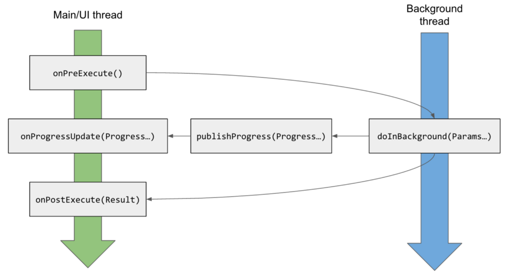

* **Pros and cons of using Async task?**

    - Advantages of AsyncTask

        - Provides generic solution for all network calls
        - Publish progress to UI while executing.
        - Run Asynchronously
        - Easy to maintain and read.

    - Problems in AysncTask

        - When you rotate your screen, Activity gets destroyed, so AsyncTask will not have a valid reference to publish data from onPostExecute(). In order to retain it, you need to usesetRetainState(true) if calling from fragment or onConfigChanges() if calling from activity method of an activity.
        - If activity gets finished, AsyncTask execution will not cancelled automatically, you need to cancel them else they will keep on running in the background.
        - If any exception occurs while performing network task, you need to handle them manually.

        Whereas AsycTask, Services, IntentService, Threads all run on different threads and all serve different purpose. please read more detail here.

        So you need to decide when to use which component while performing non UI operations.

        [Learn more here](https://www.youtube.com/watch?v=ZZ-6nGbfVdA)

  
* **Difference between AsyncTasks & Threads?**</br>
    - For long-running or CPU-intensive tasks, there are basically two ways to do this: Java threads, and Android's native AsyncTask.

        Neither one is necessarily better than the other, but knowing when to use each call is essential to leveraging the system's performance to your benefit.

  * **Thread** should be used to separate long running operations from main thread so that performance is improved. But it can't be cancelled elegantly and it can't handle configuration changes of Android. You can't update UI from Thread.
  
  * **AsyncTask** can be used to handle work items shorter than 5ms in duration. With AsyncTask, you can update UI unlike java Thread. But many long running tasks will choke the performance.</br>
    
    * Use AsyncTask for:
        - Simple network operations which do not require downloading a lot of data
        - Disk-bound tasks that might take more than a few milliseconds

    * Use Java threads for:

        - Network operations which involve moderate to large amounts of data (either uploading or downloading)
        - High-CPU tasks which need to be run in the background
        - Any task where you want to control the CPU usage relative to the GUI thread

    [Learn more here](https://www.vogella.com/tutorials/AndroidBackgroundProcessing/article.html)
 
* **When to use AsyncTask and when to use services?**
    - Services are useful when you want to run code even when your application's Activity isn't open. AsyncTask is a helper class used to run some code in a separate thread and publish results in main thread. Usually AsyncTask is used for small operations and services are used for long running operations.

* **Difference between Service, Intent Service, AsyncTask & Threads**</br>
  * **Android service** is a component that is used to perform operations on the background such as playing music. It doesn’t has any UI (user interface). The service runs in the background indefinitely even if application is destroyed.
  
  * **AsyncTask** allows you to perform asynchronous work on your user interface. It performs the blocking operations in a worker thread and then publishes the results on the UI thread, without requiring you to handle threads and/or handlers yourself
  * **IntentService** is a base class for Services that handle asynchronous requests (expressed as Intents) on demand. Clients send requests through startService(Intent) calls; the service is started as needed, handles each Intent in turn using a worker thread, and stops itself when it runs out of work.
  * A **thread** is a single sequential flow of control within a program. Threads can be thought of as mini-processes running within a main process.
   
     
* **When to use a service and when to use a thread?**
    - We will use a Thread when we want to perform background operations when application is running in foreground. We will use a service even when the application is not running.


* **What are Handlers?**</br>
    - A Handler allows you to send and process Message and Runnable objects associated with a thread's MessageQueue. Each Handler instance is associated with a single thread and that thread's message queue. When you create a new Handler, it is bound to the thread / message queue of the thread that is creating it -- from that point on, it will deliver messages and runnables to that message queue and execute them as they come out of the message queue. We will generally use handler class when we want to repeat task every few seconds.

    Handlers are objects for managing threads. It receives messages and writes code on how to handle the message. They run outside of the activity’s lifecycle, so they need to be cleaned up properly or else you will have thread leaks.
    
    Handlers allow communicating between the background thread and the main thread.
     
    A Handler class is preferred when we need to perform a background task repeatedly after every x seconds/minutes.</br>
  
  
 * **What is a Job Scheduling?**</br>
   * Job Scheduling api, as the name suggests, allows to schedule jobs while letting the system optimize based on memory, power, and connectivity conditions.
        The JobScheduler supports batch scheduling of jobs. The Android system can combine jobs so that battery consumption is reduced. JobManager makes handling uploads easier as it handles automatically the unreliability of the network. It also survives application restarts. 
   
        * Scenarios:
            * Tasks that should be done once the device is connect to a power supply
            * Tasks that require network access or a Wi-Fi connection.
            * Task that are not critical or user facing
            * Tasks that should be running on a regular basis as batch where the timing is not critical
    
    [Learn more here](https://developer.android.com/reference/android/app/job/JobScheduler) or [here](http://www.vogella.com/tutorials/AndroidTaskScheduling/article.html#schedulingtasks) </br>

* **Timer or Handler?**

    - An application often requires repeating certain tasks on a periodic basis or after a certain interval. This functionality can be used for polling new data from the network, running manual animations, or simply updating the UI. These are four common ways to achieve the same:

        - **Handler** — Execute a Runnable task on the UI Thread after an optional delay.
        - **ScheduledThreadPoolExecutor** — Execute periodic tasks with a background thread pool
        - **AlarmManager** — Execute any periodic task in the background as a service
        - **TimerTask** — Doesn’t run in UIThread and is not reliable. Consensus is to never use TimerTask

    - In fact,`Handler` is better than `TimerTask`:

        The Java `TimerTask` and the Android `Handler` both allow you to schedule delayed and repeated tasks on background threads. However, the literature overwhelmingly recommends using `Handler` over `TimerTask` in Android.

        Some of reported problems with TimerTask include:
        - Can't update the UI thread
        - Memory leaks
        - Unreliable (doesn't always work)

* **What is the relationship between the life cycle of an AsyncTask and an Activity? What problems can this result in? How can these problems be avoided?**</br>
   * An AsyncTask is not tied to the life cycle of the Activity that contains it. So, for example, if you start an AsyncTask inside an Activity and the user rotates the device, the Activity will be destroyed (and a new Activity instance will be created) but the AsyncTask will not die but instead goes on living until it completes.
   * Then, when the AsyncTask does complete, rather than updating the UI of the new Activity, it updates the former instance of the Activity (i.e., the one in which it was created but that is not displayed anymore!). This can lead to an Exception (of the type java.lang.IllegalArgumentException: View not attached to window manager if you use, for instance, findViewById to retrieve a view inside the Activity).
   * There’s also the potential for this to result in a memory leak since the AsyncTask maintains a reference to the Activity, which prevents the Activity from being garbage collected as long as the AsyncTask remains alive.
   * For these reasons, using AsyncTasks for long-running background tasks is generally a bad idea . Rather, for long-running background tasks, a different mechanism (such as a service) should be employed.
   * Note: AsyncTasks by default run on a single thread using a serial executor, meaning it has only 1 thread and each task runs one after the other.</br>

-  **What is Alarm Manager?**<br/>
    - AlarmManager is a class which helps scheduling your Application code to run at some point of time or at particular time intervals in future. When an alarm goes off, the Intent that had been registered for it is broadcast by the system, automatically starting the target application if it is not already running. Registered alarms are retained while the device is asleep (and can optionally wake the device up if they go off during that time), but will be cleared if it is turned off and rebooted. 
  
* **Android Bound Service**</br>
  * A bound service is a service that allows other android components (like activity) to bind to it and send and receive data.
A bound service is a service that can be used not only by components running in the same process as local service, but activities and services, running in different processes, can bind to it and send and receive data.</br>
  * When implementing a bound service we have to extend Service class but we have to override onBind method too. This method returns an object that implements IBinder, that can be used to interact with the service.</br>
  * Implementing Android bound service with Android Messenger</br>
  * Service based on Messenger can communicate with other components in different processes, known as Inter Process Communication (IPC), without using AIDL.</br>
  * **A service handler**: this component handles incoming requests from clients that interact with the service itself.</br>
  * **A Messenger**: this class is used to create an object implementing IBinder interface so that a client can interact with the service.</br>

    [Example Implementation](https://www.survivingwithandroid.com/2014/01/android-bound-service-ipc-with-messenger-2.html)
  
* **What is AIDL? Enumerate the steps in creating a bounded service through AIDL.** 
    - The Android Interface Definition Language (AIDL) is similar to other IDLs you might have worked with. It allows you to define the programming interface that both the client and service agree upon in order to communicate with each other using interprocess communication (IPC). On Android, one process cannot normally access the memory of another process. So to talk, they need to decompose their objects into primitives that the operating system can understand, and marshall the objects across that boundary for you. The code to do that marshalling is tedious to write, so Android handles it for you with AIDL.

        To create a bounded service using AIDL, follow these steps:
        - Create the .aidl file
                This file defines the programming interface with method signatures.
            
        - Implement the interface
                The Android SDK tools generate an interface in the Java programming language, based on your .aidl file. This interface has an inner abstract class named Stub that extends Binder and implements methods from your AIDL interface. You must extend the Stub class and implement the methods.

        - Expose the interface to clients
                Implement a Service and override onBind() to return your implementation of the Stub class.

    [Learn more here](https://developer.android.com/guide/components/aidl)

* **AIDL vs Messenger Queue**</br>
  * AIDL is for purpose when you've to go application level communication for data and control sharing, a scenario depicting it can be : An app requires list of all contacts from Contacts app (content part lies here) plus it also wants to show the call's duration and you can also disconnect it from that app (control part lies here).
  * In Messenger queues you're more IN the application and working on threads and processes to manage the queue having messages so no Outside services interference here.</br>
  * Messenger is needed if you want to bind a remote service (e.g. running in another process).</br>


* **What is a ThreadPool? And is it more effective than using several separate Threads?**</br>
  * Creating and destroying threads has a high CPU usage, so when we need to perform lots of small, simple tasks concurrently, the overhead of creating our own threads can take up a significant portion of the CPU cycles and severely affect the final response time.</br>
  * ThreadPool consists of a task queue and a group of worker threads, which allows it to run multiple parallel instances of a task.</br>


* **Explain `Looper`, `Handler` and `HandlerThread`.** - [Learn more here](https://blog.mindorks.com/android-core-looper-handler-and-handlerthread-bd54d69fe91a) and [from video](https://www.youtube.com/watch?v=rfLMwbOKLRk&list=PL6nth5sRD25hVezlyqlBO9dafKMc5fAU2)

-   **How to handle crashing of AsyncTask during screen rotation?**<br/>
    - The best way to handle AsyncTask crash is to create a RetainFragment, i.e., a fragment without UI as shown [here](https://gist.github.com/vamsitallapudi/26030c15829d7be8118e42b1fcd0fa42).
    We can also avoid this crash by using RxJava instead of AsyncTask as we will be subscribing and unsubscribing at onResume() and onPause() methods respectively.

* **Difference between Serializable and Parcelable?**</br>
    - Serializable is a standard Java interface. Parcelable is an Android specific interface where you implement the serialization yourself. It was created to be far more efficient than Serializable (The problem with this approach is that reflection is used and it is a slow process. This mechanism also tends to create a lot of temporary objects and cause quite a bit of garbage collection.).
    
        Serialization is the process of converting an object into a stream of bytes in order to store an object into memory, so that it can be recreated at a later time, while still keeping the object's original state and data.
How to disallow serialization? We can declare the variable as transient.
    
        Parcelable is faster than Serializable interface
        * Parcelable interface takes more time to implement compared to Serializable interface (with Kotlin this is not true)
        * Serializable interface is easier to implement
        * Serializable interface creates a lot of temporary objects and causes quite a bit of garbage collection

        Serializable uses reflection while for parcelable, developers from android team wrote custom code that performs manual marshalling(converting data into byte stream) and unmarshalling(converting the byte stream back to their original data). Usually Parcelable is considered faster than Serializable.

    [Learn more here](https://stackoverflow.com/a/50114007/497132)


#### TASKS AND INTER-PROCESS COMMUNICATION

* **What is IPC?**
    - IPC is inter-process communication. It describes the mechanisms used by different types of android components to communicate with one another:

        - **Intents** are messages which components can send and receive. It is a universal mechanism of passing data between processes. With help of the intents one can start services or activities, invoke broadcast receivers and so on.

        - **Bundles** are entities of data that is passed through. It is similar to the serialization of an object, but much faster on android. Bundle can be read from intent via the getExtras() method.

        - **Binders** are the entities which allow activities and services to obtain a reference to another service. It allows not simply sending messages to services but directly invoking methods on them.


* **Is it possible to run an Android app in multiple processes? How?** 
    - You can specify android:process=":remote" in your manifest to have an activity/service run in a seperate process.

        The "remote" is just the name of the remote process, and you can call it whatever you want. If you want several activities/services to run in the same process, just give it the same name.

    [Learn more here](https://stackoverflow.com/questions/6567768/how-can-an-android-application-have-more-than-one-process)

* **What can you use for background processing in Android?** 
    - The following sections describe recommended solutions for each background task type.
        - **Immediate tasks**:
            We recommend Kotlin coroutines for tasks that should end when the user leaves a certain scope or finishes an interaction. Many Android KTX libraries contain ready-to-use coroutine scopes for common app components like ViewModel and common application lifecycles.

            For Java programming language users, see Threading on Android for recommended options.

            For tasks that should be executed immediately and need continued processing, even if the user puts the application in background or the device restarts, we recommend using WorkManager and its support for long-running tasks.

            In specific cases, such as with media playback or active navigation, you might want to use foreground Services directly.

        - **Deferred tasks**:
            Every task that is not directly connected to a user interaction and can run at any time in the future can be deferred. The recommended solution for deferred tasks is WorkManager.

            WorkManager makes it easy to schedule deferrable, asynchronous tasks that are expected to run even if the app exits or the device restarts. See the documentation for WorkManager to learn how to schedule these types of tasks.
            
        - **Exact tasks**:
            A task that needs to be executed at an exact point in time can use AlarmManager.

    [Learn more here](https://developer.android.com/guide/background)


* **How to run parallel tasks in Java or Android, and get callback when all complete?** - [Learn more here](https://www.youtube.com/watch?v=v0ZSnISeyKE)

* **Why should you avoid to run non-ui code on the main thread?** - [Learn more here](https://developer.android.com/training/multiple-threads/communicate-ui)

-   **How can I get continuous location updates in android like in Google Maps?**<br/>
    - We can use Fused location provider in Android set our interval in that.
    [Learn more here](https://stackoverflow.com/a/41500910/3424919)


* **How does the threading work in Android?** - [Learn more here](https://www.youtube.com/watch?v=zfDYK-xB1Uo)

* **Android Memory Leak and Garbage Collection** - [Learn more here](https://www.youtube.com/watch?v=zCSSFRRIreo)


* **What is `onTrimMemory()`?** 
    - Called when the operating system has determined that it is a good time for a process to trim unneeded memory from its process. This will happen for example when it goes in the background and there is not enough memory to keep as many background processes running as desired.
   
        * Android can reclaim memory for from your app in several ways or kill your app entirely if necessary to free up memory for critical tasks. To help balance the system memory and avoid the system's need to kill your app process, you can implement the ```ComponentCallbacks2``` interface in your Activity classes. The provided onTrimMemory() callback method allows your app to listen for memory related events when your app is in either the foreground or the background, and then release objects in response to app lifecycle or system events that indicate the system needs to reclaim memory. 
   
   [Learn more here](https://developer.android.com/topic/performance/memory)

* **How does the OutOfMemory happens?** - [Learn more here](https://blog.mindorks.com/practical-guide-to-solve-out-of-memory-error-in-android-application)

* **What is a memory leak?**
    -   Memory leaks happen when you hold on to an object long after its purpose has been served. Every object has got its own lifetime, after which it needs to say goodbye and leave the memory. But if some other object(s) is holding onto this object (directly or indirectly), then the garbage collector will not be able to collect it.

* **How do you find memory leaks in Android applications?** - [Learn more here](https://blog.mindorks.com/practical-guide-to-solve-out-of-memory-error-in-android-application) and [here](https://mindorks.com/blog/detecting-and-fixing-memory-leaks-in-android)

* **Why Bundle class is used for data passing and why cannot we use simple Map data structure?** - [Learn more here](https://developer.android.com/guide/components/activities/parcelables-and-bundles)

#### DISPLAYING LIST OF CONTENT

* **What is RecyclerView?**
    - RecyclerView is a ViewGroup, which populates a list on a collection of data provided with the help of ViewHolder and draws it to the user on-screen.
        The major components of RecyclerView are:
            - Adapter
            - ViewHolder
            - LayoutManager


* **How does RecyclerView work?**
   * Let's start with some background on RecyclerView which is needed to understand ```onBindViewHolder()``` method inside RecyclerView:
   
        RecyclerView is designed to display long lists (or grids) of items. Say you want to display 100 rows of something. A simple approach would be to just create 100 views, one for each row and lay all of them out. But that would be wasteful because at any point of time, only 10 or so items could fit on screen and the remaining items would be off screen. So RecyclerView instead creates only the 10 or so views that are on screen. This way you get 10x better speed and memory usage. 
   * But what happens when you start scrolling and need to start showing next views?
    
        Again a simple approach would be to create a new view for each new row that you need to show. But this way by the time you reach the end of the list you will have created 100 views and your memory usage would be the same as in the first approach. And creating views takes time, so your scrolling most probably wouldn't be smooth. This is why RecyclerView takes advantage of the fact that as you scroll, **new rows come on screen also old rows disappear off screen**. Instead of creating new view for each new row, an old view is recycled and reused by binding new data to it.
     
        This happens inside the ```onBindViewHolder()``` method. Initially you will get new unused view holders and you have to fill them with data you want to display. But as you scroll you will start getting view holders that were used for rows that went off screen and you have to replace old data that they held with new data.

    [Learn more here](https://blog.mindorks.com/how-does-recyclerview-work-internally) and [here](https://www.youtube.com/watch?v=60IYWdnHsZI)

* **What is Adapters?**</br>
   - An adapter responsible for converting each data entry into a View that can then be added to the AdapterView (ListView/RecyclerView).
   
        When you define your adapter, you need to override three key methods:
        - `onCreateViewHolder()`: `RecyclerView` calls this method whenever it needs to create a new `ViewHolder`. The method creates and initializes the `ViewHolder` and its associated `View`, but does not fill in the view's contents—the `ViewHolder` has not yet been bound to specific data.
            
        - `onBindViewHolder()`: `RecyclerView` calls this method to associate a `ViewHolder` with data. The method fetches the appropriate data and uses the data to fill in the view holder's layout. For example, if the `RecyclerView` dislays a list of names, the method might find the appropriate name in the list and fill in the view holder's `TextView` widget.
            
        - `getItemCount()`: `RecyclerView` calls this method to get the size of the data set. For example, in an address book app, this might be the total number of addresses. `RecyclerView` uses this to determine when there are no more items that can be displayed.

* **What is a ViewHolder Pattern?** 
    - A ViewHolder object stores each of the component views inside the tag field of the Layout, so you can immediately access them without the need to look them up repeatedly. In ListView, the code might call ```findViewById()``` frequently during the scrolling of ListView, which can slow down performance. Even when the Adapter returns an inflated view for recycling, you still need to look up the elements and update them. A way around repeated use of ```findViewById()``` is to use the "view holder" design pattern.

   * **LayoutManager**: In a ListView, the only type of view available is the vertical ListView.  A RecyclerView decouples list from its container so we can put list items easily at run time in the different containers (linearLayout, gridLayout and staggeredLayout) by setting LayoutManager.
   * **Item Animator**: ListViews are lacking in support of good animations, but the RecyclerView brings a whole new dimension to it. Using the RecyclerView.ItemAnimator class, animating the views becomes so much easy and intuitive.

    * **Item Decoration**: In case of **ListViews**, dynamically decorating items like adding borders or dividers was never easy. But in case of **RecyclerView**, the **RecyclerView.ItemDecorator** class gives huge control to the developers but makes things a bit more time consuming and complex.

    [Learn more here](https://stackoverflow.com/questions/21501316/what-is-the-benefit-of-viewholder-pattern-in-android)

   
* **How does RecyclerView differ from ListView?**</br>
    - RecyclerView was created as a ListView improvement, so yes, you can create an attached list with ListView control, but using RecyclerView is easier as it:

        - Reuses cells while scrolling up/down - this is possible with implementing View Holder in the ListView adapter, but it was an optional thing, while in the RecycleView it's the default way of writing adapter.

        - Decouples list from its container - so you can put list items easily at run time in the different containers (linearLayout, gridLayout) with setting LayoutManager.

        - Animates common list actions - Animations are decoupled and delegated to ItemAnimator.


    So, to conclude, RecyclerView is a more flexible control for handling "list data" that follows patterns of delegation of concerns and leaves for itself only one task - recycling items.

    [Learn more here](https://stackoverflow.com/questions/26728651/recyclerview-vs-listview)


* **What is DiffUtil?** 
    - `DiffUtil` is a utility class that calculates the difference between two lists and outputs a list of update operations that converts the first list into the second one. 

        It can be used to calculate updates for a RecyclerView Adapter.  See [ListAdapter](https://developer.android.com/reference/androidx/recyclerview/widget/ListAdapter) and [AsyncListDiffer](https://developer.android.com/reference/androidx/recyclerview/widget/AsyncListDiffer) which can simplify the use of `DiffUtil` on a background thread.

        `DiffUtil` uses Eugene W. Myers's difference algorithm to calculate the minimal number of updates to convert one list into another. Myers's algorithm does not handle items that are moved so DiffUtil runs a second pass on the result to detect items that were moved.

        Note that `DiffUtil`, `ListAdapter`, and `AsyncListDiffer` require the list to not mutate while in use. This generally means that both the lists themselves and their elements (or at least, the properties of elements used in diffing) should not be modified directly. Instead, new lists should be provided any time content changes. It's common for lists passed to `DiffUtil` to share elements that have not mutated, so it is not strictly required to reload all data to use `DiffUtil`.

        If the lists are large, this operation may take significant time so you are advised to run this on a background thread, get the `DiffUtil.DiffResult` then apply it on the `RecyclerView` on the main thread.


* **RecyclerView Optimization Techniques** 
    
    - Use Image-Loading Library
    - Set Image Width and Height
    - Do less in onBindViewHolder method
    - Use Notify Item RecyclerView API
    - Avoid a nested view
    - Use setHasFixedSize
    - Use setRecycledViewPool for Optimizing Nested RecyclerView
    - Use setItemViewCacheSize

    [Learn more here](https://blog.mindorks.com/recyclerview-optimization)

* **What is `SnapHelper`?** 
    - SnapHelper is a helper class that helps in snapping any child view of the RecyclerView. For example, you can snap the firstVisibleItem of the RecyclerView as you must have seen in the play store application that the firstVisibleItem will be always completely visible when scrolling comes to the idle position.

    [Learn more here](https://blog.mindorks.com/using-snaphelper-in-recyclerview-fc616b6833e8)


#### DATA SAVING

* **What is ORM? How does it work?** 
    - Object-Relational Mapping (ORM) is a technique that lets you query and manipulate data from a database using an object-oriented paradigm. When talking about ORM, most people are referring to a library that implements the Object-Relational Mapping technique, hence the phrase "an ORM".

        An ORM library is a completely ordinary library written in your language of choice that encapsulates the code needed to manipulate the data, so you do

* **What are different ways to store data in your Android app?** 
    - Different data storage options are available in Android are:
        - SharedPreferences
        - SQlite
        - ContentProvider
        - File Storage
        - Cloud Storage


* **Describe SharedPreference storage option with example.**
     - SharedPreference is the simplest mechanism to store the data in android. You do not worry about creating the file or using files API.It stores the data in XML files. SharedPreference stores the data in key value pair.The SharedPreferences class allows you to save and retrieve key-value pairs of primitive data types. You can use SharedPreferences to save any primitive data: boolean, floats, int, longs, and strings.The data is stored in XML file in the directory data/data//shared-prefs folder.

        Application of SharedPreference

        - Storing the information about number of visitors (counter).
        - Storing the date and time (when your Application is updated).
        - Storing the username and password.
        - Storing the user settings.

    [Learn more here](https://blog.mindorks.com/understanding-storage-system-to-store-data-in-android) or [here](https://developer.android.com/guide/topics/data/data-storage.html)


* **Explain Scoped Storage in Android.** 
    - The idea of the Scoped Storage is to compartmentalize the storage into specified collections to limit the access to broad storage. There are certain principles on which the Scoped Storage is based on:

            - Better Attribution: Better attribution means the system knows which file is generated by which application. The benefit of doing this is, you will have better management of files of a particular application. Also, when you uninstall an application from the device then all the contents related to the app will also be removed unless the user explicitly wants to keep it.
            - App data protection: As we know that the internal storage of the app is private and can't be accessed by other applications. But the external storage is accessed by applications with storage permission. With the help of Scoped Storage, the data in the external storage can not be easily accessed by other applications.

        So, using these principles, the Scoped Storage came with Android 10 and have some key features.

    [Learn more here](https://blog.mindorks.com/understanding-the-scoped-storage-in-android)

* **What is commit() and apply() in SharedPreferences?**
    - `commit()` returns a boolean value of success or failure immediately by writing data synchronously.
    - `apply()` is asynchronous and it won't return any boolean response. If you have an apply() outstanding and you are performing commit(), then the commit() will be blocked until the apply() is not completed.

* **How to encrypt data in Android?** - [Learn more here](https://blog.mindorks.com/how-to-encrypt-data-safely-on-device-and-use-the-androidkeystore)

* **Why does Android use SQLite?**

* **What libraries have you used for interacting with databases and why did you choose them?**

* **How do you use the BaseColumns interface to describe your data schema?** [[info]](https://stackoverflow.com/a/7900591/497132)

* **What is Realm?**
    - Realm is a database, which isn’t SQLite-based (it brings its own core)
    - it’s generally called an “object database”: your objects are mapped directly, and many-relations are mapped directly as a list, instead of with JOINs across multiple tables
    - Realm not only handles storing your data, but it also keeps queried data up to date, and calls any registered change listeners when your data has been modified, allowing you to keep the UI up to date with minimal effort
    - Most importantly, due to lazy evaluation of RealmResults’ elements, you don’t need to implement pagination logic — just get a RealmResults, throw it in a RealmRecyclerViewAdapter, and it’s good to go — in that case, even the listener that keeps the RecyclerView updated is managed automatically.

* **Why would I use Realm instead of SQLite/DbFlow/Requery/SQLDelight/Room?**
    - Because Realm requires less knowledge of how relational databases are supposed to be designed, and how to manage your relations.

        Even with configuration-based helpers like in Room, relation management can be tricky compared to links in Realm. 


* **Room vs SQLite** 
    - SQLite is an in-process library that implements a self-contained, serverless, zero-configuration, transactional SQL database engine. 

        SQLite is an embedded SQL database engine. Unlike most other SQL databases, SQLite does not have a separate server process. SQLite reads and writes directly to ordinary disk files. A complete SQL database with multiple tables, indices, triggers, and views, is contained in a single disk file. The database file format is cross-platform - you can freely copy a database between 32-bit and 64-bit systems or between big-endian and little-endian architectures

        The Room persistence library provides an abstraction layer over SQLite to allow for more robust database access while harnessing the full power of SQLite.

        The library helps you create a cache of your app's data on a device that's running your app. This cache, which serves as your app's single source of truth, allows users to view a consistent copy of key information within your app, regardless of whether users have an internet connection.

        Room is an ORM, Object Relational Mapping library. In other words, Room will map our database objects to Java objects. Room provides an abstraction layer over SQLite to allow fluent database access while harnessing the full power of SQLite.

        Difference between SQLite and Room persistence library:
        - In the case of SQLite, There is no compile-time verification of raw SQLite queries. But in Room, there is SQL validation at compile time.
        - You need to use lots of boilerplate code to convert between SQL queries and Java data objects. But, Room maps our database objects to Java Object without boilerplate code.
        - As your schema changes, you need to update the affected SQL queries manually. Room solves this problem.
        - Room is built to work with LiveData and RxJava for data observation, while SQLite does not.


#### PERMISIONS

* **What are the permission protection levels in Android?**
   * **Normal** - A lower-risk permission that gives requesting applications access to isolated application-level features, with minimal risk to other applications, the system, or the user. The system automatically grants this type of permission to a requesting application at installation, without asking for the user's explicit approval.
   
   * **Dangerous** - A higher-risk permission. Any dangerous permissions requested by an application may be displayed to the user and require confirmation before proceeding, or some other approach may be taken to avoid the user automatically allowing the use of such facilities.
   * **Signature** - A permission that the system grants only if the requesting application is signed with the same certificate as the application that declared the permission. If the certificates match, the system automatically grants the permission without notifying the user or asking for the user's explicit approval.
   * **SignatureOrSystem** - A permission that the system grants only to applications that are in the Android system image or that are signed with the same certificate as the application that declared the permission.

        [Learn more here](https://blog.mindorks.com/what-are-the-different-protection-levels-in-android-permission) or [here](https://developer.android.com/guide/topics/manifest/permission-element.html)


#### ANDROID BATTERY

-   **How do you reduce battery consumption?**
    - **Reduce network calls as much as you can:** Cache your data and retrieve it from the cache when required next time.
    -  **Avoid wake lock as much as possible:** A wake lock is a mechanism to indicate that your application needs to have the device stay on.
    
    - **Use AlarmManager carefully:** Wrong use of AlarmManager can easily drain the battery.
    - **Batch the network calls:** You should batch the network calls if possible so that you can prevent the device from waking every second.
    - **A different logic for Mobile Data and Wifi:** You should write different logic for mobile data and wifi as one logic may be optimized for mobile data and others may be optimized for wifi.
     - **Check all background processes:** You should check all the background processes.
    - **Use GPS carefully:** Do not use it frequently, use it only when actually required.
    - **Use WorkManager:** As the official documentation says, WorkManager is an API that makes it easy to schedule deferrable, asynchronous tasks that are expected to run even if the app exits or the device restarts. The WorkManager API is a suitable and recommended replacement for all previous Android background scheduling APIs, including FirebaseJobDispatcher, GcmNetworkManager, and Job Scheduler. WorkManager incorporates the features of its predecessors in a modern, consistent API that works back to API level 14 while also being conscious of battery life.
    - **App Standby Buckets:** In earlier versions of Android, Google introduced features like Doze and App Standby modes which saves users’ battery. Android Pie (Version 9 API level 28) introduced a new feature for better battery(power) management called App Standby Buckets. Each android application is now placed into one of the priority buckets based on the app’s usage patterns like how recently & how frequently the user has used the application. The android system then limits the app’s resources based on the bucket app is currently residing in. 

    [Learn more here](https://blog.mindorks.com/battery-optimization-for-android-apps-f4ef6170ff70)

-   **How do you improve battery while fetching location for an app?**<br/>
    - By changing Accuracy -> we can use setPriority() to PRIORITY_LOW_POWER
    - By changing Frequency of fetching location -> we can use setInterval() to specify the time interval
    - By increasing latency -> After our call, we can wait for longer time - we can use setMaxWaitTime() to set large timeout.


* **What is Doze? What about App Standby?** 

    - There's a difference between App Standby (where your app goes to sleep because it's lonely) and Doze (where the system went to sleep because users have lives).

        Doze only works when your device remains stationary. If you pick it up or wake the screen, Doze mode is deactivated and the timer resets. It won’t ever turn on when the phone is sitting in your pocket unless you’re sitting remarkably still. Doze simply keeps your phone from burning through the battery while it’s asleep on a desk or table or something.

        An app that goes into Standby loses all network access and all its background sync jobs are suspended. These restrictions are temporarily lifted when your phone is plugged in and for a few minutes every day or two. This gives suspended apps a chance to run any pending sync jobs, but they won’t be allowed to continue running. A high-priority push notification will also be able to wake an app from Standby for a short time.

        [Learn more here](https://developer.android.com/training/monitoring-device-state/doze-standby)

* **What is `overdraw`?** 
    - An app may draw the same pixel more than once within a single frame, an event called overdraw. Overdraw is usually unnecessary, and best eliminated. It manifests itself as a performance problem by wasting GPU time to render pixels that don't contribute to what the user sees on the screen.

    [Learn more here](https://developer.android.com/topic/performance/rendering/overdraw.html)

#### ANDROID SYSTEM INTERNAL


* **What is the NDK and why is it useful?** 
    - NDK or Native Development Kit is a toolset that is provided by Android to use C or C++ code in our Android application. So, if you are using Android Studio version 2.2 or higher then you can use C or C++ in your Android application.

        But for Android development, Java and Kotlin are the recommended languages. So, why to use native languages in Android? Let' find out the advantages of using native languages in Andoird:

        - Very Fast: We all know that to convert a Java code into machine-level code, we need to go to JVM and then to JNI to perform the operations. Same is with Kotlin also because Kotlin also runs Java under the hood. While on the other hand, the NDK directly compiles the native code i.e. the C or C++ code into machine level language by generating a .so file. So, you need not perform the intermediate steps that were required in the case of Java/Kotlin.
        
        - Code Re-usability: You can reuse the code written in C or C++ for different platform in your Android application. You can use the code that you wrote while learning C or C++ or the codes of other developers in your Android application.

        So, whenever you want to make some high-performance applications for great speed or want to use some preexisting code written in some native language then you can use C or C++. Due to the speed factor, most of the game developers use C or C++ for writing the code for their games. Also, it becomes an easier task for them to use their C or C++ code in the Android application.

        [Learn more here](https://www.youtube.com/watch?v=iljxHVt7Arc) and [here](https://blog.mindorks.com/getting-started-with-android-ndk-android-tutorial) and [here](https://www.youtube.com/watch?v=iljxHVt7Arc)

* **What is renderscript?** 
    - RenderScript is a framework for running computationally intensive tasks at high performance on Android.

        RenderScript mainly uses for the data-parallel computation, however, the serial computationally intensive workloads can benefit as well.

        The RenderScript runtime will parallelize work across all processors available on a device such as multi-core CPUs and GPUs allowing you to focus on expressing algorithms rather than scheduling work or load balancing.

        RenderScript is especially useful for applications performing image processing, computational photography, or computer vision.

    [Learn more here](https://blog.mindorks.com/comparing-android-ndk-and-renderscript-1a718c01f6fe)

* **There are four Java classes related to the use of sensors on the Android platform. List them and explain the purpose of each.**
    - The four Java classes related to the use of sensors on the Android platform are:

        - Sensor: Provides methods to identify which capabilities are available for a specific sensor.
        - SensorManager: Provides methods for registering sensor event listeners and calibrating sensors.
        - SensorEvent: Provides raw sensor data, including information regarding accuracy.
        - SensorEventListener: Interface that defines callback methods that will receive sensor event notifications.


* **What is ABI Management?** 
    - Different Android handsets use different CPUs, which in turn support different instruction sets. Each combination of CPU and instruction sets has its own Application Binary Interface, or ABI. The ABI defines, with great precision, how an application's machine code is supposed to interact with the system at runtime. You must specify an ABI for each CPU architecture you want your app to work with. You can checkout the full specifcations <a href="https://developer.android.com/ndk/guides/abis">here</a>

* **Why bytecode cannot be run in Android?** 
    - Android uses DVM (Dalvik Virtual Machine ) rather using JVM(Java Virtual Machine).


* **What is the Dalvik Virtual Machine?** 
    - It is Android's virtual machine.
    - It is an interpreter-only virtual machine which executes files in Dalvik Executable (.dex) format. This format is optimized for efficient storage and memory-mappable execution.

        The Dalvik Virtual Machine (DVM) is an android virtual machine optimized for mobile devices. It optimizes the virtual machine for memory, battery life and performance.

        The Dex compiler converts the class files into the .dex file that run on the Dalvik VM. Multiple class files are converted into one dex file.

        Dalvik is a Just In Time (JIT) compiler. By the term JIT, we mean to say that whenever you run your app in your mobile device then that part of your code that is needed for execution of your app will only be compiled at that moment and rest of the code will be compiled in the future when needed. The JIT or Just In Time compiles only a part of your code and it has a smaller memory footprint and due to this, it uses very less physical space on your device.

* **What is ART?**
    - ART is the new Android Runtime. The idea is to replace the Dalvik Virtual Machine with an ahead-of-time on-device compiler suite called dex2oat and a new runtime environment for apps. So if you install an application, it is first compiled to native code by using one of the dex2oat compilers, for example Quick(default in 5.0, 5.1) or Optimizing (default from 6.0), and stored in a so called oat file, which is an ELF shared object. When the app is executed, the runtime loads the content of the oat file into a preinitialized app process. The advantage of AOT compilation is, that you can do state-of-the-art optimizations because it does not execute at runtime. So we get faster apps but slower installation time. 

        Benefits of ART:
        - Apps run faster as DEX bytecode translation done during installation.
        - Reduces startup time of applications as native code is directly executed.
        - Improves battery performance as power utilized to interpreted byte codes line by line is saved.
        - Improved garbage collector.
        - Improved developer tool.

      Drawbacks of ART
        - App Installation takes more time because of DEX bytecodes conversion into machine code during installation.
        - As the native machine code generated on installation is stored in internal storage, more internal storage is required.

        [Learn more here](https://blog.mindorks.com/what-are-the-differences-between-dalvik-and-art)

* **What is the difference JVM, DVM and ART?** 
    - To maintain the platform independency of the code, JAVA developed JVM i.e. Java Virtual Machine. It developed JVM specific to every platform means JVM is dependency on the platform. The Java compiler converts the .java files into .class files, which is called byte code. This byte code 
    is given to the JVM which converts it into machine code.

        In Android Java classes converted into DEX bytecode. The DEX bytecode format is translated to native machine code via either ART or the Dalvik runtimes. Here DEX bytecode is independent of device architecture.

        Dalvik is a JIT (Just in time) compilation based engine. There were drawbacks to use Dalvik hence from Android 4.4 (kitkat) ART was introduced as a runtime and from Android 5.0 (Lollipop) it has completely replaced Dalvik. Android 7.0 adds a just-in-time (JIT) compiler with code profiling to Android runtime (ART) that constantly improves the performance of Android apps as they run.

        Key Point: Dalvik used JIT (Just in time) compilation whereas ART uses AOT (Ahead of time) compilation.

    
    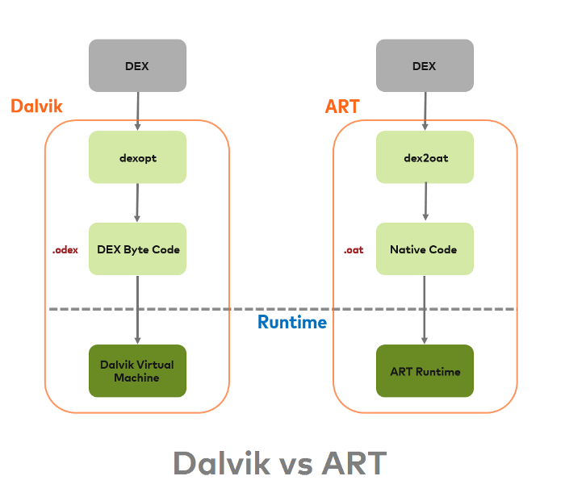

    [Learn more here](https://android.jlelse.eu/closer-look-at-android-runtime-dvm-vs-art-1dc5240c3924)

- **Differences between JIT and AOT**
    - **Just In Time (JIT)**
    With the Dalvik JIT compiler, each time when the app is run, it dynamically translates a part of the Dalvik bytecode into machine code. As the execution progresses, more bytecode is compiled and cached. Since JIT compiles only a part of the code, it has a smaller memory footprint and uses less physical space on the device.

    - **Ahead Of Time (AOT)**
    ART is equipped with an Ahead-of-Time compiler. During the app’s installation phase, it statically translates the DEX bytecode into machine code and stores in the device’s storage. This is a one-time event which happens when the app is installed on the device. With no need for JIT compilation, the code executes much faster.

        As ART runs app machine code directly (native execution), it doesn’t hit the CPU as hard as just-in-time code compiling on Dalvik. Because of less CPU usage results in less battery drain.

        ART also uses same DEX bytecode as input for Dalvik. An application compiled using ART requires additional time for compilation when an application is installed and take up slightly larger amounts of space to store the compiled code.

* **What is DEX?** 
    - One of the most remarkable features of the Dalvik Virtual Machine (the workhorse under the Android system) is that it does not use Java bytecode. Instead, a homegrown format called DEX was introduced and not even the bytecode instructions are the same as Java bytecode instructions.

        Android programs are compiled into `.dex` (Dalvik Executable) files, which are in turn zipped into a single `.apk` file on the device. `.dex` files can be created by automatically translating compiled applications written in the Java programming language.

        `.dex` files are similar to java class files, but they were run under the Dalkvik Virtual Machine (DVM) on older Android versions, and compiled at install time on the device to native code with ART on newer Android versions.


        [Learn more here](https://developer.android.com/reference/dalvik/system/DexFile)


* **What is runtime?**
    - In a simplest term it is a system used by operating system which takes care of converting the code that you write in a high level language like Java to machine code and understand by CPU/Processor.

        Runtime comprises of software instructions that execute when your program is running, even if they’re not essentially are a part of the code of that piece of software in particular.

        CPUs or more general term our computers understand only machine language (binary codes) so to make it run on CPU, the code must be converted to machine code, which is done by translator.

* **What is ARMV7**
    - There are 3 CPU architectures in Android:
        - ARMv7 is the most common as it is optimised for battery consumption.
       
        - ARM64 is an evolved version of that that supports 64-bit processing for more powerful computing.
        - ARMx86, is the least used for these three, since it is not battery friendly. It is more powerful than the other two.


* **Can you manually call the Garbage collector?** 
    - You can call Garbage collector using:
    
        `System.gc();`
        
        But this does not mean that it'll be executed immediately. The JVM decides when to execute it. In general if the JVM is about to throw an `OutOfMemoryError`, calling `System.gc()` won't prevent it. 

        Calling the gc method suggests that the Java Virtual Machine expend effort toward recycling unused objects in order to make the memory they currently occupy available for quick reuse. When control returns from the method call, the Java Virtual Machine has made a best effort to reclaim space from all discarded objects

        [Learn more here](https://stackoverflow.com/questions/15632734/can-we-call-the-garbage-collector-explicitly)

* **What is the difference between compileSdkVersion and targetSdkVersion?**
    - **compileSdkVersion**: The `compileSdkVersion` is the version of the API the app is compiled against. This means you can use Android API features included in that version of the API (as well as all previous versions, obviously). If you try and use API 16 features but set `compileSdkVersion` to 15, you will get a compilation error. If you set `compileSdkVersion` to 16 you can still run the app on a API 15 device as long as your app's execution paths do not attempt to invoke any APIs specific to API 16.

    - **targetSdkVersion**: The `targetSdkVersion` has nothing to do with how your app is compiled or what APIs you can utilize. The `targetSdkVersion` is supposed to indicate that you have tested your app on (presumably up to and including) the version you specify. This is more like a certification or sign off you are giving the Android OS as a hint to how it should handle your app in terms of OS features.

* **What are the differents Android versions and its API level?**

    | Codename              | Version               | API level/NDK release |
    | --------------------- | --------------------- | --------------------- |
    | Android11             | 11                    | API level 30          |
    | Android10             | 10                    | API level 29          |
    | Pie                   | 9                     | API level 28          |
    | Oreo                  | 8\.1.0                | API level 27          |
    | Oreo                  | 8\.0.0                | API level 26          |
    | Nougat                | 7\.1                  | API level 25          |
    | Nougat                | 7\.0                  | API level 24          |
    | Marshmallow           | 6\.0                  | API level 23          |
    | Lollipop              | 5\.1                  | API level 22          |
    | Lollipop              | 5\.0                  | API level 21          |
    | KitKat                | 4\.4 - 4.4.4          | API level 19          |
    | Jelly Bean            | 4\.3.x                | API level 18          |
    | Jelly Bean            | 4\.2.x                | API level 17          |
    | Jelly Bean            | 4\.1.x                | API level 16          |
    | Ice Cream Sandwich    | 4\.0.3 - 4.0.4        | API level 15, NDK 8   |
    | Ice Cream Sandwich    | 4\.0.1 - 4.0.2        | API level 14, NDK 7   |
    | Honeycomb             | 3\.2.x                | API level 13          |
    | Honeycomb             | 3\.1                  | API level 12, NDK 6   |
    | Honeycomb             | 3\.0                  | API level 11          |
    | Gingerbread           | 2\.3.3 - 2.3.7        | API level 10          |
    | Gingerbread           | 2\.3 - 2.3.2          | API level 9, NDK 5    |
    | Froyo                 | 2\.2.x                | API level 8, NDK 4    |
    | Eclair                | 2\.1                  | API level 7, NDK 3    |
    | Eclair                | 2\.0.1                | API level 6           |
    | Eclair                | 2\.0                  | API level 5           |
    | Donut                 | 1\.6                  | API level 4, NDK 2    |
    | Cupcake               | 1\.5                  | API level 3, NDK 1    |
    | (no codename)         | 1\.1                  | API level 2           |
    | (no codename)         | 1\.0                  | API level 1           |


* **What about LOG**
    - The Log class allows you to create log messages that are displayed in logcat. In general, you should use the following registration methods, which are ordered from highest to lowest priority (or from most detailed to least detailed).

        - Log.e (String, String) (error)
        - Log.w (String, String) (warning)
        - Log.i (String, String) (information)
        - Log.d (String, String) (debug)
        - Log.v (String, String) (verbose log)

#### ANDROID SECURITY
-   **How do you know if the device is rooted?**<br/>
    - We can check if superUser apk is installed in the device or if it contains su file or xbin folder. Alternatively you can use RootBeer library available in GitHub.

-   **What is Symmetric Encryption?**<br/>
    - Symmetric encryption deals with creating a passphrase and encrypting the file with it. Then the server needs to send the key to the client so that the client can decrypt. Here the problem is sending that key to decrypt the file. Hackers can easily access that key and could misuse the data.

-   **What is Asymmetric Encryption?**<br/>
    - Using algorithms like RSA, the server generates 2 keys - public key and private key. The server then gives public key to clients. Client then encrypts the sensitive data with that public key and send it back to server.-Now as the server alone has the private key, only it can decrypt the data. This is the most efficient way of sending data across the client and server.

        Example of this Asymmetric encryption are HTTPS using SSL certificate, Bitcoin, etc.

    * **Some security tips**
        - **User data**
            - **Store private data within internal storage**. Store all private user data within the device's internal storage, which is sandboxed per app. Your app doesn't need to request permission to view these files, and other apps cannot access the files. As an added security measure, when the user uninstalls an app, the device deletes all files that the app saved within internal storage.
           
            - **Store data in external storage based on use case**. Use external storage for large, non-sensitive files that are specific to your app, as well as files that your app shares with other apps.
            - **Check validity of data**. If your app uses data from external storage, make sure that the contents of the data haven't been corrupted or modified. Your app should also include logic to handle files that are no longer in a stable format.
            - **Store only non-sensitive data in cache files**. To provide quicker access to non-sensitive app data, store it in the device's cache. For caches larger than 1 MB in size, use `getExternalCacheDir()`; otherwise, use `getCacheDir()`. Each method provides you with the `File` object that contains your app's cached data.
            - **Use SharedPreferences in private mode**. When using `getSharedPreferences()` to create or access your app's `SharedPreferences` objects, use `MODE_PRIVATE`. That way, only your app can access the information within the shared preferences file.

        - **Other**
            - **Code Obfuscation**. Protect the source code by making it unintelligible for both humans and decompiler. All this, while preserving its entire operations during the compilation. The purpose of the obfuscation process is to give an impenetrable code. It promotes the confidentiality of all intellectual properties against reverse engineering.
            
            - **Data encryption**. Mobile app security involves securing all kinds of stored data on the mobile device. It includes the source code as well as the data transmitted between the application and the back-end server. The execution of certificate pinning helps affirm the backend Web service certificate for the application. High-level data encryption is one of the best android mobile app security practices. It protects the valuable data from hackers.
            - **Regular Updation And Testing**. Hackers detect vulnerabilities in software and exploit, while developers repair the breach, which causes hackers to discover another weakness. Although Google cannot avoid the development of these vulnerabilities, it effectively updates the Android OS to counter the detected problems. However, these measures will not be useful if the software is not up-to-date. Penetration testing is another method for server-side checks.

* **Are SQL Injection attacks valid in Android? How would you prevent them?**
    - Are SQL Injection attacks valid in Android? How would you prevent them?
        If you are using data and retrieving it from components or network components that at the end perform an SQL query, SQL injections are an issue. Besides using validation in input fields or libraries to avoid SQL injections, another possible solution is to use parameterized queries with ContentProviders, which virtually remove the risk of suffering an SQL Injection.

* **How to save password safely in Android?**<br/>
    - Using Android Keystore. 

    [Learn more here](https://medium.com/@josiassena/using-the-android-keystore-system-to-store-sensitive-information-3a56175a454b)

#### ANDROID JETPACK

* **What is Android Jetpack and why to use this?** 
    - Jetpack encompasses a collection of Android libraries that incorporate best practices and provide backwards compatibility in your Android apps. The Android Jetpack components bring together the existing Support Library and Architecture Components and arranges them into four categories.

        

        Android Jetpack components are provided as "unbundled" libraries that are not part of the underlying Android platform. This means that you can adopt each component at your own speed, at your own time. When new Android Jetpack functionality is available, you can add it to your app.

        In addition, your app can run on various versions of the platform because Android Jetpack components are built to provide their functionality independent of any specific version, providing backwards compatibility.

        Further, Android Jetpack is built around modern design practices like separation of concerns and testability as well as productivity features like Kotlin integration. This makes it far easier for you to build robust, high quality apps with less code. While the components of Android Jetpack are built to work together, e.g. lifecycle awareness and live data, you don't have to use all of them -- you can integrate the parts of Android Jetpack that solve your problems while keeping the parts of your app that are already working great.

        [Learn more here](https://blog.mindorks.com/what-is-android-jetpack-and-why-should-we-use-it)

* **What are Android Architecture Components?** 
   * A collection of libraries that help you design robust, testable, and maintainable apps.
      * **Room**: The Room persistence library provides an abstraction layer over SQLite to allow for more robust database access while harnessing the full power of SQLite.

        The library helps you create a cache of your app's data on a device that's running your app. This cache, which serves as your app's single source of truth, allows users to view a consistent copy of key information within your app, regardless of whether users have an internet connection.
       
        **Components:**
        


        [Official documentation](https://developer.android.com/topic/libraries/architecture/room) or [Article on how to implement Room Db](https://medium.com/@anitaa_1990/5-steps-to-implement-room-persistence-library-in-android-47b10cd47b24) or [Sample  implementation](https://github.com/anitaa1990/RoomDb-Sample)
        
        
      * **Live Data**: LiveData is an observable data holder class. Unlike a regular observable, LiveData is lifecycle-aware, meaning it respects the lifecycle of other app components, such as activities, fragments, or services. This awareness ensures LiveData only updates app component observers that are in an active lifecycle state.

        LiveData considers an observer, which is represented by the Observer class, to be in an active state if its lifecycle is in the STARTED or RESUMED state. LiveData only notifies active observers about updates. Inactive observers registered to watch LiveData objects aren't notified about changes.

        You can register an observer paired with an object that implements the LifecycleOwner interface. This relationship allows the observer to be removed when the state of the corresponding Lifecycle object changes to DESTROYED. This is especially useful for activities and fragments because they can safely observe LiveData objects and not worry about leaks—activities and fragments are instantly unsubscribed when their lifecycles are destroyed.

        [Official documentation](https://developer.android.com/topic/libraries/architecture/livedata) or [More info](https://github.com/Kirchhoff-/Android-Interview-Questions/blob/master/Android/What's%20LiveData.md) or [Sample  implementation](https://github.com/anitaa1990/GameOfThronesTrivia) or [Learn more here](https://blog.mindorks.com/understanding-livedata-in-android)

       * **Navigation Component**: The Navigation Architecture Component simplifies implementing navigation, while also helping you visualize your app's navigation flow. The library provides a number of benefits, including:  
            * Automatic handling of fragment transactions 
            * Correctly handling up and back by default 
            * Default behaviors for animations and transitions 
            * Deep linking as a first class operation 
            * Implementing navigation UI patterns (like navigation drawers and bottom nav) with little additional work 
            * Type safety when passing information while navigating 
            * Android Studio tooling for visualizing and editing the navigation flow of an appvisualizing and editing the navigation flow of an app

            The Navigation component consists of three key parts that are described below:
            * Navigation graph: An XML resource that contains all navigation-related information in one centralized location. This includes all of the individual content areas within your app, called *destinations*, as well as the possible paths that a user can take through your app.
            * `NavHost`: An empty container that displays destinations from your navigation graph. The Navigation component contains a default `NavHost` implementation, `NavHostFragment`, that displays fragment destinations.
            * `NavController`: An object that manages app navigation within a `NavHost`. The `NavController` orchestrates the swapping of destination content in the `NavHost` as users move throughout your app. As you navigate through your app, you tell the `NavController` that you want to navigate either along a specific path in your navigation graph or directly to a specific destination. The `NavController` then shows the appropriate destination in the `NavHost`.

                [Official documentation](https://developer.android.com/guide/navigation) or [More info](https://github.com/Kirchhoff-/Android-Interview-Questions/blob/master/Android/What's%20Navigation%20component.md)
        
      * **ViewModel**: The `ViewModel` class is designed to store and manage UI-related data in a lifecycle conscious way. The `ViewModel` class allows data to survive configuration changes such as screen rotations.

        The Android framework manages the lifecycles of UI controllers, such as activities and fragments. The framework may decide to destroy or re-create a UI controller in response to certain user actions or device events that are completely out of your control.

        If the system destroys or re-creates a UI controller, any transient UI-related data you store in them is lost. For example, your app may include a list of users in one of its activities. When the activity is re-created for a configuration change, the new activity has to re-fetch the list of users.  For simple data, the activity can use the `onSaveInstanceState()` method and restore its data from the bundle in `onCreate()`, but this approach is only suitable for small amounts of data that can be serialized then deserialized, not for potentially large amounts of data like a list of users or bitmaps.

        Another problem is that UI controllers frequently need to make asynchronous calls that may take some time to return. The UI controller needs to manage these calls and ensure the system cleans them up after it's destroyed to avoid potential memory leaks. This management requires a lot of maintenance, and in the case where the object is re-created for a configuration change, it's a waste of resources since the object may have to reissue calls it has already made.

        UI controllers such as activities and fragments are primarily intended to display UI data, react to user actions, or handle operating system communication, such as permission requests. Requiring UI controllers to also be responsible for loading data from a database or network adds bloat to the class. Assigning excessive responsibility to UI controllers can result in a single class that tries to handle all of an app's work by itself, instead of delegating work to other classes. Assigning excessive responsibility to the UI controllers in this way also makes testing a lot harder.

        [Official documentation](https://developer.android.com/topic/libraries/architecture/viewmodel) or [Sample  implementation](https://github.com/anitaa1990/GameOfThronesTrivia)

      * **Work Manager:** WorkManager is an API that makes it easy to schedule deferrable, asynchronous tasks that are expected to run even if the app exits or the device restarts. The WorkManager API is a suitable and recommended replacement for all previous Android background scheduling APIs, including *FirebaseJobDispatcher*, *GcmNetworkManager*, and *Job Scheduler*. WorkManager incorporates the features of its predecessors in a modern, consistent API that works back to API level 14 while also being conscious of battery life.

        WorkManager handles background work that needs to run when various constraints are met, regardless of whether the application process is alive or not. Background work can be started when the app is in the background, when the app is in the foreground, or when the app starts in the foreground but goes to the background. Regardless of what the application is doing, background work should continue to execute, or be restarted if Android kills its process.

        Under the hood WorkManager uses an underlying job dispatching service based on the following criteria:
        
        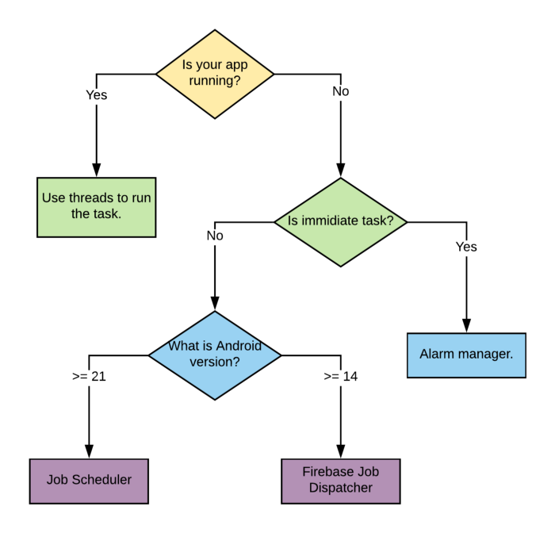

        [Learn more here](https://blog.mindorks.com/integrating-work-manager-in-android)

        
      * **Data Binding:** Data binding is a general technique that binds data sources from the provider and consumer together and synchronizes them. In a data binding process, each data change is reflected automatically by the elements that are bound to the data. The term data binding is also used in cases where an outer representation of data in an element changes, and the underlying data is automatically updated to reflect this change.

        The Data Binding Library is a support library that allows you to bind UI components in your layouts to data sources in your app using a declarative format rather than programmatically.

        Layouts are often defined in activities with code that calls UI framework methods. For example, the code below calls `findViewById()` to find a `TextView` widget and bind it to the `userName` property of the `viewModel` variable:
        ```
        findViewById<TextView>(R.id.sample_text).apply {
            text = viewModel.userName
        }
        ```

        With helping of data binding library we can simplify code showed above by moving such logic to XML:

        ```
        <TextView
            android:text="@{viewmodel.userName}" />
        ```

        Binding components in the layout file lets you remove many UI framework calls in your activities, making them simpler and easier to maintain. This can also improve your app's performance and help prevent memory leaks and null pointer exceptions.
    
        [Official documentation](https://developer.android.com/topic/libraries/data-binding/) or [Sample  implementation](https://github.com/anitaa1990/DataBindingExample)

      * **Paging:** The Paging Library helps you load and display small chunks of data at a time. Loading partial data on demand reduces usage of network bandwidth and system resources.

        The Paging Library supports the following data architectures:
        - Served only from a backend server;
        - Stored only in an on-device database;
        - A combination of the other sources, using the on-device database as a cache.

      [Official documentation](https://developer.android.com/topic/libraries/architecture/lifecycle)        
        
      * **Lifecycles:**  Lifecycle-aware components perform actions in response to a change in the lifecycle status of another component, such as activities and fragments. These components help you produce better-organized, and often lighter-weight code, that is easier to maintain.

        A common pattern is to implement the actions of the dependent components in the lifecycle methods of activities and fragments. However, this pattern leads to a poor organization of the code and to the proliferation of errors. By using lifecycle-aware components, you can move the code of dependent components out of the lifecycle methods and into the components themselves.

        The `androidx.lifecycle` package provides classes and interfaces that let you build lifecycle-aware components—which are components that can automatically adjust their behavior based on the current lifecycle state of an activity or fragment. 

      [Official documentation](https://developer.android.com/topic/libraries/architecture/lifecycle)

    [Learn more here](https://blog.mindorks.com/what-are-android-architecture-components)

* **What is Jetpack Compose?**
    - Jetpack Compose is Android’s modern toolkit for building native UI. It simplifies and accelerates UI development on Android. Quickly bring your app to life with less code, powerful tools, and intuitive Kotlin APIs. 

    Learn more here](https://developer.android.com/jetpack/compose)

* **How LiveData is different from ObservableField?** - [Learn more here](https://blog.mindorks.com/livedata-vs-observable-in-android)

* **What is the difference between setValue and postValue in LiveData?** - [Learn more here](https://blog.mindorks.com/livedata-setvalue-vs-postvalue-in-android)

* **How to share ViewModel between Fragments in Android?** - [Learn more here](https://blog.mindorks.com/shared-viewmodel-in-android-shared-between-fragments)

* **Use-cases of WorkManager in Android.** - [Learn more here](https://www.youtube.com/watch?v=4LTpYXFMnJw)

* **How ViewModel work internally?** - [Learn more here](https://blog.mindorks.com/android-viewmodels-under-the-hood)


#### ARCHITECTURE

* **S.O.L.I.D Principles in Android development**</br>
   * [Answer](https://github.com/anitaa1990/Today-I-Learned/blob/master/android/solid_principle.md)</br>  
  

 **Difference between MVC & MVP & MVVM?**</br>
   * **MVC** is the Model-View-Controller architecture where model refers to the data model classes. The view refers to the xml files and the controller handles the business logic. The issue with this architecture is unit testing. The model can be easily tested since it is not tied to anything. The controller is tightly coupled with the android apis making it difficult to unit test. Modularity & flexibility is a problem since the view and the controller are tightly coupled. If we change the view, the controller logic should also be changed. Maintenance is also an issues.
   
   * **MVP architecture**: Model-View-Presenter architecture. The View includes the xml and the activity/fragment classes. So the activity would ideally implement a view interface making it easier for unit testing (since this will work without a view). 
        
        [Sample Implementation](https://github.com/anitaa1990/Inshorts) 
   * **MVVM**: Model-View-ViewModel Architecture. The Model comprises data, tools for data processing, business logic.  The View Model is responsible for wrapping the model data and preparing the data for the view. IT also provides a hook to pass events from the view to the model.  

        [Sample Implementation](https://github.com/anitaa1990/Trailers)</br></br>

-   **What is the role of Presenter in MVP?**<br/>
    - The Presenter is responsible to act as the middle man between View and Model. It retrieves data from the Model and returns it formatted to the View. But unlike the typical MVC, it also decides what happens when you interact with the View.

-   **What is the advantage of MVVM over MVP?**<br/>
    - In MVP, Presenter is responsible for view data updates as well as data operations where as in MVVM, ViewModel does not hold any reference to View. It is the View's responsibility to pick the changes from ViewModel. This helps in writing more maintainable test cases since ViewModel does not depend upon View.

* **Describe the architecture of your last app.**

* **Describe MVP.** - [Learn more here](https://mindorks.com/course/android-mvp-introduction)

* **Describe MVVM.** - [Learn more here](https://blog.mindorks.com/mvvm-architecture-android-tutorial-for-beginners-step-by-step-guide) and [here](https://www.youtube.com/watch?v=HJMZNF-tG-4)

* **MVC vs MVP vs MVVM architecture.** - [Learn more here](https://blog.mindorks.com/mvc-mvp-mvvm-architecture-in-android)

* **What is presenter?** - [Learn more here](https://mindorks.com/course/android-mvp-introduction)

* **What is model?** - [Learn more here](https://mindorks.com/course/android-mvp-introduction)

* **Describe MVC.** - [Learn more here](https://blog.mindorks.com/mvc-mvp-mvvm-architecture-in-android)

* **Describe MVI** - [Learn more here](https://github.com/MindorksOpenSource/MVI-Architecture-Android-Beginners)

* **Describe the repository pattern** - [Learn more here](https://blog.mindorks.com/android-mvp-architecture-extension-with-interactors-and-repositories-bd4b51972339)

* **What is controller?** - [Learn more here](https://blog.mindorks.com/mvc-mvp-mvvm-architecture-in-android)

* **Tell something about clean code** - [Learn more here](https://blog.mindorks.com/every-programmer-should-read-this-book-6755dedec78d)

* **What is a singleton class in Android?**</br>
    - A singleton class is a class which can create only an object that can be shared all other classes.

   ```java
   private static volatile RESTService instance;
    protected RESTService(Context context) {
        super(context);
    }
    
    public static RESTService getInstance(Context context) {
    if (instance == null) {
       synchronized (RESTService.class) {
          if (instance == null) instance = new RESTService(context);
            }
        }
        return instance;
    }
    ```

#### ANDROID LIBRARIES

* Have you use an HTTP Library, which, why, did you like it?
* Describe how REST APIs work.
* What are some typical methods of HTTP request/responses? [[GET, POST, PUT, PATCH, DELETE, UPDATE]](http://www.restapitutorial.com/lessons/httpmethods.html)

* **Explain OkHttp Interceptor** - [Learn more here](https://blog.mindorks.com/okhttp-interceptor-making-the-most-of-it)

* **OkHttp - HTTP Caching - How caching work in Android** - [Learn more here](https://www.youtube.com/watch?v=D6dQn6pUQD0)

* **What is Retrofit?**
    - Retrofit is a REST Client for Java and Android. It makes it relatively easy to retrieve and upload JSON (or other structured data) via a REST based webservice. In Retrofit you configure which converter is used for the data serialization. Typically for JSON you use GSon, but you can add custom converters to process XML or other protocols. Retrofit uses the OkHttp library for HTTP requests.

    [Learn more here](https://www.vogella.com/tutorials/Retrofit/article.html)

* **Advantage of Retrofit over Volley?**<br/>
    - Retrofit is type-safe. Type safety means that the compiler will validate types while compiling, and throw an error if you try to assign the wrong type to a variable.

-   **Advantage of Volley over Retrofit?**<br/>
    - Android Volley has a very elaborate and flexible cache mechanism. When a request is made through Volley, first the cache is checked for Response. If it is found, then it is fetched and parsed, else, it will hit Network to fetch the data. Retrofit does not support cache by default.


-   **What is the advantage of using Retrofit over AsyncTask?**<br/>
    - Retrofit reduces boiler plate code by internally using GSON library which helps parsing the json file automatically.
    Retrofit is a type safe library. This means - it checks if wrong data type is assigned to variables at compilation time itself.
    More use-cases at: https://stackoverflow.com/a/16903205/3424919

-   **How to handle multiple network calls using Retrofit?**<br/>
    - In Retrofit, we can call the operations asynchronously by using enqueue() method where as to call operations synchronously, we can use execute() method. In addition, we can use zip() operator from RxJava to perform multiple network calls using Retrofit library.

* **FlatBuffers vs JSON.**  
    - FlatBuffers are an efficient cross platform serialization library for C++, C#, C, Go, Java, JavaScript, PHP, and Python. They were originally created at Google for game development, and other performance-critical applications.
    
        For storing data in DB or in filesystems such as S3, JSON should be the obvious choice. This is because it allows you to query these systems without writing additional code using already available tools. For squeezing more data, you can always use GZIP or LZ4 compression which is supported out of the box in most of the systems these days.

        However for inter-communications between various REST services or streaming systems (e.g. Kafka) , you should prefer protocol buffers or flat buffers. This is because of the significant difference between the serialization/deserialization performance of these two vs JSON which I’ll show later. Also, the memory footprint is much smaller in flatbuffers.

        Flatbuffers should only be used for cases where the object is large and you normally need to extract only one or two entities out of it. This is because the code for making a flatbuffer object is much more than that needed for protobuf and JSON. Even converting from/to JSON is not supported in flatbuffers which is essential for logging in many cases.

        [Learn more here](https://blog.mindorks.com/why-consider-flatbuffer-over-json-2e4aa8d4ed07)

* **GSON vs Jackson vs Moshi**
    - **Gson** – Google’s own JSON Parser library for Android and the most popular of the bunch (sitting at 18.5k Github stars, vs 5.9k and 6.5k). It is the oldest as well, with its 1.0 version being released in 2008

    - **Jackson** – The longest competitor of Gson in an attempt to provide a faster and more feature-rich parser than its competitor. Fun fact, its 1.0 release in 2009 was codenamed “Hazelnut”, named after the fact that lots of people choke on nuts.

    - **Moshi** – The most modern of the 3 parsers having its first release was in 2015. It was created by Square, the same people who created Retrofit and includes some of the people who have worked on Gson in the past.

        Jackson takes the win here. Gson, quite expectedly didn’t excel in any aspect over the other two. I mean, it is the oldest after all.

        Jackson is very feature rich especially with its many annotations and the fact that it supports parsing for XML and other formats beyond JSON. Despite that, excels in performance. In some cases, extremely so over the other 2 parsers.

        Moshi is also great, with plenty of features to cover your parsing needs, some of which I haven’t seen from Jackson (such as allowing for multiple JSON representations for the same data type).


*   **What about Image loading libraries?**
    - **Glide** is a fast and efficient open source media management and image loading framework for Android that wraps media decoding, memory and disk caching, and resource pooling into a simple and easy to use interface. 
    
        Glide supports fetching, decoding, and displaying video stills, images, and animated GIFs. Glide includes a flexible API that allows developers to plug in to almost any network stack. By default Glide uses a custom `HttpUrlConnection` based stack, but also includes utility libraries plug in to Google's Volley project or Square's OkHttp library instead.

        Glide's primary focus is on making scrolling any kind of a list of images as smooth and fast as possible, but Glide is also effective for almost any case where you need to fetch, resize, and display a remote image.

      
    - **Picasso** allows for hassle-free image loading in your application—often in one line of code! Many common pitfalls of image loading on Android are handled automatically by Picasso:
        - Handling ImageView recycling and download cancelation in an adapter.
        - Complex image transformations with minimal memory use.
        - Automatic memory and disk caching.

    - **Fresco** is a powerful system for displaying images in Android applications.

        Fresco takes care of image loading and display, so you don't have to. It will load images from the network, local storage, or local resources, and display a placeholder until the image has arrived. It has two levels of cache; one in memory and another in internal storage.
        
        In Android 4.x and lower, Fresco puts images in a special region of Android memory. This lets your application run faster - and suffer the dreaded `OutOfMemoryError` much less often.
    
        Fresco also supports:
        - streaming of progressive JPEGs
        - display of animated GIFs and WebPs
        - extensive customization of image loading and display

    - **Coil** image loading library for Android backed by Kotlin Coroutines. Coil is:
        - **Fast**: Coil performs a number of optimizations including memory and disk caching, downsampling the image in memory, re-using Bitmaps, automatically pausing/cancelling requests, and more.
        - **Lightweight**: Coil adds ~2000 methods to your APK (for apps that already use OkHttp and Coroutines), which is comparable to Picasso and significantly less than Glide and Fresco.
        - **Easy to use**: Coil's API leverages Kotlin's language features for simplicity and minimal boilerplate.
        - **Modern**: Coil is Kotlin-first and uses modern libraries including Coroutines, OkHttp, Okio, and AndroidX Lifecycles.


* **What is ANKO?**
    - Anko is a Kotlin library which makes Android application development faster and easier. It makes your code clean and easy to read, and lets you forget about rough edges of the Android SDK for Java.

    **Note:** Now, Anko is deprecated.
* **Dependency injection libraries**

    - [Dagger 2](https://github.com/google/dagger) - A fast dependency injector for Java and Android. Dagger is a compile-time framework for dependency injection. It uses no reflection or runtime bytecode generation, does all its analysis at compile-time, and generates plain Java source code.

        One of the primary advantages of Dagger 2 over most other dependency injection frameworks is that its strictly generated implementation (no reflection) means that it can be used in Android applications.

    - [Hilt](https://developer.android.com/training/dependency-injection/hilt-android) - Hilt is a dependency injection library for Android that reduces the boilerplate of doing manual dependency injection in your project. 

        Hilt provides a standard way to use DI in your application by providing containers for every Android class in your project and managing their lifecycles automatically. Hilt is built on top of the popular DI library Dagger to benefit from the compile-time correctness, runtime performance, scalability, and Android Studio support that Dagger provides.

    - [Koin](https://github.com/InsertKoinIO/koin) - A pragmatic lightweight dependency injection framework for Kotlin developers. Written in pure Kotlin, using functional resolution only: no proxy, no code generation, no reflection. Koin is a DSL, a lightweight container and a pragmatic API.

    - [Kodein](https://github.com/Kodein-Framework/Kodein-DI) - is a very simple and yet very useful dependency retrieval container. it is very easy to use and configure.

    Kodein-DI allows you to:

    - Lazily instantiate your dependencies when needed
    - Stop caring about dependency initialization order
    - Easily bind classes or interfaces to their instance or provider
    - Easily debug your dependency bindings and recursions

    Kodein-DI is a good choice because:

    - It proposes a very simple and readable declarative DSL
    - It is not subject to type erasure (as Java is)
    - It integrates nicely with Android
    - It proposes a very kotlin-esque idiomatic API
    - It is fast and optimized (makes extensive use of inline)
    - It can be used in plain Java


* **What is dependency injection?**
    - Dependency Injection is a design pattern to implement inversion of control, and to resolve dependencies. Dependency Injection (DI) eliminates boilerplate code (for example, by removing listener) and provides a much cleaner and more effective code.
        There are a few DI libraries used in Android development:
        -   Dagger
        -   ButterKnife
        -   RoboGuice


* **What is Flow in Kotlin?** - [Learn more here](https://blog.mindorks.com/what-is-flow-in-kotlin-and-how-to-use-it-in-android-project)


#### ANDROID TOOLS

* **What is ADB?** 
    - ADB is short for Android Debug Bridge. It allows developers the power to execute remote shell commands. Its basic function is to allow and control communication towards and from the emulator port. 
    
    [Learn more here](https://developer.android.com/studio/command-line/adb)

* **What is AAPT?** 
    - AAPT2 (Android Asset Packaging Tool) is a build tool that Android Studio and Android Gradle Plugin use to compile and package your app’s resources. AAPT2 parses, indexes, and compiles the resources into a binary format that its optimized for the Android platform.

    
* **What is DDMS and what can you do with it?** 
    - DDMS is the Dalvik Debug Monitor Server that ships with Android. It provides a wide array of debugging features including:

        - port-forwarding services
        - screen capture
        - thread and heap information
        - network traffic tracking
        - logcat
        - incoming call and SMS spoofing
        - simulating network state, speed, and latency
        - location data spoofing

    [Learn more here](https://developer.android.com/studio/profile/monitor)


* **What is an Application Not Responding (ANR) error, and how can you prevent them from occurring in an app?**</br>
   - An ANR dialog appears when your UI has been unresponsive for more than 5 seconds, usually because you’ve blocked the main thread. To avoid encountering ANR errors, you should move as much work off the main thread as possible.

        The ANR dialog is displayed to the user based on two possible conditions. One is when there is no response to an input event within 5 seconds, and the other is when a broadcast receiver is not done executing within 10 seconds.

    [Learn more here](https://developer.android.com/topic/performance/vitals/anr.html) or [here](https://developer.android.com/topic/performance/vitals/crash)

* **ANR vs Crash**
   - An ANR will occur if you are running a process on the UI thread which takes a long time, usually around 5 seconds. During this time the GUI (Graphical User Interface) will lock up which will result in anything the user presses will not be actioned. After the 5 seconds approx has occurred, if the thread still hasn't recovered then an ANR dialogue box is shown informing the user that the application is not responding and will give the user the choice to either wait, in the hope that the app will eventually recover, or to force close the app. 
    A crash is when an exception within the app has been thrown which has not been handled. For example, if you try to set the text of an `EditText` component, but the `EditText` is null and there is no try catch statement to catch the exception that your app will crash and will be force closed. The user will not see what caused the crash, they will be shown a dialogue telling that the app has force closed unexpectedly and will give them the option to send a bug report. In this example if you were to look in the bug report you would see the error caused by `java.lang.NullPointerException`. 

* **What is StrictMode?**
    - StrictMode is a developer tool which detects things you might be doing by accident and brings them to your attention so you can fix them.

        StrictMode is most commonly used to catch accidental disk or network access on the application's main thread, where UI operations are received and animations take place. Keeping disk and network operations off the main thread makes for much smoother, more responsive applications. By keeping your application's main thread responsive, you also prevent ANR dialogs from being shown to users. 
    
    [Learn more here](https://blog.mindorks.com/use-strictmode-to-find-things-you-did-by-accident-in-android-development-4cf0e7c8d997)

* **Build Type, Product Flavor, Build Variant**
    * **Build Type:** Build Types controls how to build and package your app, for example whether or not ProGuard is run, how the resulting application package is signed and whether debug symbols are to be included. By default, the build system defines two build types: `debug` and `release`.
    
    * **Product Flavor:** Product Flavor configuration defines a customized version of the application build. It can be used to specify custom features, minimum and target API levels, device and API requirements like layout, drawable and custom code. This can help create different label apps as well. Flavours can vary in adding different features or customizing exisitng features, different icons and resources, different styles and strings etc.
    
    * **Build Variant:** The combination of **Build Type** and **Product Flavor** is known as **Build Variant**. For example, for above build types (debug and release) and product flavours (demo and full versions), build variants can be: `demoDebug`, `demoRelease`, `fullDebug`, `fullRelease`.

        [Learn more here](https://developer.android.com/studio/build/build-variants)

* **How to reduce build time of an Android app?**</br>
   * Check out this awesome [article](https://medium.com/exploring-code/how-to-decrease-your-gradle-build-time-by-65-310b572b0c43) on it. 
   * What I got from the article: A few commands we can add to the gradle.properties file:
     * ```org.gradle.configureondemand=true``` - This command will tell gradle to only build the projects that it really needs to build.
     * Use Daemon - ```org.gradle.daemon=true``` - Daemon keeps the instance of the gradle up and running in the background even after your build finishes. This will remove the time required to initialize the gradle and decrease your build timing significantly.
     * ```org.gradle.parallel=true``` - Allow gradle to build your project in parallel. If you have multiple modules in you project, then by enabling this, gradle can run build operations for independent modules parallelly.
     * Increase Heap Size - ```org.gradle.jvmargs=-Xmx3072m -XX:MaxPermSize=512m -XX:+HeapDumpOnOutOfMemoryError -Dfile.encoding=UTF-8``` - Since android studio 2.0, gradle uses dex in the process to decrease the build timings for the project. Generally, while building the applications, multiple dx processes runs on different VM instances. But starting from the Android Studio 2.0, all these dx processes runs in the single VM and that VM is also shared with the gradle. This decreases the build time significantly as all the dex process runs on the same VM instances. But this requires larger memory to accommodate all the dex processes and gradle. That means you need to increase the heap size required by the gradle daemon. By default, the heap size for the daemon is about 1GB. 
  * Ensure that dynamic dependency is not used. i.e. do not use 
  </br>```implementation 'com.android.support:appcompat-v7:27.0.+'```. </br>
  This command means gradle will go online and check for the latest version every time it builds the app.</br> 
  Instead use fixed versions i.e. ```'com.android.support:appcompat-v7:27.0.2'```    
   </br>

* **What is Gradle?** 
    - By definition, Gradle is an open-source build automation tool focused on flexibility and performance

        So, simply putting, it is an automation tool that generates the application build. Gradle is the official build tool for Android.

        Whenever we try to run the developed code into an emulator or an actual device via USB, we can see the process of “Gradle Build Running” in our IDEs.

        This is when Gradle helps in compiling the Java and Kotlin code into an APK.

        Every time, we start a new Android Project, we can see two different build.gradle files present. One at the project level and another at the app level.

        A module is a collection of source files and build settings that allow you to divide your project into discrete units of functionality. Your project can have one or many modules and one module may use another module as a dependency. Each module can be independently built, tested, and debugged.

        Since modules are based on functionality, each module will have its dependencies or third-party libraries and hence each module will have it’s own Gradle file.

    [Learn more here](https://blog.mindorks.com/gradle-for-android-developers-getting-the-most-of-it)


* **How can you speed up the Gradle build?** - [Learn more here](https://blog.mindorks.com/speed-up-gradle-build-for-android-to-save-your-time)

* **What is a BuildType in Gradle? And what can you use it for?** 
    - Build types define properties that Gradle uses when building and packaging your Android app.
    - A build type defines how a module is built, for example whether ProGuard is run.
    - A product flavor defines what is built, such as which resources are included in the build.
    - Gradle creates a build variant for every possible combination of your project’s product flavors and build types.

* **Explain the build process in Android:** 
    - First step involves compiling the resources folder (/res) using the aapt (android asset packaging tool) tool. These are compiled to a single class file called R.java. This is a class that just contains constants.
    - Second step involves the java source code being compiled to .class files by javac, and then the class files are converted to Dalvik bytecode by the "dx" tool, which is included in the sdk 'tools'. The output is classes.dex.
    - The final step involves the android apkbuilder which takes all the input and builds the apk (android packaging key) file.

    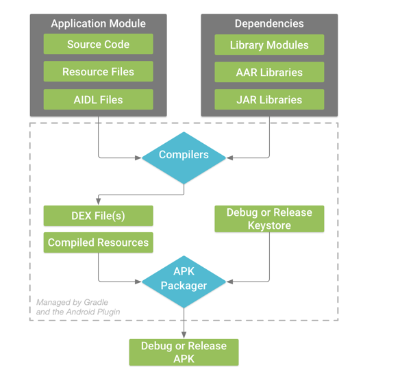


* **What is Lint? What is it used for?** 
    - Lint is like a full-fledged stack analysis framework

        Lint is a code scanning tool provided by the Android Studio to identify, suggest and correct the wrong or the risky code present in the project.
        
        We all have been using the Lint since we started using the Android Studio because by default Android studio provides the support for Lint in our every project. The problems detected in your code by the Lint will be reported to you with some suggestions and a warning level. You can use the suggestion to correct your code. The best part of Lint is that you can use Lint as per your need. If you want to see a particular type of error in your project then the Lint will only show you that type of error. Lint is customizable in nature. By default Android Studio runs the inspection process whenever you build your project but apart from this, you can inspect your code with the help of Lint manually or from the command line.
    
    [Learn more here](https://blog.mindorks.com/what-is-lint-what-is-it-used-for)

* **What is ProGuard?** 
    - Proguard is free Java class file shrinker, optimizer, obfuscator, and preverifier. It detects and removes unused classes, fields, methods, and attributes. It optimizes bytecode and removes unused instructions. It renames the remaining classes, fields, and methods using short meaningless names.

        When you build you project using `Android Gradle plugin 3.4.0` or higher, the plugin no longer uses ProGuard to perform compile-time code optimization. Instead, the plugin works with the R8 compiler to handle the following compile-time tasks:
        - **Code shrinking (or tree-shaking)**: detects and safely removes unused classes, fields, methods, and attributes from your app and its library dependencies (making it a valuable tool for working around the 64k reference limit). For example, if you use only a few APIs of a library dependency, shrinking can identify library code that your app is not using and remove only that code from your app.
           
        - **Resource shrinking**: Removes unused resources from your packaged app, including unused resources in your app’s library dependencies. It works in conjunction with code shrinking such that once unused code has been removed, any resources no longer referenced can be safely removed as well. 
        - **Obfuscation**: Shortens the name of classes and members, which results in reduced DEX file sizes.
        - **Optimization**: Inspects and rewrites your code to further reduce the size of your app’s DEX files. For example, if R8 detects that the `else {}` branch for a given `if/else` statement is never taken, R8 removes the code for the `else {}` branch.

        When building the release version of your app, by default, R8 automatically performs the compile-time tasks described above for you. However, you can disable certain tasks or customize R8’s behavior through ProGuard rules files. In fact, R8 works with all of your existing ProGuard rules files, so updating the Android Gradle plugin to use R8 should not require you to change your existing rules.

    [Learn things to care while using Proguard in Android application](https://blog.mindorks.com/things-to-care-while-using-proguard-in-android-application)

* **Proguard vs R8**
    - Let's now compare both R8 and Proguard both and see how it fares,

        - With the Android app using Gradle plugin above 3.4.0 or more the project uses R8 by default and no longer uses the Proguard to perform optimizations. But, it uses Proguard rules only.
        - R8 effectively inlines the container classes and removes unused class, fields, and methods. Proguard reduces the app size by 8.5% and compared to   - R8 which reduces the code by 10%.
        - R8 has more Kotlin support compared to Proguard.
        - R8 gives better outputs than Proguard, and to do so faster than Proguard does, thereby reducing overall build time.

        **Proguard**
            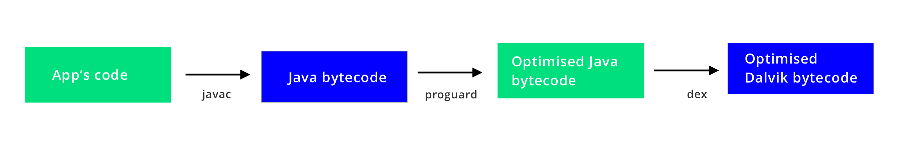
        **R8**
            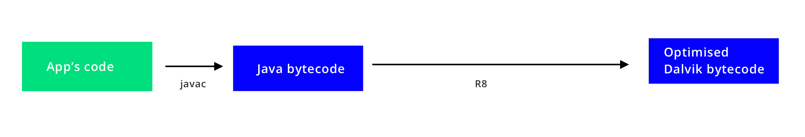

* **What is Multidex in Android?** 
    - In Android, the compilers convert your source code into DEX files. This DEX file contains the compiled code used to run the app. But there is a limitation with the DEX file. The DEX file limits the total number of methods that can be referenced within a single DEX file to 64K i.e. 65,536 methods. So, you can't use more than 64K methods in a particular DEX file. These 64K methods include Android framework methods, library methods, and methods in our code also. This limit of 64K is referred to as the "64K reference limit".

        So, if our app exceeds 65,536 methods, we will encounter a build error that indicates our app has reached the limit of the Android build architecture. 

        So, here comes the role of Multidex support in our Android Project. Next time if you want to use more than 64K methods in your project then you can use the Multidex to achieve this.

    [Learn more here](https://blog.mindorks.com/understanding-multidex-in-android)

* **Most Useful Android Development Tools.** 
    - **Android Debug Database:** is a powerful library for debugging databases and shared preferences in Android applications.

        It’s a very simple tool for viewing databases and shared preferences directly in your browser.
  
    - **Stetho:** is a debug bridge for Android applications created by Facebook. It integrates with the Chrome desktop browser’s Developer Tools.

        With Stetho, you can easily inspect your application — most notably, its network traffic. It also allows you to easily inspect and edit SQLite databases and the shared preferences in your app.
    
    - **APK Analyzer:** Android Studio APK Analyzer is very useful. I highly recommend taking advantage of it.

        With APK Analyzer you can check the size of files in the APK, such as the DEX and Android resource files and that can help you in APK size reduction; uou can check what is going inside the manifest file before every release; and you can compare two APK side by side. You can compare it to check the size difference before every release.
    
    - **LeakCanary:** LeakCanary is a memory leak detection library for Android and Java.

    -**Android Asset Studio:** is a one-stop-shop for all your project asset needs. Android Asset Studio provides you with multiple options. From generating icons to styling your action bar, this tool greatly simplifies development.

    - **ProGuard:** ProGuard (or DexGuard) is normally used on Android projects to shrink and obfuscate the packaged code. This reduces your method count.

    -**Material Design Icons:** Material Design Icons does just that — helps you customize your Material Design icons.

    [Learn more here](https://blog.mindorks.com/android-development-useful-tools-fd73283e82e3)

* **Explain Android notification system?** 
    - A notification is a message that Android displays outside your app's UI to provide the user with reminders, communication from other people, or other timely information from your app. Users can tap the notification to open your app or take an action directly from the notification.

        Notifications appear to users in different locations and formats, such as an icon in the status bar, a more detailed entry in the notification drawer, as a badge on the app's icon, and on paired wearables automatically. Beginning with Android 5.0, notifications can appear on the lock screen.

        Starting in Android 8.0 (API level 26), all notifications must be assigned to a channel or it will not appear. By categorizing notifications into channels, users can disable specific notification channels for your app (instead of disabling all your notifications), and users can control the visual and auditory options for each channel—all from the Android system settings.
    
    [Learn more here](https://blog.mindorks.com/how-to-increase-push-notification-delivery-rate-in-android)

* **How to send SMS in android? Explain with example.**
    - SMS messaging is one of the basic and important applications on a mobile phone. Now days every mobile phone has SMS messaging capabilities, and nearly all users of any age know how to send and receive such messages. Mobile phones come with a built-in SMS application that enables you to send and receive SMS messages. If you want to send the SMS programmatically then follow the following steps.

        SmsManager class is responsible for sending SMS from one emulator to another or device.

        You cannot directly instantiate this class; instead, you call the getDefault() static method to obtain an SmsManager object. You then send the SMS message using the sendTextMessage() method:
    `
    SmsManagersms = SmsManager.getDefault();
    sms.sendTextMessage("5556", null, "Hello from careerRide", null, null);
    sendTextMessage() method takes five argument.
    `
    - destinationAddress — Phone number of the recipient.
    - scAddress — Service center address; you can use null also.
    - text — Content of the SMS message that you want to send.
    - sentIntent — Pending intent to invoke when the message is sent.
    - deliveryIntent — Pending intent to invoke when the message has been delivered.

* **What is Android Slices?**
    - Slices are UI templates that can display rich, dynamic, and interactive content from your app from within the Google Search app and also in other places like the Google Assistant. Slices can help users perform tasks faster by enabling engagement outside of the fullscreen app experience. You can build Slices as enhancements to App Actions.

* **Why widgets?** 
    - Home screen widgets are broadcast receivers which provide interactive components. They are primarily used on the Android home screen. They typically display some kind of data and allow the user to perform actions with them.

        Widgets typically fall into one of the following categories:
        - **Information widgets**. Typically display a few crucial information elements that are important to a user and track how that information changes over time. Good examples for information widgets are weather widgets, clock widgets or sports score trackers.
        - **Collection widgets**. Specialize in displaying multitude elements of the same type, such as a collection of pictures from a gallery app, a collection of articles from a news app or a collection of emails/messages from a communication app.

        - **Control widgets**. The main purpose of a control widget is to display often used functions that the user can trigger right from the home screen without having to open the app first. A typical example of control widgets are music app widgets that allow the user to play, pause or skip music tracks from outside the actual music app.
        - **Hybrid widgets**. Combine elements of different types. For example a music player widget is primarily a control widget, but also keeps the user informed about what track is currently playing. It essentially combines a control widget with elements of an information widget type.

            Steps to create a `Widget`:
            - Define a layout file
            - Create an XML file which describes the properties of the widget, e.g. size or the fixed update frequency.
            - Create a `BroadcastReceiver` which is used to build the user interface of the widget.
            - Enter the *Widget* configuration in the *AndroidManifest.xml* file.
            - Optional you can specify a configuration *activity* which is called once a new instance of the widget is added to the `widget` host

            Lifecycle method:
            
    | Method | Description |
    |---|---|
    | `onEnabled()`   |  Called the first time an instance of your widget is added to the home screen.  |
    | `onDisabled()`  |  Called once the last instance of your widget is removed from the home screen.  |
    | `onUpdate()`    |  Called for every update of the widget. Contains the ids of `appWidgetIds` for which an update is needed. |
    | `onDeleted()`   |  Widget instance is removed from the home screen. |
    | `onReceive()`   |  This is called for every broadcast and before each of the above callback methods. You normally don't need to implement this method because the default AppWidgetProvider implementation filters all App Widget broadcasts and calls the above methods as appropriate. |

    - Widget limitations
        - Because widgets live on the home screen, they have to co-exist with the navigation that is established there. This limits the gesture support that is available in a widget compared to a full-screen app. The only gestures available for widgets are: - Touch and - Vertical swipe

        - Creating the App Widget layout is simple if you're familiar with `Layouts`. However, you must be aware that App Widget layouts are based on `RemoteViews`, which do not support every kind of layout or view widget. A RemoteViews object (and, consequently, an App Widget) can support the following layout classes: - `FragmeLayout`, `LinearLayout`, `RelativeLayout` and `GridLayout`. And the following widget classes: `AnalogClock`,  `Button`, `Chronometer`, `ImageButton`, `ImageView`, `ProgressBar`, `TextView`, `ViewFlipper`, `ListView`, `GridView`, `StackView`, `AdapterViewFlipper`.

        - A widget has the same runtime restrictions as a normal broadcast receiver, i.e., it has only 5 seconds to finish its processing. A receive (widget) should therefore perform time consuming operations in a service and perform the update of the widgets from the service.

* **Imagine you need to create an Android app that supports multiple languages and cultures, what's the best approach for you to do this?**
    - First we need to make sure that we don't have any hardcoded strings inside our app. All strings should be put inside values => strings.xml file. If we want to create translation into Spanish language, we will create a new folder called values-es and create a new strings.xml file inside this folder. The newly created strings file will contain the same string Ids but the value will be translated into Spanish.
    **values>strings.xml**
        `
    <resources>
    <string name="thank_you">Thank You</string>
    </resources>
    `
    **values-es>strings.xml**
    `
    <resources>
    <string name="thank_you">Gracias</string>
    </resources>
`


* **What are Annotations?** - 
    Annotations are Metadata. And Metadata is a set of data that gives information about other data.
    
    - **Nullness annotations**

        - `@Nullable` and `@NonNull` annotations are used to check the nullness of a given variable, parameter, or even the return value.

        - `@Nullable` : It indicates a variable, parameter, or return value that can a null.

        - `@NonNUll` : It indicates a variable, parameter, or return value that cannot be null.

        Example: 
        ```java
        @NonNull
        public View getView(@Nullable String s1, @NonNull String s2) {
         // s1 can be null
         // s2 should not be null
         // it must return non null view
        }
        ```
    - **Resource annotations**

        As we know that Android references to resources, such as drawable and string resources, are passed as integers so we must validate the resource types. Code that expects a parameter to reference a specific type of resource, for example Drawables, can be passed the expected reference type of int, but actually reference a different type of resource, such as an R.string resource. 
        
        ```java
        public void setText(@StringRes int resId) {
          // resId must be string resources
          // resId should not be a normal int
        }
        ```
    - **Thread annotations**
        Thread annotations check if a method is called from a specific type of thread from which it is intended to be called.Supported annotations are
            - `@MainThread`
            - `@UiThread`
            - `@WorkerThread`
            - `@BinderThread`
            - `@AnyThread`
        ```java
            @WorkerThread
            public void doSomething(){
              // this method must be called from the worker thread
            }
        ```
            
    - **Value constraint annotations**

        Sometimes, we have to put some constraints on the parameters, so use the `@IntRange`, `@FloatRange`, and `@Size` annotations to validate the values of passed parameters.

        These are useful when the caller of the method are likely to pass the wrong value(out of the specified range).

        Here, in the below example, the `@IntRange` annotation ensures that an integer value which will be passed must be in a range of 0 to 255.

        ```java
        public void setAlpha(@IntRange(from=0,to=255) int alpha) {}
        ```

    - **Permission annotations**

        Use the `@RequiresPermission` annotation to validate the permissions of the caller of a method.The following example annotates the `setWallpaper()` method to ensure that the caller of the method has the `permission.SET_WALLPAPERS` permission:
        ```java
        @RequiresPermission(Manifest.permission.SET_WALLPAPER)
        public abstract void setWallpaper(Bitmap bitmap) throws IOException;
        ```

        [Learn more here](https://blog.mindorks.com/creating-custom-annotations-in-android-a855c5b43ed9), or [here](https://blog.mindorks.com/improve-your-android-coding-through-annotations-26b3273c137a), or [from video](https://www.youtube.com/watch?v=LEb9if2HHSw)

* **How to create custom Annotation?** - [Learn more here](https://blog.mindorks.com/creating-custom-annotations-in-android-a855c5b43ed9) and [here](https://www.youtube.com/watch?v=LEb9if2HHSw)


* **Tips for APK Size Reduction.** 
   * Enable proguard in your project by adding following lines to your release build type.
   * Enable shrinkResources and minifyEnabled
   * Strip down all the unused locale resources by adding required resources name in “resConfigs”.
   * Convert all the images to the webp or vector drawables.

    [Article on the subject](https://medium.com/exploring-code/how-you-can-decrease-application-size-by-60-in-only-5-minutes-47eff3e7874e) or [Learn more here](https://blog.mindorks.com/how-to-reduce-apk-size-in-android-2f3713d2d662) and [here](https://blog.mindorks.com/using-r8-to-reduce-apk-size-in-android)

* **What is installLocation tag in AndroidManifest?**
    - `installLocation` is the tag in AndroidManifest that configure default install location for the app. The following keyword strings are accepted:

    | Value | Description |
    |---|---|
    | internalOnly | The app must be installed on the internal device storage only. If this is set, the app will never be installed on the external storage. If the internal storage is full, then the system will not install the app. This is also the default behavior if you do not define `android:installLocation`. |
    | auto | The app may be installed on the external storage, but the system will install the app on the internal storage by default. If the internal storage is full, then the system will install it on the external storage. Once installed, the user can move the app to either internal or external storage through the system settings. |
    | preferExternal |  The app prefers to be installed on the external storage (SD card). There is no guarantee that the system will honor this request. The app might be installed on internal storage if the external media is unavailable or full. Once installed, the user can move the app to either internal or external storage through the system settings. |

     When an app is installed on the external storage:
    - The `.apk` file is saved to the external storage, but any app data (such as databases) is still saved on the internal device memory.
    - The container in which the `.apk` file is saved is encrypted with a key that allows the app to operate only on the device that installed it. (A user cannot transfer the SD card to another device and use apps installed on the card.) Though, multiple SD cards can be used with the same device.
    -  At the user's request, the app can be moved to the internal storage.

    
    The user may also request to move an app from the internal storage to the external storage. However, the system will not allow the user to move the app to external storage if this attribute is set to `internalOnly`, which is the default setting.

* **What is a SparseArray and how works?** 
    - `SparseArray` maps integers to Objects and, unlike a normal array of Objects, its indices can contain gaps. `SparseArray` is intended to be more memory-efficient than a `HashMap`, because it avoids auto-boxing keys and its data structure doesn't rely on an extra entry object for each mapping.

        Note that this container keeps its mappings in an array data structure, using a binary search to find keys. The implementation is not intended to be appropriate for data structures that may contain large numbers of items. It is generally slower than a `HashMap` because lookups require a binary search, and adds and removes require inserting and deleting entries in the array. For containers holding up to hundreds of items, the performance difference is less than 50%.

        To help with performance, the container includes an optimization when removing keys: instead of compacting its array immediately, it leaves the removed entry marked as deleted. The entry can then be re-used for the same key or compacted later in a single garbage collection of all removed entries. This garbage collection must be performed whenever the array needs to be grown, or when the map size or entry values are retrieved.

        It is possible to iterate over the items in this container using `keyAt(int)` and `valueAt(int)`. Iterating over the keys using `keyAt(int)` with ascending values of the index returns the keys in ascending order. In the case of `valueAt(int)`, the values corresponding to the keys are returned in ascending order.

* **What is a ArrayMap and how works?**
    - ArrayMap is a generic key->value mapping data structure that is designed to be more memory efficient than a traditional HashMap. It keeps its mappings in an array data structure - an integer array of hash codes for each item, and an Object array of the key/value pairs. This allows it to avoid having to create an extra object for every entry put in to the map, and it also tries to control the growth of the size of these arrays more aggressively (since growing them only requires copying the entries in the array, not rebuilding a hash map).

        Note that this implementation is not intended to be appropriate for data structures that may contain large numbers of items. It is generally slower than a traditional HashMap, since lookups require a binary search and adds and removes require inserting and deleting entries in the array. For containers holding up to hundreds of items, the performance difference is not significant, less than 50%.

        Because this container is intended to better balance memory use, unlike most other standard Java containers it will shrink its array as items are removed from it. Currently you have no control over this shrinking - if you set a capacity and then remove an item, it may reduce the capacity to better match the current size. In the future an explicit call to set the capacity should turn off this aggressive shrinking behavior.

        This structure is **NOT thread-safe**.

    * **How works**
       `ArrayMap` uses 2 arrays. The instance variables used internally are `Object[] mArray` to store the objects and the `int[] mHashes` to store hashCodes. When a key/value is inserted:
        * Key/Value is autoboxed;
        * The key object is inserted in the `mArray` where on the index in which it needs to pushed is searched using the binary search;
        * A value object is also inserted in the position next to key’s position in `mArray[]`;
        * The hashCode of the key is calculated and placed in `mHashes[]` at the next available position.

    * For searching a key:
        * Key’s hashCode is calculated;
        * Binary search is done for this hashCode in the `mHashes` array. This implies time complexity increases to `O(logN)`;
        * Once we get the index of hash, we know that key is at 2\*index position in `mArray` and value is at 2\*index+1 position;
        * Here the time complexity increases from `O(1)` to `O(logN)`, but it is memory efficient. Whenever we play on a dataset of around 100, there will no problem of time complexity, it will be non-noticeable. As we have the advantage of memory efficient application.

* **Arraymap/SparseArray vs HashMap in Android?** -
   * [Article 1 on the subject](https://android.jlelse.eu/app-optimization-with-arraymap-sparsearray-in-android-c0b7de22541a)
   * [Article 2 on the subject](https://medium.com/@mohom.r/optimising-android-app-performance-with-arraymap-9296f4a1f9eb) or [Learn more here](https://blog.mindorks.com/android-app-optimization-using-arraymap-and-sparsearray-f2b4e2e3dc47)

* **What is the difference between an interface and an abstract class?**
    - An interface is absolutely abstracted, and cannot be implemented. It defines the behavior that an object will need to perform, without providing any details about it. An abstract class cannot be instantiated, but it can partially or totally define behavior and internal structure for an object. Interfaces are always implemented, and objects always do extend from abstract classes.

-   **String a = “abc”;  String b = new String(“abc”); Will a == b ??**<br/>
    - It depends. Here with the first statement, i.e, String a = “abc”, JVM will search for a string with “abc” in String constant pool(SCP) and if its not there it will create a new Object.
    If we wrote second statement similarly, i.e., String b = “abc”, then b will point to same string from SCP.
    However, String b = new String(“abc”) always creates a new String object.

* **How to measure method execution time in Android?** - [Learn more here](https://blog.mindorks.com/measure-method-execution-time-in-android-debug-build)

* **About multiple apk for android application.** - [Learn more here](https://mindorks.com/blog/how-to-create-multiple-apk-files-for-android-application)

* **How to change some parameters in an app without app update? (FEATURE FLAG)** - [Learn more here](https://blog.mindorks.com/getting-started-with-firebase-remote-config-in-android)


#### ANDROID TESTING

* **What kind of tests can you write to test your Android application?**
    - Your app should include the three categories of tests: small, medium, and large:

        - Small tests are unit tests that you can run in isolation from production systems. They typically mock every major component and should run quickly on your machine.
        - Medium tests are integration tests that sit in between small tests and large tests. They integrate several components, and they run on emulators or real devices.
        - Large tests are integration and UI tests that run by completing a UI workflow. They ensure that key end-user tasks work as expected on emulators or real devices.


* **What is Espresso?** 
    - Espresso is an open source android user interface (UI) testing framework developed by Google. Espresso is a simple, efficient and flexible testing framework. Google released the Espresso framework in Oct. 2013. Since its 2.0 release Espresso is part of the Android Support Repository. Espresso tests can be written in both Java and Kotlin, a modern programming language to develop android application.

        Espresso automatically synchronizes your test actions with the user interface of your application. The framework also ensures that your activity is started before the tests run. It also let the test wait until all observed background activities have finished. The Espresso API is simple and easy to learn. You can easily perform Android UI tests without the complexity of multi-threaded testing. Google Drive, Maps and some other applications are currently using Espresso.

        Espresso Testing works basically in three blocks:

        - `ViewMatchers` – allows you to find an item in the view
        - `ViewActions` – allows to execute actions on the elements
        - `ViewAssertions` – validate a view state

        Base Espresso Test

        ```java
        onView(ViewMatcher)   //1     
         .perform(ViewAction) // 2    
           .check(ViewAssertion);  //3
        ```

        1. Finds the view
        2. Performs an action on the view
        3. Validates a assertioin

        Features of Espresso:
        - Very simple API and so, easy to learn.
        - Highly scalable and flexible.
        - Provides separate module to test Android WebView component.
        - Provides separate module to validate as well as mock Android Intents.
        - Provides automatic synchronization between your application and tests.

        Advantages of Espresso:
        - Backward compatibility
        - Easy to setup.
        - Highly stable test cycle.
        - Supports testing activities outside application as well.
        - Supports JUnit4
        - UI automation suitable for writing black box tests. 
    
    [Learn more here](https://developer.android.com/training/testing/ui-testing/espresso-testing.html)


* **What is Robolectric?** 
    - Robolectric is the industry-standard unit testing framework for Android. With Robolectric, your tests run in a simulated Android environment inside a JVM, without the overhead of an emulator.

        Unlike traditional emulator-based Android tests, Robolectric tests run inside a sandbox which allows allows the Android environment to be precisely configured to the desired conditions for each test, isolates each test from its neighbors, and extends the Android framework with test APIs which provide minute control over the Android framework’s behavior and visibility of state for assertions.

        While much of the Android framework will work as expected inside a Robolectric test, some Android components’ regular behavior doesn’t translate well to unit tests: hardware sensors need to be simulated, system services need to be loaded with test fixture data. In those cases, Robolectric provides a test double that’s suitable for most unit testing scenarios. Robolectric replaced all Android classes by so-called shadow objects. If a method is implemented by Robolectric, it forwards these method calls to the shadow object. Shadow objects behave similar to the Android implementation. If a method is not implemented by the shadow object, it simply returns a default value, e.g., `null` or 0.

        Robolectric handles inflation of views, resource loading, and lots of other stuff that’s implemented in native C code on Android devices. This allows tests to do most things you could do on a real device. It’s easy to provide your own implementation for specific SDK methods too, so you could simulate error conditions or real-world sensor behavior, for example. 

        Robolectric allows a test style that is closer to black box testing, making the tests more effective for refactoring and allowing the tests to focus on the behavior of the application instead of the implementation of Android. 

        Example of test:

    ```java
    @RunWith(AndroidJUnit4.class)
    public class MyActivityTest {

      @Test
      public void clickingButton_shouldChangeResultsViewText() throws Exception {
        Activity activity = Robolectric.setupActivity(MyActivity.class);

        Button button = (Button) activity.findViewById(R.id.press_me_button);
        TextView results = (TextView) activity.findViewById(R.id.results_text_view);

        button.performClick();
        assertThat(results.getText().toString(), equalTo("Testing Android Rocks!"));
      }
    }
    ```
    
    [Learn more here](http://robolectric.org/)

* **What are the disadvantages of using Robolectric?** 
    - Robolectric excels at aiding Unit testing, but does not cover all the functionality a real device or emulator can offer. For example sensors, gps, open-gl etc etc.

        - You'll need an emulator or real device when doing integration or UI testing, so that Activities and services can interact with full android environment (other apps, like using camera app to get a picture for your app), not a limited one. Here you'll need to use the default test framework as it has functions to test UI as well.

        - JNI loading seems not to be supported. So code with native dependency can't be tested.

        - As of now, Robolectric has a hard wired dependency on google maps jar to work. And will download another android.jar from maven. So, project setup may require a bit of a tinkering. Update: as of v3 it seems to pull all dependencies via Gradle without much fuss.

        - Newer Android tools support coverage and reports generation etc, but only when test are run on a device. So with Robolectric you'll have to create extra Gradle tasks (run Jacoco) to do it for you. Update: Gradle 2.9 + ships with jacoco plugin.

        - As both gradle and android build tools are shipping out newer build versions at a fast rate, stable Robolectric versions will sometimes start having problems with the changed build tooling. Most typical problems include: sdk version incompatible, manifest not found, build output paths mismatch, resources not loading, build config issues etc. Some issues are also related to bugs in android tools. At times you may even have to write your own custom test runner or apply workarounds till next version fixes those issues. Check out open issues and configure tests accordingly.

    [Learn more here](https://stackoverflow.com/questions/18271474/robolectric-vs-android-test-framework) 

* **What is UI-Automator?** 
    - A user interface (UI) test that involves user interactions across multiple apps lets you verify that your app behaves correctly when the user flow crosses into other apps or into the system UI. 

    [Learn more here](https://developer.android.com/training/testing/ui-testing/uiautomator-testing.html)

* **Explain unit test.** 
   - Unit testing is a software testing method by which individual units of source code, sets of one or more computer program modules together with associated control data, usage procedures, and operating procedures, are tested to determine whether they are fit for use. In object-oriented programming, a unit is often an entire interface, such as a class, but could be an individual method. By writing tests first for the smallest testable units, then the compound behaviors between those, one can build up comprehensive tests for complex applications.

        The goal of unit testing is to isolate each part of the program and show that the individual parts are correct. A unit test provides a strict, written contract that the piece of code must satisfy. Unit testing allows the programmer to refactor code or upgrade system libraries at a later date, and make sure the module still works correctly (e.g., in regression testing). The procedure is to write test cases for all functions and methods so that whenever a change causes a fault, it can be quickly identified. Unit tests detect changes which may break a design contract.

        Unit Testing Techniques:
        - Black Box Testing - Using which the user interface, input and output are tested.
        - White Box Testing - used to test each one of those functions behaviour is tested.
        - Gray Box Testing - Used to execute tests, risks and assessment methods.

- **What Makes a Good Unit Test?**
    - **Easy to write**. Developers typically write lots of unit tests to cover different cases and aspects of the application’s behavior, so it should be easy to code all of those test routines without enormous effort.
    - **Readable**. The intent of a unit test should be clear. A good unit test tells a story about some behavioral aspect of our application, so it should be easy to understand which scenario is being tested and — if the test fails — easy to detect how to address the problem. With a good unit test, we can fix a bug without actually debugging the code!
   
    - **Reliable**. Unit tests should fail only if there’s a bug in the system under test. That seems pretty obvious, but programmers often run into an issue when their tests fail even when no bugs were introduced. For example, tests may pass when running one-by-one, but fail when running the whole test suite, or pass on our development machine and fail on the continuous integration server. These situations are indicative of a design flaw. Good unit tests should be reproducible and independent from external factors such as the environment or running order.
    - **Fast**. Developers write unit tests so they can repeatedly run them and check that no bugs have been introduced. If unit tests are slow, developers are more likely to skip running them on their own machines. One slow test won’t make a significant difference; add one thousand more and we’re surely stuck waiting for a while. Slow unit tests may also indicate that either the system under test, or the test itself, interacts with external systems, making it environment-dependent.

* **Advantages and disadvantages of unit testing**
   -  Advantages:
        - The earlier a problem is identified, the fewer compound errors occur.
        - Costs of fixing a problem early can quickly outweigh the cost of fixing it later.
        - Debugging processes are made easier.
        - Developers can quickly make changes to the code base.
        - Developers can also re-use code, migrating it to new projects.
     
     - Disadvantages:
        - Tests will not uncover every bug.
        - Unit tests only test sets of data and its functionality—it will not catch errors in integration.
        - More lines of test code may need to be written to test one line of code—creating a potential time investment.
        - Unit testing may have a steep learning curve, for example, having to learn how to use specific automated software tools.
        
        [Learn more here](https://developer.android.com/training/testing/unit-testing/local-unit-tests)

* **Explain instrumented test.** 
    - Instrumented unit tests are tests that run on physical devices and emulators, and they can take advantage of the Android framework APIs and supporting APIs, such as AndroidX Test. Instrumented tests provide more fidelity than local unit tests, but they run much more slowly. Therefore, we recommend using instrumented unit tests only in cases where you must test against the behavior of a real device. AndroidX Test provides several libraries that make it easier to write instrumented unit tests when necessary. For example, Android Builder classes make it easier to create Android data objects that would otherwise be difficult to build.

    [Learn more here](https://developer.android.com/training/testing/unit-testing/instrumented-unit-tests)

* **What is Mockito and why is used?** 
    - Mockito is a popular mock framework which can be used in conjunction with JUnit. If you have minimal Android dependencies and need to test specific interactions between a component and its dependency within your app, use a mocking framework to stub out external dependencies in your code. That way, you can easily test that your component interacts with the dependency in an expected way. By substituting Android dependencies with mock objects, you can isolate your unit test from the rest of the Android system while verifying that the correct methods in those dependencies are called. Mockito allows you to create and configure mock objects. Using Mockito greatly simplifies the development of tests for classes with external dependencies.

        If you use Mockito in tests you typically:
        - Mock away external dependencies and insert the mocks into the code under test
        - Execute the code under test
        - Validate that the code executed correctly

   * **Mock objects**
       Mockito provides several methods to create mock objects:
        - Using the static `mock()` method.
        - Using the `@Mock` annotation.

        If you use the `@Mock` annotation, you must trigger the initialization of the annotated fields. The `MockitoRule` does this by calling the static method `MockitoAnnotations.initMocks(this)`. Alternatively you can use `@RunWith(MockitoJUnitRunner.class)`.
    
        ```java
        @RunWith(JUnit4::class)
        class MainViewModelTest {

            @Mock
            lateinit var userService: UserService
            
            val userRepository = mock(UserRepository::class.java)

            @Before
            fun setUp() {
                MockitoAnnotations.initMocks(this)
                
                //Here can be used both userService and userRepository
            }
          //...
        }
        ```
    
   * **Mock types**
    There are two types of mock methods - `mock()` and `spy()`

        `mock()` method creates mock or fake objects. The default behavior of mock methods is to do nothing. `spy()` method, just spy or stub specific methods of a real object. If don't stub some method of mock object, then the real object method is called.

        ```java
            @Test
            public void testMockMethod(){
                List mockList = Mockito.mock(ArrayList.class);
                mockList.add("hello world");
                Mockito.verify(mockList).add("hello world");
                assertEquals(0, mockList.size());
            }
            @Test
            public void testSpyMethod(){
                List spyList = Mockito.spy(new ArrayList());
                spyList.add("hello world");
                Mockito.verify(spyList).add("hello world");
                assertEquals(1, spyList.size());
            }
        ```

        In the above example, when we add an object to a mocked list, the object isn't actually added as the actual add method is not called. However, when we call add on a spied list, the object is actually added as the actual method is called.

    
    
   * **Mocking Behavior**
    There are a lot of method for interaction with mock objects. Some of them:
        - `when()` - is used to configure simple return behavior for a mock or spy object.
        - `doReturn()` - is used when we want to return a specific value when calling a method on a mock object. The mocked method is called in case of both mock and spy objects. `doReturn()` can also be used with methods that don’t return any value.
        - `thenReturn()` - is used when we want to return a specific value when calling a method on a mock object. The mocked method is called in case of mock objects, and real method in case of spy objects. `thenReturn()` always expects a return type.
        - `verify()` - verify calling of specific method on mock/spy object. 

        ```java
        @Test
            public void testThenReturn(){
                //Create a mock object of the class Calculator
                Calculator mockCalculator = Mockito.mock(Calculator.class);
                //Return the value of 30 when the add method is called with the arguments 10 and 20
                Mockito.when(mockCalculator.add(10, 20)).thenReturn(30);
                //Asserts that the return value of add method with arguments 10 and 20 is 30
                assertEquals(mockCalculator.add(10, 20), 30);
            }
            @Test
            public void testDoReturn(){
                //Create a spy object of the class Calculator
                Calculator mockCalculator = Mockito.spy(new Calculator());
                //Return the value of 30 when the add method is called on the spied object with the arguments 10 and 20
                Mockito.doReturn(30).when(mockCalculator).add(10, 20);
                //Asserts that the return value of add method with arguments 10 and 20 is 30
                assertEquals(mockCalculator.add(10, 20), 30);
            }
        ```

- **Advantages & Disadvantages of Mockito:**
    - Advantages:
        - We can Mock any class or interface as per our need.
        - It supports Test Spies, not just Mocks, thus it can be used for partial mocking as well.
    - Disadvantages
        - Mockito cannot test static classes. So, if you’re using Mockito, it’s recommended to change static classes to Singletons.
         - Mockito cannot be used to test a private method.

    [Learn more here](http://site.mockito.org/)

* **Describe JUnit test.** 
    - JUnit is a unit testing framework for the Java programming language. JUnit has been important in the development of test-driven development, and is one of a family of unit testing frameworks which is collectively known as xUnit that originated with SUnit.

        JUnit promotes the idea of "first testing then coding", which emphasizes on setting up the test data for a piece of code that can be tested first and then implemented. This approach is like "test a little, code a little, test a little, code a little." It increases the productivity of the programmer and the stability of program code, which in turn reduces the stress on the programmer and the time spent on debugging.

        Feature of JUnit:
        - JUnit is an open source framework, which is used for writing and running tests.
        - Provides annotations to identify test methods.
        - Provides assertions for testing expected results.
        - Provides test runners for running tests.
        - JUnit tests allow you to write codes faster, which increases quality.
        - JUnit is elegantly simple. It is less complex and takes less time.
        - JUnit tests can be run automatically and they check their own results and provide immediate feedback. There's no need to manually comb through a report of test results.
        - JUnit tests can be organized into test suites containing test cases and even other test suites.
        - JUnit shows test progress in a bar that is green if the test is running smoothly, and it turns red when a test fails.

        A JUnit test fixture is a Java object. With older versions of JUnit, fixtures had to inherit from `junit.framework.TestCase`, but the new tests using JUnit 4 should not do this. Test methods must be annotated by the `@Test` annotation. If the situation requires it it is also possible to define a method to execute before (or after) each (or all) of the test methods with the `@Before` (or `@After`) and `@BeforeClass` (or `@AfterClass`) annotations.
    
        ```java
        import org.junit.*;

        public class FoobarTest {
            @BeforeClass
            public static void setUpClass() throws Exception {
                // Code executed before the first test method
            }

            @Before
            public void setUp() throws Exception {
                // Code executed before each test
            }
         
            @Test
            public void testOneThing() {
                // Code that tests one thing
            }

            @Test
            public void testAnotherThing() {
                // Code that tests another thing
            }

            @Test
            public void testSomethingElse() {
                // Code that tests something else
            }

            @After
            public void tearDown() throws Exception {
                // Code executed after each test 
            }
         
            @AfterClass
            public static void tearDownClass() throws Exception {
                // Code executed after the last test method 
            }
        }
        ```

        | JUnit 4  | Description  |
        |---|---|
        | `@Test` | Identifies a method as a test method.  |
        | `@Before`  | Executed before each test. It is used to prepare the test environment (e.g., read input data, initialize the class).  |
        | `@After`  | Executed after each test. It is used to cleanup the test environment (e.g., delete temporary data, restore defaults). It can also save memory by cleaning up expensive memory structures.  |
        | `@BeforeClass`  | Executed once, before the start of all tests. It is used to perform time intensive activities, for example, to connect to a database. Methods marked with this annotation need to be defined as `static` to work with JUnit.  |
        | `@AfterClass` | Executed once, after all tests have been finished. It is used to perform clean-up activities, for example, to disconnect from a database. Methods annotated with this annotation need to be defined as `static` to work with JUnit.  |
        | `@Ignore` or `@Ignore("Why disabled")`  | Marks that the test should be disabled. This is useful when the underlying code has been changed and the test case has not yet been adapted. Or if the execution time of this test is too long to be included. It is best practice to provide the optional description, why the test is disabled.  |
        | `@Test (expected = Exception.class)`  | Fails if the method does not throw the named exception.  |
        | `@Test(timeout=100)`  | Fails if the method takes longer than 100 milliseconds  |

    [Learn more here](https://en.wikipedia.org/wiki/JUnit)


* **Describe code coverage.** - [Learn more here](https://blog.mindorks.com/generate-global-code-coverage-report-in-android-development-using-jacoco-plugin)

* **JUnit 4 vs JUnit 5**
    - JUnit 5 aims to adapt Java 8 style of coding and to be more robust and flexible than JUnit 4. One of the main ideas behind the new JUnit version is utilizing the features Java 8 brought to the table (mainly lambdas) to make everybody's life easier. 

    JUnit 4 has everything bundled into single jar file.
    Junit 5 is composed of 3 sub-projects i.e. JUnit Platform, JUnit Jupiter and JUnit Vintage.

    - **JUnit Platform**. It defines the `TestEngine` API for developing new testing frameworks that runs on the platform.
    - **JUnit Jupiter**.  It has all new junit annotations and `TestEngine` implementation to run tests written with these annotations.
    - **JUnit Vintage**. To support running JUnit 3 and JUnit 4 written tests on the JUnit 5 platform.

    Junit 4 requires Java 5 or higher.
    Junit 5 requires Java 8 or higher.

    A few annotation was changed:

    | Feature | JUnit 4 | JUnit 5 |
    |---|---|---|
    | Execute before all test methods in the current class  | `@BeforeClass`  | `@BeforeAll`  |
    | Execute after all test methods in the current class  | `@AfterClass`  | `@AfterAll`  |
    | Execute before each test method  | `@Before`  | `@BeforeEach`  |
    | Execute after each test method  | `@After` | `@AfterEach`  |
    | Disable a test method / class  | `@Ignore`  | `@Disabled`  |
    | Tagging and filtering  | `@Category`  | `@Tag`  |

    The most important one is that we can no longer use `@Test` annotation for specifying expectations.
    The *expected* parameter in JUnit 4:
    ```
    @Test(expected = Exception.class)
    public void shouldRaiseAnException() throws Exception {
        // ...
    }
    ```

    Now, we can use a method *assertThrows*:
    ```
    public void shouldRaiseAnException() throws Exception {
        Assertions.assertThrows(Exception.class, () -> {
            //...
        });
    }
    ```

    The *timeout* attribute in JUnit 4:
    ```java
    @Test(timeout = 1)
    public void shouldFailBecauseTimeout() throws InterruptedException {
        Thread.sleep(10);
    }
    ```

    Now, the *assertTimeout* method in JUnit 5:
    ```java
    @Test
    public void shouldFailBecauseTimeout() throws InterruptedException {
        Assertions.assertTimeout(Duration.ofMillis(1), () -> Thread.sleep(10));
    }
    ```

    #### Assertions
    We can now write assertion messages in a lambda in JUnit 5, allowing the lazy evaluation to skip complex message construction until needed:
    ```java
    @Test
    public void shouldFailBecauseTheNumbersAreNotEqual_lazyEvaluation() {
        Assertions.assertTrue(
          2 == 3, 
          () -> "Numbers " + 2 + " and " + 3 + " are not equal!");
    }
    ```
    We can also group assertions in JUnit 5:
    ```java
    @Test
    public void shouldAssertAllTheGroup() {
        List<Integer> list = Arrays.asList(1, 2, 4);
        Assertions.assertAll("List is not incremental",
            () -> Assertions.assertEquals(list.get(0).intValue(), 1),
            () -> Assertions.assertEquals(list.get(1).intValue(), 2),
            () -> Assertions.assertEquals(list.get(2).intValue(), 3));
    }
    ```

    #### New Annotations for Running Tests
    The `@RunWith` was used to integrate the test context with other frameworks or to change the overall execution flow in the test cases in JUnit 4.

    With JUnit 5, we can now use the `@ExtendWith` annotation to provide similar functionality.

    As an example, to use the Spring features in JUnit 4:
    ```java
    @RunWith(SpringJUnit4ClassRunner.class)
    @ContextConfiguration(
      {"/app-config.xml", "/test-data-access-config.xml"})
    public class SpringExtensionTest {
        /*...*/
    }
    ```

    Now, in JUnit 5 it is a simple extension:
    ```java
    @ExtendWith(SpringExtension.class)
    @ContextConfiguration(
      { "/app-config.xml", "/test-data-access-config.xml" })
    public class SpringExtensionTest {
        /*...*/
    }
    ```

    #### @Nested
    This annotation lets us group tests where it makes sense to do so. We might want to separate tests that deal with addition from tests that deal with division, multiplication, etc; and it provides us with an easy way to `@Disable` certain groups entirely. It also lets us try and make full English sentences as our test output, making it extremely readable.

    ```java
    @DisplayName("The calculator class: ")
    class CalculatorTest {
        Calculator calc;

        @BeforeEach
        void init() {
            calc = new Calculator();
        }

        @Nested
        @DisplayName("when testing addition, ")
        class Addition {
            @Test
            @DisplayName("with positive numbers ")
            void positive() {
                assertEquals(100, calc.add(1,1), "the result should be the sum of the arguments");
            }

            @Test
            @DisplayName("with negative numbers ")
            void negative() {
                assertEquals(100, calc.add(-1,-1), "the result should be the sum of the arguments");
            }
        }

        @Nested
        @DisplayName("when testing division, ")
        class Division {
            @Test
            @DisplayName("with 0 as the divisor ")
            void throwsAtZero() {
                assertThrows(ArithmeticException.class, () -> calc.divide(2,0), "the method should throw and ArithmeticException");
            }
        }
    }
    ```


* **Whats is Test pyramid?**
    - A test pyramid is a pyramid of where all the different types of tests fits. Mike Cohn came up with this concept in his book *Succeeding with Agile*. It's a great visual metaphor telling you to think about different layers of testing. It also tells you how much testing to do on each layer. Agile testing relies more on automation. It requires a much greater contribution from developers. And it has a different basic philosophy – to prevent bugs.

    

    Original test pyramid consists of three layers:
    - Unit Test
    - Service/Integration Test
    - UI/GUI Test

    **Unit Test** 

    Unit testing is a software testing method by which individual units of source code, sets of one or more computer program modules together with associated control data, usage procedures, and operating procedures, are tested to determine whether they are fit for use. In object-oriented programming, a unit is often an entire interface, such as a class, but could be an individual method. By writing tests first for the smallest testable units, then the compound behaviors between those, one can build up comprehensive tests for complex applications.

    The goal of unit testing is to isolate each part of the program and show that the individual parts are correct. A unit test provides a strict, written contract that the piece of code must satisfy. Unit testing allows the programmer to refactor code or upgrade system libraries at a later date, and make sure the module still works correctly (e.g., in regression testing). The procedure is to write test cases for all functions and methods so that whenever a change causes a fault, it can be quickly identified. Unit tests detect changes which may break a design contract.

    **Integration Test**

    Integration testing is the phase in software testing  in which individual software modules are combined and tested as a group. Integration testing is conducted to evaluate the compliance of a system or component with specified functional requirements. It occurs after unit testing and before validation testing. Integration testing takes as its input modules that have been unit tested, groups them in larger aggregates, applies tests defined in an integration test plan to those aggregates, and delivers as its output the integrated system ready for system testing.

    **GUI Test**

    GUI testing is a software testing type that checks the Graphical User Interface of the Application Under Test. GUI testing involves checking the screens with the controls like menus, buttons, icons, and all types of bars - toolbar, menu bar, dialog boxes, and windows, etc. The purpose of Graphical User Interface (GUI) Testing is to ensure UI functionality works as per the specification.

* **Unit testing vs Functional testing**

    Unit testing is a software testing method by which individual units of source code, sets of one or more computer program modules together with associated control data, usage procedures, and operating procedures, are tested to determine whether they are fit for use. In object-oriented programming, a unit is often an entire interface, such as a class, but could be an individual method. By writing tests first for the smallest testable units, then the compound behaviors between those, one can build up comprehensive tests for complex applications.

    The goal of unit testing is to isolate each part of the program and show that the individual parts are correct. A unit test provides a strict, written contract that the piece of code must satisfy. Unit testing allows the programmer to refactor code or upgrade system libraries at a later date, and make sure the module still works correctly (e.g., in regression testing). The procedure is to write test cases for all functions and methods so that whenever a change causes a fault, it can be quickly identified. Unit tests detect changes which may break a design contract.

    Functional testing is a quality assurance (QA) process and a type of black-box testing that bases its test cases on the specifications of the software component under test. Functions are tested by feeding them input and examining the output, and internal program structure is rarely considered (unlike white-box testing). Functional testing is conducted to evaluate the compliance of a system or component with specified functional requirements. Functional testing usually describes what the system does.

    Functional testing does not imply that you are testing a function (method) of your module or class. Functional testing tests a slice of functionality of the whole system.

    | Unit Testing  |  Functional Testing  |
    |---|---|
    | It tests the Structure.  |  It tests the Functionality.  |
    | This is performed by the developer while he codes.  | This is performed by Functional tester in line with User/business documents.  |
    | Test happens while coding, one code at a time, ensuring the code correctness.  | Test happens after the development is complete and the software reaches the Acceptance testing phase.  |
    | The cost to quality is low as it impacts just one code/function.  | Cost to correct is much higher as it impacts a set of codes that are interdependent.  |
    | Testing happens within System Structure.  |  No System Structure Assumptions.  |
    | White Box Testing Method.  | Black Box testing Method.  |
    | Third-party tool or created within the development group.  | Test conditions created from Business requirements.  |
    | Helps in Debugging-process simplification by isolation the code that’s bad.  | It helps in eliminating Functional errors.  |
    | Mostly, this is Automation testing.  | It’s a Manual Testing process.  |

    Unit testing is fast and helps writing clean code, but doesn’t provide confidence that the system will work as expected. Basically, it tells us where is the problem in the code.

    Functional testing is slow and complex but it ensures that the system will work according to the requirements. Basically, it tells us that what is the problem in the functionality.


#### ANDROID DESIGN PROBLEMS

* **Design Uber App.** - [Learn more here](https://github.com/MindorksOpenSource/ridesharing-uber-lyft-app)

* **Design Facebook App.**

* **Implement search functionality with debounce operator (If user keeps on typing, then cancel the last network call and hit for the present one, How will you achieve that?)**

* **Design a Location Tracking application**

* **Design Twitter.**

* **Design Bookmyshow.**

* **Design Facebook Near-By Friends App.**

* **Design WhatsApp.**

* **Design SnapChat.**

* **Design problems based on location based app.**

* **How to build offline-first app? Explain the architecture.**

* **Design LRU Cache.**

* **Design File Downloader** - [Lear from here](https://github.com/MindorksOpenSource/PRDownloader)

* **HTTP Request vs HTTP Long-Polling vs WebSockets** - [Lear from here](https://www.youtube.com/watch?v=k56H0DHqu5Y)
